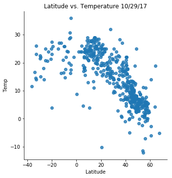
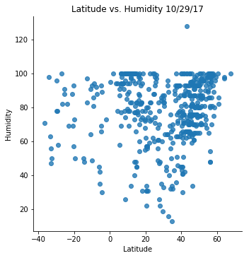

```python
#Dependencies
import pandas as pd
import numpy as np
import matplotlib.pyplot as plt
import seaborn as sns
from citipy import citipy
import openweathermapy.core as ow
import json
import requests as req
import random
import time
```


```python
cities_data = pd.read_csv('worldcities.csv')

```


```python
random_cities = cities_data.sample(n=500)
random_cities.head()
```


<div>
<style>
    .dataframe thead tr:only-child th {
        text-align: right;
    }

    .dataframe thead th {
        text-align: left;
    }

    .dataframe tbody tr th {
        vertical-align: top;
    }
</style>
<table border="1" class="dataframe">
  <thead>
    <tr style="text-align: right;">
      <th></th>
      <th>Country</th>
      <th>City</th>
      <th>Latitude</th>
      <th>Longitude</th>
    </tr>
  </thead>
  <tbody>
    <tr>
      <th>13973</th>
      <td>gr</td>
      <td>naxos</td>
      <td>37.105556</td>
      <td>25.376389</td>
    </tr>
    <tr>
      <th>42438</th>
      <td>us</td>
      <td>napa</td>
      <td>38.297222</td>
      <td>-122.284444</td>
    </tr>
    <tr>
      <th>8907</th>
      <td>de</td>
      <td>glinde</td>
      <td>53.550000</td>
      <td>10.200000</td>
    </tr>
    <tr>
      <th>37629</th>
      <td>ru</td>
      <td>petropavlovskaya</td>
      <td>45.081894</td>
      <td>40.451253</td>
    </tr>
    <tr>
      <th>14924</th>
      <td>hn</td>
      <td>guinope</td>
      <td>13.883333</td>
      <td>-86.933333</td>
    </tr>
  </tbody>
</table>
</div>


```python
random_cities["Temp"] = ""
random_cities["Humidity"] = ""
random_cities["Cloudiness"] = ""
random_cities["Wind Speed"] = ""
random_cities.head()
```


<div>
<style>
    .dataframe thead tr:only-child th {
        text-align: right;
    }

    .dataframe thead th {
        text-align: left;
    }

    .dataframe tbody tr th {
        vertical-align: top;
    }
</style>
<table border="1" class="dataframe">
  <thead>
    <tr style="text-align: right;">
      <th></th>
      <th>Country</th>
      <th>City</th>
      <th>Latitude</th>
      <th>Longitude</th>
      <th>Temp</th>
      <th>Humidity</th>
      <th>Cloudiness</th>
      <th>Wind Speed</th>
    </tr>
  </thead>
  <tbody>
    <tr>
      <th>13973</th>
      <td>gr</td>
      <td>naxos</td>
      <td>37.105556</td>
      <td>25.376389</td>
      <td></td>
      <td></td>
      <td></td>
      <td></td>
    </tr>
    <tr>
      <th>42438</th>
      <td>us</td>
      <td>napa</td>
      <td>38.297222</td>
      <td>-122.284444</td>
      <td></td>
      <td></td>
      <td></td>
      <td></td>
    </tr>
    <tr>
      <th>8907</th>
      <td>de</td>
      <td>glinde</td>
      <td>53.550000</td>
      <td>10.200000</td>
      <td></td>
      <td></td>
      <td></td>
      <td></td>
    </tr>
    <tr>
      <th>37629</th>
      <td>ru</td>
      <td>petropavlovskaya</td>
      <td>45.081894</td>
      <td>40.451253</td>
      <td></td>
      <td></td>
      <td></td>
      <td></td>
    </tr>
    <tr>
      <th>14924</th>
      <td>hn</td>
      <td>guinope</td>
      <td>13.883333</td>
      <td>-86.933333</td>
      <td></td>
      <td></td>
      <td></td>
      <td></td>
    </tr>
  </tbody>
</table>
</div>


```python
api_key = "2c263cd1454305f3e560ee3e7652fbbf"
url = "http://api.openweathermap.org/data/2.5/weather?"
units = "metric"
```


```python
query_url = url + "appid=" + api_key + "&units=" + units + "&q=" + city
query_url
```


    'http://api.openweathermap.org/data/2.5/weather?appid=2c263cd1454305f3e560ee3e7652fbbf&units=metric&q=aspindza'


```python
weather_data = []

for city in random_cities.City:
    
    time.sleep(1)
    query_url = url + "appid=" + api_key + "&units=" + units + "&q=" + city
    weather_data.append(req.get(query_url).json())
weather_data[0]
print(weather_data)
```

    [{'coord': {'lon': 25.38, 'lat': 37.11}, 'weather': [{'id': 800, 'main': 'Clear', 'description': 'clear sky', 'icon': '01n'}], 'base': 'stations', 'main': {'temp': 19.26, 'pressure': 1017.89, 'humidity': 100, 'temp_min': 19.26, 'temp_max': 19.26, 'sea_level': 1021.49, 'grnd_level': 1017.89}, 'wind': {'speed': 7.92, 'deg': 253.001}, 'clouds': {'all': 0}, 'dt': 1509315810, 'sys': {'message': 0.1666, 'country': 'GR', 'sunrise': 1509252036, 'sunset': 1509290586}, 'id': 256632, 'name': 'Naxos', 'cod': 200}, {'coord': {'lon': -122.29, 'lat': 38.3}, 'weather': [{'id': 800, 'main': 'Clear', 'description': 'clear sky', 'icon': '01d'}], 'base': 'stations', 'main': {'temp': 20.22, 'pressure': 1011, 'humidity': 77, 'temp_min': 14, 'temp_max': 25}, 'visibility': 16093, 'wind': {'speed': 2.6, 'deg': 210}, 'clouds': {'all': 1}, 'dt': 1509314400, 'sys': {'type': 1, 'id': 434, 'message': 0.247, 'country': 'US', 'sunrise': 1509287612, 'sunset': 1509325888}, 'id': 5376095, 'name': 'Napa', 'cod': 200}, {'coord': {'lon': 10.2, 'lat': 53.55}, 'weather': [{'id': 800, 'main': 'Clear', 'description': 'clear sky', 'icon': '01n'}], 'base': 'stations', 'main': {'temp': 7.51, 'pressure': 1013, 'humidity': 75, 'temp_min': 7, 'temp_max': 8}, 'visibility': 10000, 'wind': {'speed': 4.1, 'deg': 280}, 'clouds': {'all': 0}, 'dt': 1509313800, 'sys': {'type': 1, 'id': 4883, 'message': 0.0034, 'country': 'DE', 'sunrise': 1509257676, 'sunset': 1509292214}, 'id': 2919880, 'name': 'Glinde', 'cod': 200}, {'coord': {'lon': 40.45, 'lat': 45.08}, 'weather': [{'id': 500, 'main': 'Rain', 'description': 'light rain', 'icon': '10n'}], 'base': 'stations', 'main': {'temp': 10.76, 'pressure': 999.08, 'humidity': 95, 'temp_min': 10.76, 'temp_max': 10.76, 'sea_level': 1013.46, 'grnd_level': 999.08}, 'wind': {'speed': 3.47, 'deg': 244.001}, 'rain': {'3h': 0.59}, 'clouds': {'all': 92}, 'dt': 1509315814, 'sys': {'message': 0.003, 'country': 'RU', 'sunrise': 1509249231, 'sunset': 1509286150}, 'id': 510171, 'name': 'Petropavlovskaya', 'cod': 200}, {'coord': {'lon': -86.93, 'lat': 13.88}, 'weather': [{'id': 803, 'main': 'Clouds', 'description': 'broken clouds', 'icon': '04d'}], 'base': 'stations', 'main': {'temp': 21, 'pressure': 1017, 'humidity': 77, 'temp_min': 21, 'temp_max': 21}, 'visibility': 10000, 'wind': {'speed': 5.1, 'deg': 10}, 'clouds': {'all': 75}, 'dt': 1509314400, 'sys': {'type': 1, 'id': 4196, 'message': 0.1677, 'country': 'HN', 'sunrise': 1509277309, 'sunset': 1509319239}, 'id': 3609112, 'name': 'Guinope', 'cod': 200}, {'coord': {'lon': 83.65, 'lat': 48.57}, 'weather': [{'id': 803, 'main': 'Clouds', 'description': 'broken clouds', 'icon': '04n'}], 'base': 'stations', 'main': {'temp': 3.11, 'pressure': 984.89, 'humidity': 99, 'temp_min': 3.11, 'temp_max': 3.11, 'sea_level': 1041.02, 'grnd_level': 984.89}, 'wind': {'speed': 2.07, 'deg': 112.001}, 'clouds': {'all': 76}, 'dt': 1509315817, 'sys': {'message': 0.1721, 'country': 'KZ', 'sunrise': 1509239286, 'sunset': 1509275356}, 'id': 1521762, 'name': 'Kurchum', 'cod': 200}, {'coord': {'lon': 11.49, 'lat': 55.53}, 'weather': [{'id': 804, 'main': 'Clouds', 'description': 'overcast clouds', 'icon': '04n'}], 'base': 'stations', 'main': {'temp': 7, 'pressure': 1008, 'humidity': 65, 'temp_min': 7, 'temp_max': 7}, 'wind': {'speed': 2.6, 'deg': 350}, 'clouds': {'all': 92}, 'dt': 1509313800, 'sys': {'type': 1, 'id': 5256, 'message': 0.0043, 'country': 'DK', 'sunrise': 1509257715, 'sunset': 1509291552}, 'id': 2623028, 'name': 'Dianalund', 'cod': 200}, {'coord': {'lon': 32.74, 'lat': 56.93}, 'weather': [{'id': 500, 'main': 'Rain', 'description': 'light rain', 'icon': '10n'}], 'base': 'stations', 'main': {'temp': 4.76, 'pressure': 966.82, 'humidity': 100, 'temp_min': 4.76, 'temp_max': 4.76, 'sea_level': 994.3, 'grnd_level': 966.82}, 'wind': {'speed': 5.27, 'deg': 183.001}, 'rain': {'3h': 1.57}, 'clouds': {'all': 92}, 'dt': 1509315819, 'sys': {'message': 0.0048, 'country': 'RU', 'sunrise': 1509252879, 'sunset': 1509286187}, 'id': 511592, 'name': 'Peno', 'cod': 200}, {'coord': {'lon': 123.01, 'lat': 11.26}, 'weather': [{'id': 500, 'main': 'Rain', 'description': 'light rain', 'icon': '10n'}], 'base': 'stations', 'main': {'temp': 24.51, 'pressure': 1018.38, 'humidity': 100, 'temp_min': 24.51, 'temp_max': 24.51, 'sea_level': 1023.27, 'grnd_level': 1018.38}, 'wind': {'speed': 1.37, 'deg': 313.501}, 'rain': {'3h': 0.1425}, 'clouds': {'all': 56}, 'dt': 1509315821, 'sys': {'message': 0.1647, 'country': 'PH', 'sunrise': 1509226754, 'sunset': 1509269028}, 'id': 1687196, 'name': 'Sara', 'cod': 200}, {'coord': {'lon': 8.6, 'lat': 49.39}, 'weather': [{'id': 800, 'main': 'Clear', 'description': 'clear sky', 'icon': '01n'}], 'base': 'stations', 'main': {'temp': 5.69, 'pressure': 1012.78, 'humidity': 87, 'temp_min': 5.69, 'temp_max': 5.69, 'sea_level': 1033.61, 'grnd_level': 1012.78}, 'wind': {'speed': 3.32, 'deg': 284.001}, 'clouds': {'all': 0}, 'dt': 1509315822, 'sys': {'message': 0.1787, 'country': 'DE', 'sunrise': 1509257428, 'sunset': 1509293235}, 'id': 2853435, 'name': 'Plankstadt', 'cod': 200}, {'coord': {'lon': 47.36, 'lat': 42.74}, 'weather': [{'id': 741, 'main': 'Fog', 'description': 'fog', 'icon': '50n'}], 'base': 'stations', 'main': {'temp': 11, 'pressure': 1000, 'humidity': 93, 'temp_min': 11, 'temp_max': 11}, 'visibility': 350, 'wind': {'speed': 3, 'deg': 300}, 'clouds': {'all': 20}, 'dt': 1509312600, 'sys': {'type': 1, 'id': 7297, 'message': 0.1675, 'country': 'RU', 'sunrise': 1509247310, 'sunset': 1509284756}, 'id': 512607, 'name': 'Paraul', 'cod': 200}, {'coord': {'lon': 2.31, 'lat': 48.63}, 'weather': [{'id': 800, 'main': 'Clear', 'description': 'clear sky', 'icon': '01n'}], 'base': 'stations', 'main': {'temp': 8.14, 'pressure': 1025, 'humidity': 76, 'temp_min': 7, 'temp_max': 9}, 'visibility': 10000, 'wind': {'speed': 5.7, 'deg': 10}, 'clouds': {'all': 0}, 'dt': 1509314400, 'sys': {'type': 1, 'id': 5615, 'message': 0.1658, 'country': 'FR', 'sunrise': 1509258836, 'sunset': 1509294847}, 'id': 2977952, 'name': 'Saint-Michel-sur-Orge', 'cod': 200}, {'coord': {'lon': -1.98, 'lat': 43.31}, 'weather': [{'id': 500, 'main': 'Rain', 'description': 'light rain', 'icon': '10n'}], 'base': 'stations', 'main': {'temp': 13.27, 'pressure': 1024, 'humidity': 100, 'temp_min': 12, 'temp_max': 15}, 'visibility': 7000, 'wind': {'speed': 0.5}, 'rain': {'3h': 1.2775}, 'clouds': {'all': 92}, 'dt': 1509314400, 'sys': {'type': 1, 'id': 5499, 'message': 0.1647, 'country': 'ES', 'sunrise': 1509259224, 'sunset': 1509296524}, 'id': 3110044, 'name': 'San Sebastian', 'cod': 200}, {'coord': {'lon': 27.9, 'lat': 45.87}, 'weather': [{'id': 801, 'main': 'Clouds', 'description': 'few clouds', 'icon': '02n'}], 'base': 'stations', 'main': {'temp': 10.11, 'pressure': 998.11, 'humidity': 63, 'temp_min': 10.11, 'temp_max': 10.11, 'sea_level': 1004.19, 'grnd_level': 998.11}, 'wind': {'speed': 6.72, 'deg': 266.001}, 'clouds': {'all': 12}, 'dt': 1509315828, 'sys': {'message': 0.1662, 'country': 'RO', 'sunrise': 1509252339, 'sunset': 1509289064}, 'id': 683352, 'name': 'Bujor', 'cod': 200}, {'coord': {'lon': 19.94, 'lat': 48.68}, 'weather': [{'id': 600, 'main': 'Snow', 'description': 'light snow', 'icon': '13n'}], 'base': 'stations', 'main': {'temp': 2.57, 'pressure': 999, 'humidity': 75, 'temp_min': 0, 'temp_max': 5}, 'visibility': 10000, 'wind': {'speed': 4.1, 'deg': 320}, 'clouds': {'all': 90}, 'dt': 1509314400, 'sys': {'type': 1, 'id': 5906, 'message': 0.0061, 'country': 'SK', 'sunrise': 1509254607, 'sunset': 1509290614}, 'id': 3057197, 'name': 'Tisovec', 'cod': 200}, {'coord': {'lon': -76.13, 'lat': 6.32}, 'weather': [{'id': 521, 'main': 'Rain', 'description': 'shower rain', 'icon': '09d'}], 'base': 'stations', 'main': {'temp': 20, 'pressure': 1020, 'humidity': 77, 'temp_min': 20, 'temp_max': 20}, 'visibility': 10000, 'wind': {'speed': 3.1, 'deg': 30}, 'clouds': {'all': 90}, 'dt': 1509314400, 'sys': {'type': 1, 'id': 4261, 'message': 0.0032, 'country': 'CO', 'sunrise': 1509274257, 'sunset': 1509317112}, 'id': 3666395, 'name': 'Urrao', 'cod': 200}, {'coord': {'lon': 9.23, 'lat': 60.99}, 'weather': [{'id': 802, 'main': 'Clouds', 'description': 'scattered clouds', 'icon': '03n'}], 'base': 'stations', 'main': {'temp': -2.64, 'pressure': 902.13, 'humidity': 86, 'temp_min': -2.64, 'temp_max': -2.64, 'sea_level': 1025.42, 'grnd_level': 902.13}, 'wind': {'speed': 4.07, 'deg': 337.001}, 'clouds': {'all': 44}, 'dt': 1509315832, 'sys': {'message': 0.1692, 'country': 'NO', 'sunrise': 1509259461, 'sunset': 1509290882}, 'id': 3157897, 'name': 'Fagernes', 'cod': 200}, {'coord': {'lon': -87.57, 'lat': 44.15}, 'weather': [{'id': 800, 'main': 'Clear', 'description': 'clear sky', 'icon': '01d'}], 'base': 'stations', 'main': {'temp': 5.7, 'pressure': 1007, 'humidity': 65, 'temp_min': 5, 'temp_max': 7}, 'visibility': 16093, 'wind': {'speed': 5.7, 'deg': 170}, 'clouds': {'all': 1}, 'dt': 1509314160, 'sys': {'type': 1, 'id': 2998, 'message': 0.1692, 'country': 'US', 'sunrise': 1509279878, 'sunset': 1509316952}, 'id': 5276609, 'name': 'Two Rivers', 'cod': 200}, {'coord': {'lon': 44.4, 'lat': 33.34}, 'weather': [{'id': 761, 'main': 'Dust', 'description': 'dust', 'icon': '50n'}], 'base': 'stations', 'main': {'temp': 21, 'pressure': 1011, 'humidity': 40, 'temp_min': 21, 'temp_max': 21}, 'visibility': 1000, 'wind': {'speed': 1, 'deg': 290}, 'clouds': {'all': 0}, 'dt': 1509314400, 'sys': {'type': 1, 'id': 7158, 'message': 0.1647, 'country': 'IQ', 'sunrise': 1509247142, 'sunset': 1509286354}, 'id': 98182, 'name': 'Baghdad', 'cod': 200}, {'coord': {'lon': -8.08, 'lat': 40.52}, 'weather': [{'id': 800, 'main': 'Clear', 'description': 'clear sky', 'icon': '01n'}], 'base': 'stations', 'main': {'temp': 19, 'pressure': 1018, 'humidity': 45, 'temp_min': 19, 'temp_max': 19}, 'visibility': 10000, 'wind': {'speed': 1}, 'clouds': {'all': 0}, 'dt': 1509314400, 'sys': {'type': 1, 'id': 5956, 'message': 0.1642, 'country': 'PT', 'sunrise': 1509260397, 'sunset': 1509298282}, 'id': 2733533, 'name': 'Tondela', 'cod': 200}, {'coord': {'lon': 22.11, 'lat': 44.94}, 'weather': [{'id': 800, 'main': 'Clear', 'description': 'clear sky', 'icon': '01n'}], 'base': 'stations', 'main': {'temp': 7, 'pressure': 1006, 'humidity': 75, 'temp_min': 7, 'temp_max': 7}, 'visibility': 10000, 'wind': {'speed': 6.2, 'deg': 280}, 'clouds': {'all': 0}, 'dt': 1509314400, 'sys': {'type': 1, 'id': 5979, 'message': 0.1701, 'country': 'RO', 'sunrise': 1509253621, 'sunset': 1509290563}, 'id': 669647, 'name': 'Prigor', 'cod': 200}, {'coord': {'lon': -74.79, 'lat': 6.76}, 'weather': [{'id': 500, 'main': 'Rain', 'description': 'light rain', 'icon': '10d'}], 'base': 'stations', 'main': {'temp': 18.31, 'pressure': 879.52, 'humidity': 98, 'temp_min': 18.31, 'temp_max': 18.31, 'sea_level': 1023.47, 'grnd_level': 879.52}, 'wind': {'speed': 0.67, 'deg': 154.501}, 'rain': {'3h': 1.325}, 'clouds': {'all': 92}, 'dt': 1509315838, 'sys': {'message': 0.1653, 'country': 'CO', 'sunrise': 1509273962, 'sunset': 1509316764}, 'id': 3792377, 'name': 'Vegachi', 'cod': 200}, {'coord': {'lon': 52.5, 'lat': 57.71}, 'weather': [{'id': 500, 'main': 'Rain', 'description': 'light rain', 'icon': '10n'}], 'base': 'stations', 'main': {'temp': 4.31, 'pressure': 987.57, 'humidity': 97, 'temp_min': 4.31, 'temp_max': 4.31, 'sea_level': 1010.18, 'grnd_level': 987.57}, 'wind': {'speed': 4.77, 'deg': 180.501}, 'rain': {'3h': 0.95}, 'clouds': {'all': 92}, 'dt': 1509315839, 'sys': {'message': 0.166, 'country': 'RU', 'sunrise': 1509248289, 'sunset': 1509281290}, 'id': 542356, 'name': 'Krasnogorskoye', 'cod': 200}, {'coord': {'lon': 35.02, 'lat': -10.93}, 'weather': [{'id': 801, 'main': 'Clouds', 'description': 'few clouds', 'icon': '02n'}], 'base': 'stations', 'main': {'temp': 21, 'pressure': 1021, 'humidity': 64, 'temp_min': 21, 'temp_max': 21}, 'visibility': 10000, 'wind': {'speed': 2.6, 'deg': 120}, 'clouds': {'all': 20}, 'dt': 1509310800, 'sys': {'type': 1, 'id': 6498, 'message': 0.1675, 'country': 'TZ', 'sunrise': 1509246551, 'sunset': 1509291481}, 'id': 877998, 'name': 'Mbinga', 'cod': 200}, {'coord': {'lon': -120.48, 'lat': 37.3}, 'weather': [{'id': 800, 'main': 'Clear', 'description': 'clear sky', 'icon': '01d'}], 'base': 'stations', 'main': {'temp': 26.99, 'pressure': 1009, 'humidity': 36, 'temp_min': 26, 'temp_max': 28}, 'visibility': 16093, 'wind': {'speed': 5.1, 'deg': 310}, 'clouds': {'all': 1}, 'dt': 1509313980, 'sys': {'type': 1, 'id': 423, 'message': 0.17, 'country': 'US', 'sunrise': 1509287084, 'sunset': 1509325548}, 'id': 5372253, 'name': 'Merced', 'cod': 200}, {'coord': {'lon': 6.87, 'lat': 50.87}, 'weather': [{'id': 802, 'main': 'Clouds', 'description': 'scattered clouds', 'icon': '03n'}], 'base': 'stations', 'main': {'temp': 5.7, 'pressure': 1021, 'humidity': 87, 'temp_min': 4, 'temp_max': 7}, 'visibility': 10000, 'wind': {'speed': 3.6, 'deg': 320}, 'clouds': {'all': 40}, 'dt': 1509313800, 'sys': {'type': 1, 'id': 4885, 'message': 0.2442, 'country': 'DE', 'sunrise': 1509258055, 'sunset': 1509293436}, 'id': 2897216, 'name': 'Hurth', 'cod': 200}, {'coord': {'lon': -122.91, 'lat': 46.15}, 'weather': [{'id': 804, 'main': 'Clouds', 'description': 'overcast clouds', 'icon': '04d'}], 'base': 'stations', 'main': {'temp': 13.34, 'pressure': 1017, 'humidity': 82, 'temp_min': 12, 'temp_max': 14}, 'visibility': 16093, 'wind': {'speed': 3.1, 'deg': 340}, 'clouds': {'all': 90}, 'dt': 1509314160, 'sys': {'type': 1, 'id': 2938, 'message': 0.1709, 'country': 'US', 'sunrise': 1509288603, 'sunset': 1509325187}, 'id': 5799571, 'name': 'Kelso', 'cod': 200}, {'coord': {'lon': 33.57, 'lat': 13.57}, 'weather': [{'id': 500, 'main': 'Rain', 'description': 'light rain', 'icon': '10n'}], 'base': 'stations', 'main': {'temp': 25.56, 'pressure': 972.9, 'humidity': 72, 'temp_min': 25.56, 'temp_max': 25.56, 'sea_level': 1020.56, 'grnd_level': 972.9}, 'wind': {'speed': 2.22, 'deg': 125.501}, 'rain': {'3h': 0.2875}, 'clouds': {'all': 68}, 'dt': 1509315847, 'sys': {'message': 0.1795, 'country': 'SD', 'sunrise': 1509248364, 'sunset': 1509290346}, 'id': 367644, 'name': 'Sinnar', 'cod': 200}, {'coord': {'lon': 6.8, 'lat': 49.28}, 'weather': [{'id': 800, 'main': 'Clear', 'description': 'clear sky', 'icon': '01n'}], 'base': 'stations', 'main': {'temp': 3.25, 'pressure': 1021, 'humidity': 93, 'temp_min': 2, 'temp_max': 4}, 'visibility': 10000, 'wind': {'speed': 2.6, 'deg': 320}, 'clouds': {'all': 0}, 'dt': 1509314400, 'sys': {'type': 1, 'id': 4890, 'message': 0.173, 'country': 'DE', 'sunrise': 1509257846, 'sunset': 1509293681}, 'id': 2945730, 'name': 'Bous', 'cod': 200}, {'coord': {'lon': 28.61, 'lat': 45.75}, 'weather': [{'id': 803, 'main': 'Clouds', 'description': 'broken clouds', 'icon': '04n'}], 'base': 'stations', 'main': {'temp': 11.16, 'pressure': 997.05, 'humidity': 71, 'temp_min': 11.16, 'temp_max': 11.16, 'sea_level': 1003.58, 'grnd_level': 997.05}, 'wind': {'speed': 9.42, 'deg': 253.001}, 'clouds': {'all': 76}, 'dt': 1509315850, 'sys': {'message': 0.1653, 'country': 'UA', 'sunrise': 1509252154, 'sunset': 1509288909}, 'id': 687797, 'name': 'Zaliznychne', 'cod': 200}, {'coord': {'lon': 33.27, 'lat': 46.75}, 'weather': [{'id': 501, 'main': 'Rain', 'description': 'moderate rain', 'icon': '10n'}], 'base': 'stations', 'main': {'temp': 9.69, 'pressure': 998.51, 'humidity': 96, 'temp_min': 9.69, 'temp_max': 9.69, 'sea_level': 1002.16, 'grnd_level': 998.51}, 'wind': {'speed': 8.27, 'deg': 233.001}, 'rain': {'3h': 3.49}, 'clouds': {'all': 92}, 'dt': 1509315851, 'sys': {'message': 0.0032, 'country': 'UA', 'sunrise': 1509251156, 'sunset': 1509287669}, 'id': 709940, 'name': 'Dnipryany', 'cod': 200}, {'coord': {'lon': 26.27, 'lat': 48.22}, 'weather': [{'id': 802, 'main': 'Clouds', 'description': 'scattered clouds', 'icon': '03n'}], 'base': 'stations', 'main': {'temp': 4, 'pressure': 990, 'humidity': 80, 'temp_min': 4, 'temp_max': 4}, 'visibility': 10000, 'wind': {'speed': 11.8, 'deg': 290}, 'clouds': {'all': 40}, 'dt': 1509314400, 'sys': {'type': 1, 'id': 5997, 'message': 0.1667, 'country': 'UA', 'sunrise': 1509253026, 'sunset': 1509289158}, 'id': 699285, 'name': 'Novoselytsya', 'cod': 200}, {'coord': {'lon': -66.88, 'lat': 18.29}, 'weather': [{'id': 800, 'main': 'Clear', 'description': 'clear sky', 'icon': '02d'}], 'base': 'stations', 'main': {'temp': 27, 'pressure': 1012, 'humidity': 74, 'temp_min': 27, 'temp_max': 27}, 'visibility': 16093, 'wind': {'speed': 2.1, 'deg': 180}, 'clouds': {'all': 5}, 'dt': 1509314100, 'sys': {'type': 1, 'id': 4062, 'message': 0.167, 'country': 'PR', 'sunrise': 1509272775, 'sunset': 1509314146}, 'id': 4565908, 'name': 'Lares', 'cod': 200}, {'coord': {'lon': 76.95, 'lat': 27.8}, 'weather': [{'id': 800, 'main': 'Clear', 'description': 'clear sky', 'icon': '01n'}], 'base': 'stations', 'main': {'temp': 15.91, 'pressure': 997.94, 'humidity': 78, 'temp_min': 15.91, 'temp_max': 15.91, 'sea_level': 1029.72, 'grnd_level': 997.94}, 'wind': {'speed': 1.17, 'deg': 71.0014}, 'clouds': {'all': 0}, 'dt': 1509315855, 'sys': {'message': 0.1647, 'country': 'IN', 'sunrise': 1509238896, 'sunset': 1509278982}, 'id': 1271881, 'name': 'Firozpur Jhirka', 'cod': 200}, {'coord': {'lon': 46.92, 'lat': 41.42}, 'weather': [{'id': 803, 'main': 'Clouds', 'description': 'broken clouds', 'icon': '04n'}], 'base': 'stations', 'main': {'temp': 13, 'pressure': 1012, 'humidity': 76, 'temp_min': 13, 'temp_max': 13}, 'visibility': 10000, 'wind': {'speed': 2.1, 'deg': 150}, 'clouds': {'all': 75}, 'dt': 1509310800, 'sys': {'type': 1, 'id': 7216, 'message': 0.1729, 'country': 'AZ', 'sunrise': 1509247278, 'sunset': 1509285001}, 'id': 585227, 'name': 'Qax', 'cod': 200}, {'coord': {'lon': 10.64, 'lat': 5.51}, 'weather': [{'id': 802, 'main': 'Clouds', 'description': 'scattered clouds', 'icon': '03n'}], 'base': 'stations', 'main': {'temp': 19.06, 'pressure': 912.26, 'humidity': 91, 'temp_min': 19.06, 'temp_max': 19.06, 'sea_level': 1022.54, 'grnd_level': 912.26}, 'wind': {'speed': 1.32, 'deg': 221.001}, 'clouds': {'all': 36}, 'dt': 1509315858, 'sys': {'message': 0.1646, 'country': 'CM', 'sunrise': 1509253383, 'sunset': 1509296339}, 'id': 2231504, 'name': 'Foumbot', 'cod': 200}, {'coord': {'lon': 16.64, 'lat': 50.3}, 'weather': [{'id': 500, 'main': 'Rain', 'description': 'light rain', 'icon': '10n'}], 'base': 'stations', 'main': {'temp': 2.66, 'pressure': 961.87, 'humidity': 95, 'temp_min': 2.66, 'temp_max': 2.66, 'sea_level': 1018.93, 'grnd_level': 961.87}, 'wind': {'speed': 7.52, 'deg': 306.001}, 'rain': {'3h': 0.415}, 'clouds': {'all': 92}, 'dt': 1509315860, 'sys': {'message': 0.1726, 'country': 'PL', 'sunrise': 1509255625, 'sunset': 1509291178}, 'id': 3101968, 'name': 'Bystrzyca Klodzka', 'cod': 200}, {'coord': {'lon': -77.56, 'lat': 37.59}, 'weather': [{'id': 501, 'main': 'Rain', 'description': 'moderate rain', 'icon': '10d'}, {'id': 701, 'main': 'Mist', 'description': 'mist', 'icon': '50d'}], 'base': 'stations', 'main': {'temp': 15.18, 'pressure': 991, 'humidity': 93, 'temp_min': 11, 'temp_max': 18}, 'visibility': 11265, 'wind': {'speed': 1.5, 'deg': 330}, 'clouds': {'all': 90}, 'dt': 1509314460, 'sys': {'type': 1, 'id': 2873, 'message': 0.1672, 'country': 'US', 'sunrise': 1509276803, 'sunset': 1509315228}, 'id': 4790207, 'name': 'Tuckahoe', 'cod': 200}, {'coord': {'lon': 16.09, 'lat': 50.48}, 'weather': [{'id': 802, 'main': 'Clouds', 'description': 'scattered clouds', 'icon': '03n'}], 'base': 'stations', 'main': {'temp': 6, 'pressure': 1009, 'humidity': 70, 'temp_min': 6, 'temp_max': 6}, 'visibility': 10000, 'wind': {'speed': 8.2, 'deg': 280}, 'clouds': {'all': 40}, 'dt': 1509314400, 'sys': {'type': 1, 'id': 5896, 'message': 0.0053, 'country': 'CZ', 'sunrise': 1509255783, 'sunset': 1509291284}, 'id': 3077955, 'name': 'Cerveny Kostelec', 'cod': 200}, {'coord': {'lon': 7.99, 'lat': 13.76}, 'weather': [{'id': 800, 'main': 'Clear', 'description': 'clear sky', 'icon': '02n'}], 'base': 'stations', 'main': {'temp': 22.69, 'pressure': 977.36, 'humidity': 40, 'temp_min': 22.69, 'temp_max': 22.69, 'sea_level': 1024.08, 'grnd_level': 977.36}, 'wind': {'speed': 2.97, 'deg': 29.5014}, 'clouds': {'all': 8}, 'dt': 1509315864, 'sys': {'message': 0.1643, 'country': 'NE', 'sunrise': 1509254516, 'sunset': 1509296472}, 'id': 2438823, 'name': 'Tessaoua', 'cod': 200}, {'coord': {'lon': 141.86, 'lat': 43.32}, 'weather': [{'id': 520, 'main': 'Rain', 'description': 'light intensity shower rain', 'icon': '09n'}], 'base': 'stations', 'main': {'temp': 6.13, 'pressure': 989, 'humidity': 100, 'temp_min': 4, 'temp_max': 8}, 'visibility': 10000, 'wind': {'speed': 5.1, 'deg': 350}, 'clouds': {'all': 75}, 'dt': 1509313200, 'sys': {'type': 1, 'id': 7540, 'message': 0.1687, 'country': 'JP', 'sunrise': 1509224673, 'sunset': 1509262035}, 'id': 2130534, 'name': 'Bibai', 'cod': 200}, {'coord': {'lon': 103.33, 'lat': 2.03}, 'weather': [{'id': 803, 'main': 'Clouds', 'description': 'broken clouds', 'icon': '04n'}], 'base': 'stations', 'main': {'temp': 24, 'pressure': 1009, 'humidity': 100, 'temp_min': 24, 'temp_max': 24}, 'visibility': 10000, 'wind': {'speed': 1.47, 'deg': 3.5014}, 'clouds': {'all': 75}, 'dt': 1509314400, 'sys': {'type': 1, 'id': 8131, 'message': 0.1639, 'country': 'MY', 'sunrise': 1509230932, 'sunset': 1509274303}, 'id': 1732811, 'name': 'Kluang', 'cod': 200}, {'coord': {'lon': 18.82, 'lat': 46.46}, 'weather': [{'id': 800, 'main': 'Clear', 'description': 'clear sky', 'icon': '02n'}], 'base': 'stations', 'main': {'temp': 6.84, 'pressure': 1002.16, 'humidity': 76, 'temp_min': 6.84, 'temp_max': 6.84, 'sea_level': 1020.68, 'grnd_level': 1002.16}, 'wind': {'speed': 9.07, 'deg': 316.501}, 'clouds': {'all': 8}, 'dt': 1509315868, 'sys': {'message': 0.1651, 'country': 'HU', 'sunrise': 1509254592, 'sunset': 1509291169}, 'id': 3053132, 'name': 'Fadd', 'cod': 200}, {'coord': {'lon': 26.52, 'lat': 46.95}, 'weather': [{'id': 801, 'main': 'Clouds', 'description': 'few clouds', 'icon': '02n'}], 'base': 'stations', 'main': {'temp': 10, 'pressure': 991, 'humidity': 61, 'temp_min': 10, 'temp_max': 10}, 'visibility': 10000, 'wind': {'speed': 4.6, 'deg': 310}, 'clouds': {'all': 20}, 'dt': 1509314400, 'sys': {'type': 1, 'id': 5984, 'message': 0.1645, 'country': 'RO', 'sunrise': 1509252803, 'sunset': 1509289262}, 'id': 677158, 'name': 'Girov', 'cod': 200}, {'coord': {'lon': 124.17, 'lat': 53.98}, 'weather': [{'id': 800, 'main': 'Clear', 'description': 'clear sky', 'icon': '01n'}], 'base': 'stations', 'main': {'temp': -11.49, 'pressure': 965.93, 'humidity': 73, 'temp_min': -11.49, 'temp_max': -11.49, 'sea_level': 1032.63, 'grnd_level': 965.93}, 'wind': {'speed': 1.67, 'deg': 294.501}, 'clouds': {'all': 0}, 'dt': 1509315871, 'sys': {'message': 0.1631, 'country': 'RU', 'sunrise': 1509230359, 'sunset': 1509264826}, 'id': 2019296, 'name': 'Never', 'cod': 200}, {'coord': {'lon': 13.75, 'lat': 50.6}, 'weather': [{'id': 803, 'main': 'Clouds', 'description': 'broken clouds', 'icon': '04n'}], 'base': 'stations', 'main': {'temp': 4.02, 'pressure': 1011, 'humidity': 75, 'temp_min': 3, 'temp_max': 5}, 'visibility': 10000, 'wind': {'speed': 4.6, 'deg': 340}, 'clouds': {'all': 75}, 'dt': 1509314400, 'sys': {'type': 1, 'id': 5898, 'message': 0.1658, 'country': 'CZ', 'sunrise': 1509256363, 'sunset': 1509291827}, 'id': 3076311, 'name': 'Duchcov', 'cod': 200}, {'coord': {'lon': 79.97, 'lat': 28.92}, 'weather': [{'id': 800, 'main': 'Clear', 'description': 'clear sky', 'icon': '01n'}], 'base': 'stations', 'main': {'temp': 14.91, 'pressure': 1004.19, 'humidity': 84, 'temp_min': 14.91, 'temp_max': 14.91, 'sea_level': 1029.88, 'grnd_level': 1004.19}, 'wind': {'speed': 1.27, 'deg': 11.5014}, 'clouds': {'all': 0}, 'dt': 1509315873, 'sys': {'message': 0.1647, 'country': 'IN', 'sunrise': 1509238254, 'sunset': 1509278173}, 'id': 1266843, 'name': 'Khatima', 'cod': 200}, {'coord': {'lon': -51.15, 'lat': -29.83}, 'weather': [{'id': 800, 'main': 'Clear', 'description': 'clear sky', 'icon': '01d'}], 'base': 'stations', 'main': {'temp': 21.49, 'pressure': 1009, 'humidity': 78, 'temp_min': 21, 'temp_max': 22}, 'visibility': 10000, 'wind': {'speed': 6.7, 'deg': 110}, 'clouds': {'all': 0}, 'dt': 1509310800, 'sys': {'type': 1, 'id': 4478, 'message': 0.0042, 'country': 'BR', 'sunrise': 1509265900, 'sunset': 1509313510}, 'id': 3448031, 'name': 'Sapucaia', 'cod': 200}, {'coord': {'lon': 124.66, 'lat': 12.04}, 'weather': [{'id': 802, 'main': 'Clouds', 'description': 'scattered clouds', 'icon': '03n'}], 'base': 'stations', 'main': {'temp': 22.19, 'pressure': 1010.02, 'humidity': 100, 'temp_min': 22.19, 'temp_max': 22.19, 'sea_level': 1023.19, 'grnd_level': 1010.02}, 'wind': {'speed': 1.42, 'deg': 50.0014}, 'clouds': {'all': 36}, 'dt': 1509315876, 'sys': {'message': 0.1663, 'country': 'PH', 'sunrise': 1509226405, 'sunset': 1509268584}, 'id': 1688066, 'name': 'Santa Margarita', 'cod': 200}, {'coord': {'lon': 80.06, 'lat': 6.72}, 'weather': [{'id': 802, 'main': 'Clouds', 'description': 'scattered clouds', 'icon': '03n'}], 'base': 'stations', 'main': {'temp': 24, 'pressure': 1009, 'humidity': 94, 'temp_min': 24, 'temp_max': 24}, 'visibility': 10000, 'wind': {'speed': 2.1, 'deg': 50}, 'clouds': {'all': 40}, 'dt': 1509311400, 'sys': {'type': 1, 'id': 7864, 'message': 0.1707, 'country': 'LK', 'sunrise': 1509236793, 'sunset': 1509279608}, 'id': 1243867, 'name': 'Horana South', 'cod': 200}, {'coord': {'lon': -85.66, 'lat': 30.16}, 'weather': [{'id': 800, 'main': 'Clear', 'description': 'clear sky', 'icon': '01d'}], 'base': 'stations', 'main': {'temp': 14.48, 'pressure': 1012, 'humidity': 33, 'temp_min': 14, 'temp_max': 15}, 'visibility': 16093, 'wind': {'speed': 4.1, 'deg': 350, 'gust': 7.7}, 'clouds': {'all': 1}, 'dt': 1509314160, 'sys': {'type': 1, 'id': 730, 'message': 0.1678, 'country': 'US', 'sunrise': 1509278120, 'sunset': 1509317806}, 'id': 4167694, 'name': 'Panama City', 'cod': 200}, {'coord': {'lon': -54.78, 'lat': -26.61}, 'weather': [{'id': 501, 'main': 'Rain', 'description': 'moderate rain', 'icon': '10n'}], 'base': 'stations', 'main': {'temp': 20.81, 'pressure': 992.19, 'humidity': 91, 'temp_min': 20.81, 'temp_max': 20.81, 'sea_level': 1020.39, 'grnd_level': 992.19}, 'wind': {'speed': 2.67, 'deg': 14.0014}, 'rain': {'3h': 3.8575}, 'clouds': {'all': 92}, 'dt': 1509315880, 'sys': {'message': 0.1662, 'country': 'AR', 'sunrise': 1509267027, 'sunset': 1509314123}, 'id': 3435679, 'name': 'Caraguatay', 'cod': 200}, {'coord': {'lon': -2.18, 'lat': 57.34}, 'weather': [{'id': 500, 'main': 'Rain', 'description': 'light rain', 'icon': '10n'}], 'base': 'stations', 'main': {'temp': 6, 'pressure': 1029, 'humidity': 81, 'temp_min': 6, 'temp_max': 6}, 'visibility': 10000, 'wind': {'speed': 4.6, 'deg': 300}, 'clouds': {'all': 75}, 'dt': 1509313800, 'sys': {'type': 1, 'id': 5119, 'message': 0.0087, 'country': 'GB', 'sunrise': 1509261356, 'sunset': 1509294470}, 'id': 2640253, 'name': 'Pitmedden', 'cod': 200}, {'coord': {'lon': 28.87, 'lat': 44.77}, 'weather': [{'id': 802, 'main': 'Clouds', 'description': 'scattered clouds', 'icon': '03n'}], 'base': 'stations', 'main': {'temp': 10.52, 'pressure': 991, 'humidity': 76, 'temp_min': 10, 'temp_max': 11}, 'visibility': 10000, 'wind': {'speed': 5.7, 'deg': 240}, 'clouds': {'all': 48}, 'dt': 1509314400, 'sys': {'type': 1, 'id': 5998, 'message': 0.1671, 'country': 'RO', 'sunrise': 1509251977, 'sunset': 1509288962}, 'id': 675130, 'name': 'Jurilovca', 'cod': 200}, {'coord': {'lon': -43.49, 'lat': -19.95}, 'weather': [{'id': 803, 'main': 'Clouds', 'description': 'broken clouds', 'icon': '04d'}], 'base': 'stations', 'main': {'temp': 23, 'pressure': 1014, 'humidity': 73, 'temp_min': 23, 'temp_max': 23}, 'visibility': 10000, 'wind': {'speed': 4.1, 'deg': 150}, 'clouds': {'all': 75}, 'dt': 1509310800, 'sys': {'type': 1, 'id': 4528, 'message': 0.1646, 'country': 'BR', 'sunrise': 1509264801, 'sunset': 1509310922}, 'id': 3470878, 'name': 'Barao de Cocais', 'cod': 200}, {'coord': {'lon': 26.45, 'lat': 45.02}, 'weather': [{'id': 800, 'main': 'Clear', 'description': 'clear sky', 'icon': '01n'}], 'base': 'stations', 'main': {'temp': 9, 'pressure': 995, 'humidity': 76, 'temp_min': 9, 'temp_max': 9}, 'visibility': 10000, 'wind': {'speed': 10.8, 'deg': 260}, 'clouds': {'all': 0}, 'dt': 1509314400, 'sys': {'type': 1, 'id': 5994, 'message': 0.1645, 'country': 'RO', 'sunrise': 1509252588, 'sunset': 1509289513}, 'id': 673033, 'name': 'Mizil', 'cod': 200}, {'coord': {'lon': 124.83, 'lat': 8.43}, 'weather': [{'id': 803, 'main': 'Clouds', 'description': 'broken clouds', 'icon': '04n'}], 'base': 'stations', 'main': {'temp': 21.46, 'pressure': 961.22, 'humidity': 100, 'temp_min': 21.46, 'temp_max': 21.46, 'sea_level': 1022.87, 'grnd_level': 961.22}, 'wind': {'speed': 1.22, 'deg': 135.501}, 'clouds': {'all': 76}, 'dt': 1509315887, 'sys': {'message': 0.1646, 'country': 'PH', 'sunrise': 1509226148, 'sunset': 1509268762}, 'id': 1702322, 'name': 'Mambatangan', 'cod': 200}, {'coord': {'lon': -100.52, 'lat': 28.7}, 'weather': [{'id': 800, 'main': 'Clear', 'description': 'clear sky', 'icon': '02d'}], 'base': 'stations', 'main': {'temp': 23, 'pressure': 1016, 'humidity': 35, 'temp_min': 23, 'temp_max': 23}, 'visibility': 16093, 'wind': {'speed': 3.6, 'deg': 150}, 'clouds': {'all': 5}, 'dt': 1509313740, 'sys': {'type': 1, 'id': 4007, 'message': 0.168, 'country': 'MX', 'sunrise': 1509281576, 'sunset': 1509321484}, 'id': 3992619, 'name': 'Piedras Negras', 'cod': 200}, {'coord': {'lon': -8.4, 'lat': 43.12}, 'weather': [{'id': 802, 'main': 'Clouds', 'description': 'scattered clouds', 'icon': '03n'}], 'base': 'stations', 'main': {'temp': 13.98, 'pressure': 1026, 'humidity': 82, 'temp_min': 13, 'temp_max': 15}, 'visibility': 10000, 'wind': {'speed': 2.1, 'deg': 20}, 'clouds': {'all': 40}, 'dt': 1509314400, 'sys': {'type': 1, 'id': 5474, 'message': 0.1655, 'country': 'ES', 'sunrise': 1509260746, 'sunset': 1509298085}, 'id': 3118579, 'name': 'Leira', 'cod': 200}, {'coord': {'lon': 3.57, 'lat': 45.85}, 'weather': [{'id': 300, 'main': 'Drizzle', 'description': 'light intensity drizzle', 'icon': '09n'}, {'id': 701, 'main': 'Mist', 'description': 'mist', 'icon': '50n'}], 'base': 'stations', 'main': {'temp': 10, 'pressure': 1021, 'humidity': 100, 'temp_min': 10, 'temp_max': 10}, 'visibility': 4200, 'wind': {'speed': 4.6, 'deg': 350}, 'clouds': {'all': 90}, 'dt': 1509314400, 'sys': {'type': 1, 'id': 5565, 'message': 0.1677, 'country': 'FR', 'sunrise': 1509258182, 'sunset': 1509294900}, 'id': 2972857, 'name': 'Thiers', 'cod': 200}, {'coord': {'lon': -56.52, 'lat': -32.82}, 'weather': [{'id': 802, 'main': 'Clouds', 'description': 'scattered clouds', 'icon': '03d'}], 'base': 'stations', 'main': {'temp': 23, 'pressure': 1018, 'humidity': 56, 'temp_min': 23, 'temp_max': 23}, 'visibility': 10000, 'wind': {'speed': 4.1, 'deg': 20}, 'clouds': {'all': 40}, 'dt': 1509310800, 'sys': {'type': 1, 'id': 4619, 'message': 0.1728, 'country': 'UY', 'sunrise': 1509266934, 'sunset': 1509315057}, 'id': 3441273, 'name': 'Paso de los Toros', 'cod': 200}, {'coord': {'lon': 120.65, 'lat': 15.18}, 'weather': [{'id': 803, 'main': 'Clouds', 'description': 'broken clouds', 'icon': '04n'}], 'base': 'stations', 'main': {'temp': 25.57, 'pressure': 1011, 'humidity': 83, 'temp_min': 25, 'temp_max': 26}, 'visibility': 10000, 'wind': {'speed': 3.6, 'deg': 60}, 'clouds': {'all': 75}, 'dt': 1509314400, 'sys': {'type': 1, 'id': 7703, 'message': 0.0049, 'country': 'PH', 'sunrise': 1509227560, 'sunset': 1509269352}, 'id': 1695583, 'name': 'Pandacaqui', 'cod': 200}, {'coord': {'lon': 31.42, 'lat': -26.63}, 'weather': [{'id': 800, 'main': 'Clear', 'description': 'clear sky', 'icon': '01n'}], 'base': 'stations', 'main': {'temp': 14, 'pressure': 1025, 'humidity': 82, 'temp_min': 14, 'temp_max': 14}, 'wind': {'speed': 4.1, 'deg': 60}, 'clouds': {'all': 0}, 'dt': 1509310800, 'sys': {'type': 1, 'id': 6710, 'message': 0.2454, 'country': 'SZ', 'sunrise': 1509246348, 'sunset': 1509293427}, 'id': 934862, 'name': 'Sidvokodvo', 'cod': 200}, {'coord': {'lon': 13.72, 'lat': 42.66}, 'weather': [{'id': 800, 'main': 'Clear', 'description': 'clear sky', 'icon': '01n'}], 'base': 'stations', 'main': {'temp': 13, 'pressure': 1006, 'humidity': 66, 'temp_min': 13, 'temp_max': 13}, 'visibility': 10000, 'wind': {'speed': 2.6, 'deg': 250}, 'clouds': {'all': 0}, 'dt': 1509313800, 'sys': {'type': 1, 'id': 5747, 'message': 0.1648, 'country': 'IT', 'sunrise': 1509255382, 'sunset': 1509292831}, 'id': 6541856, 'name': 'Teramo', 'cod': 200}, {'coord': {'lon': -87.98, 'lat': 41.96}, 'weather': [{'id': 801, 'main': 'Clouds', 'description': 'few clouds', 'icon': '02d'}], 'base': 'stations', 'main': {'temp': 7.18, 'pressure': 1008, 'humidity': 42, 'temp_min': 6, 'temp_max': 8}, 'visibility': 16093, 'wind': {'speed': 3.6, 'deg': 230}, 'clouds': {'all': 20}, 'dt': 1509315300, 'sys': {'type': 1, 'id': 962, 'message': 0.1687, 'country': 'US', 'sunrise': 1509279737, 'sunset': 1509317292}, 'id': 4916975, 'name': 'Wood Dale', 'cod': 200}, {'coord': {'lon': 72.47, 'lat': 34.06}, 'weather': [{'id': 800, 'main': 'Clear', 'description': 'clear sky', 'icon': '01n'}], 'base': 'stations', 'main': {'temp': 11.46, 'pressure': 957.17, 'humidity': 76, 'temp_min': 11.46, 'temp_max': 11.46, 'sea_level': 1032.39, 'grnd_level': 957.17}, 'wind': {'speed': 2.07, 'deg': 42.5014}, 'clouds': {'all': 0}, 'dt': 1509315900, 'sys': {'message': 0.179, 'country': 'PK', 'sunrise': 1509240461, 'sunset': 1509279561}, 'id': 1162261, 'name': 'Zaida', 'cod': 200}, {'coord': {'lon': 81.67, 'lat': 16.45}, 'weather': [{'id': 800, 'main': 'Clear', 'description': 'clear sky', 'icon': '01n'}], 'base': 'stations', 'main': {'temp': 28.46, 'pressure': 1025.75, 'humidity': 100, 'temp_min': 28.46, 'temp_max': 28.46, 'sea_level': 1025.91, 'grnd_level': 1025.75}, 'wind': {'speed': 6.97, 'deg': 70.5014}, 'clouds': {'all': 0}, 'dt': 1509315902, 'sys': {'message': 0.1807, 'country': 'IN', 'sunrise': 1509236996, 'sunset': 1509278624}, 'id': 1261852, 'name': 'Narasapur', 'cod': 200}, {'coord': {'lon': 41.76, 'lat': 46.27}, 'weather': [{'id': 803, 'main': 'Clouds', 'description': 'broken clouds', 'icon': '04n'}], 'base': 'stations', 'main': {'temp': 9.56, 'pressure': 1005.73, 'humidity': 95, 'temp_min': 9.56, 'temp_max': 9.56, 'sea_level': 1014.19, 'grnd_level': 1005.73}, 'wind': {'speed': 2.97, 'deg': 217.501}, 'clouds': {'all': 76}, 'dt': 1509315903, 'sys': {'message': 0.0041, 'country': 'RU', 'sunrise': 1509249058, 'sunset': 1509285693}, 'id': 498866, 'name': 'Sandata', 'cod': 200}, {'coord': {'lon': -100.07, 'lat': 20.42}, 'weather': [{'id': 802, 'main': 'Clouds', 'description': 'scattered clouds', 'icon': '03d'}], 'base': 'stations', 'main': {'temp': 25, 'pressure': 1022, 'humidity': 31, 'temp_min': 25, 'temp_max': 25}, 'visibility': 12874, 'wind': {'speed': 2.6, 'deg': 260}, 'clouds': {'all': 40}, 'dt': 1509313680, 'sys': {'type': 1, 'id': 4012, 'message': 0.1669, 'country': 'MX', 'sunrise': 1509280883, 'sunset': 1509321967}, 'id': 4002462, 'name': 'La Estancia', 'cod': 200}, {'coord': {'lon': -122.68, 'lat': 45.52}, 'weather': [{'id': 803, 'main': 'Clouds', 'description': 'broken clouds', 'icon': '04d'}], 'base': 'stations', 'main': {'temp': 13.57, 'pressure': 1016, 'humidity': 71, 'temp_min': 13, 'temp_max': 14}, 'visibility': 16093, 'wind': {'speed': 2.6, 'deg': 300}, 'clouds': {'all': 75}, 'dt': 1509314160, 'sys': {'type': 1, 'id': 2274, 'message': 0.1673, 'country': 'US', 'sunrise': 1509288471, 'sunset': 1509325209}, 'id': 5746545, 'name': 'Portland', 'cod': 200}, {'coord': {'lon': 39.21, 'lat': -7.12}, 'weather': [{'id': 801, 'main': 'Clouds', 'description': 'few clouds', 'icon': '02n'}], 'base': 'stations', 'main': {'temp': 24, 'pressure': 1014, 'humidity': 88, 'temp_min': 24, 'temp_max': 24}, 'visibility': 10000, 'wind': {'speed': 2.6, 'deg': 140}, 'clouds': {'all': 20}, 'dt': 1509310800, 'sys': {'type': 1, 'id': 6482, 'message': 0.1799, 'country': 'TZ', 'sunrise': 1509245778, 'sunset': 1509290240}, 'id': 153482, 'name': 'Mkuranga', 'cod': 200}, {'coord': {'lon': -95.21, 'lat': 29.69}, 'weather': [{'id': 800, 'main': 'Clear', 'description': 'clear sky', 'icon': '01d'}], 'base': 'stations', 'main': {'temp': 21.2, 'pressure': 1016, 'humidity': 19, 'temp_min': 20, 'temp_max': 22}, 'visibility': 16093, 'wind': {'speed': 2.6, 'deg': 210}, 'clouds': {'all': 1}, 'dt': 1509314100, 'sys': {'type': 1, 'id': 2638, 'message': 0.0058, 'country': 'US', 'sunrise': 1509280377, 'sunset': 1509320133}, 'id': 4717782, 'name': 'Pasadena', 'cod': 200}, {'coord': {'lon': -77.83, 'lat': -10.67}, 'weather': [{'id': 802, 'main': 'Clouds', 'description': 'scattered clouds', 'icon': '03d'}], 'base': 'stations', 'main': {'temp': 16.41, 'pressure': 1022.67, 'humidity': 91, 'temp_min': 16.41, 'temp_max': 16.41, 'sea_level': 1027.08, 'grnd_level': 1022.67}, 'wind': {'speed': 4.32, 'deg': 168.001}, 'clouds': {'all': 44}, 'dt': 1509315910, 'sys': {'message': 0.1653, 'country': 'PE', 'sunrise': 1509273645, 'sunset': 1509318553}, 'id': 3933024, 'name': 'Paramonga', 'cod': 200}, {'coord': {'lon': 13.22, 'lat': 47.42}, 'weather': [{'id': 803, 'main': 'Clouds', 'description': 'broken clouds', 'icon': '04n'}], 'base': 'stations', 'main': {'temp': 8, 'pressure': 1017, 'humidity': 91, 'temp_min': 8, 'temp_max': 8}, 'visibility': 10000, 'wind': {'speed': 5.1, 'deg': 280}, 'clouds': {'all': 75}, 'dt': 1509313800, 'sys': {'type': 1, 'id': 5933, 'message': 0.1713, 'country': 'AT', 'sunrise': 1509256057, 'sunset': 1509292391}, 'id': 2781735, 'name': 'Bischofshofen', 'cod': 200}, {'coord': {'lon': -4.26, 'lat': 55.87}, 'weather': [{'id': 800, 'main': 'Clear', 'description': 'clear sky', 'icon': '01n'}], 'base': 'stations', 'main': {'temp': 0.65, 'pressure': 1031, 'humidity': 84, 'temp_min': 0, 'temp_max': 1}, 'visibility': 10000, 'wind': {'speed': 1, 'deg': 240}, 'clouds': {'all': 0}, 'dt': 1509313800, 'sys': {'type': 1, 'id': 5121, 'message': 0.1868, 'country': 'GB', 'sunrise': 1509261565, 'sunset': 1509295262}, 'id': 2648579, 'name': 'Glasgow', 'cod': 200}, {'coord': {'lon': -77.08, 'lat': 38.75}, 'weather': [{'id': 501, 'main': 'Rain', 'description': 'moderate rain', 'icon': '10d'}, {'id': 701, 'main': 'Mist', 'description': 'mist', 'icon': '50d'}], 'base': 'stations', 'main': {'temp': 12.5, 'pressure': 992, 'humidity': 93, 'temp_min': 8, 'temp_max': 18}, 'visibility': 16093, 'wind': {'speed': 6.7, 'deg': 320, 'gust': 9.8}, 'clouds': {'all': 90}, 'dt': 1509314760, 'sys': {'type': 1, 'id': 2848, 'message': 0.1687, 'country': 'US', 'sunrise': 1509276797, 'sunset': 1509315003}, 'id': 4765520, 'name': 'Hybla Valley', 'cod': 200}, {'coord': {'lon': 122.52, 'lat': 9.55}, 'weather': [{'id': 801, 'main': 'Clouds', 'description': 'few clouds', 'icon': '02n'}], 'base': 'stations', 'main': {'temp': 27.06, 'pressure': 1013.84, 'humidity': 100, 'temp_min': 27.06, 'temp_max': 27.06, 'sea_level': 1022.5, 'grnd_level': 1013.84}, 'wind': {'speed': 3.57, 'deg': 37.5014}, 'clouds': {'all': 12}, 'dt': 1509315915, 'sys': {'message': 0.1667, 'country': 'PH', 'sunrise': 1509226769, 'sunset': 1509269249}, 'id': 1730097, 'name': 'Asia', 'cod': 200}, {'coord': {'lon': 13.79, 'lat': 46.48}, 'weather': [{'id': 802, 'main': 'Clouds', 'description': 'scattered clouds', 'icon': '03n'}], 'base': 'stations', 'main': {'temp': 10, 'pressure': 1010, 'humidity': 34, 'temp_min': 10, 'temp_max': 10}, 'visibility': 10000, 'wind': {'speed': 3.6, 'deg': 320}, 'clouds': {'all': 40}, 'dt': 1509314400, 'sys': {'type': 1, 'id': 5882, 'message': 0.1669, 'country': 'SI', 'sunrise': 1509255803, 'sunset': 1509292372}, 'id': 3197373, 'name': 'Kranjska Gora', 'cod': 200}, {'coord': {'lon': 48.26, 'lat': 33.86}, 'weather': [{'id': 800, 'main': 'Clear', 'description': 'clear sky', 'icon': '01n'}], 'base': 'stations', 'main': {'temp': 12, 'pressure': 1021, 'humidity': 32, 'temp_min': 12, 'temp_max': 12}, 'visibility': 10000, 'wind': {'speed': 3.1, 'deg': 120}, 'clouds': {'all': 0}, 'dt': 1509310200, 'sys': {'type': 1, 'id': 7024, 'message': 0.1665, 'country': 'IR', 'sunrise': 1509246259, 'sunset': 1509285385}, 'id': 144269, 'name': 'Aleshtar', 'cod': 200}, {'coord': {'lon': 7.09, 'lat': 44.46}, 'weather': [{'id': 800, 'main': 'Clear', 'description': 'clear sky', 'icon': '01n'}], 'base': 'stations', 'main': {'temp': 1.69, 'pressure': 853.58, 'humidity': 63, 'temp_min': 1.69, 'temp_max': 1.69, 'sea_level': 1021.57, 'grnd_level': 853.58}, 'wind': {'speed': 1.12, 'deg': 303.001}, 'clouds': {'all': 0}, 'dt': 1509315920, 'sys': {'message': 0.0034, 'country': 'IT', 'sunrise': 1509257174, 'sunset': 1509294220}, 'id': 6535469, 'name': 'Marmora', 'cod': 200}, {'coord': {'lon': -80.09, 'lat': 26.93}, 'weather': [{'id': 800, 'main': 'Clear', 'description': 'clear sky', 'icon': '01d'}], 'base': 'stations', 'main': {'temp': 20.74, 'pressure': 1008, 'humidity': 56, 'temp_min': 19, 'temp_max': 22}, 'visibility': 16093, 'wind': {'speed': 9.8, 'deg': 290}, 'clouds': {'all': 1}, 'dt': 1509313980, 'sys': {'type': 1, 'id': 734, 'message': 0.0044, 'country': 'US', 'sunrise': 1509276539, 'sunset': 1509316716}, 'id': 4160610, 'name': 'Jupiter', 'cod': 200}, {'coord': {'lon': 59.53, 'lat': 22.57}, 'weather': [{'id': 800, 'main': 'Clear', 'description': 'clear sky', 'icon': '01n'}], 'base': 'stations', 'main': {'temp': 25.01, 'pressure': 997.62, 'humidity': 100, 'temp_min': 25.01, 'temp_max': 25.01, 'sea_level': 1028.22, 'grnd_level': 997.62}, 'wind': {'speed': 3.77, 'deg': 176.001}, 'clouds': {'all': 0}, 'dt': 1509315922, 'sys': {'message': 0.1658, 'country': 'OM', 'sunrise': 1509242710, 'sunset': 1509283533}, 'id': 286245, 'name': 'Sur', 'cod': 200}, {'coord': {'lon': 45.47, 'lat': -19.52}, 'weather': [{'id': 803, 'main': 'Clouds', 'description': 'broken clouds', 'icon': '04n'}], 'base': 'stations', 'main': {'temp': 25.81, 'pressure': 987.33, 'humidity': 50, 'temp_min': 25.81, 'temp_max': 25.81, 'sea_level': 1028.78, 'grnd_level': 987.33}, 'wind': {'speed': 3.57, 'deg': 69.0014}, 'clouds': {'all': 56}, 'dt': 1509315924, 'sys': {'message': 0.1882, 'country': 'MG', 'sunrise': 1509243488, 'sunset': 1509289535}, 'id': 1059051, 'name': 'Miandrivazo', 'cod': 200}, {'coord': {'lon': 9.5, 'lat': 39.85}, 'weather': [{'id': 800, 'main': 'Clear', 'description': 'clear sky', 'icon': '01n'}], 'base': 'stations', 'main': {'temp': 20, 'pressure': 1008, 'humidity': 45, 'temp_min': 20, 'temp_max': 20}, 'visibility': 10000, 'wind': {'speed': 8.2, 'deg': 340}, 'clouds': {'all': 0}, 'dt': 1509310500, 'sys': {'type': 1, 'id': 5778, 'message': 0.1663, 'country': 'IT', 'sunrise': 1509256108, 'sunset': 1509294134}, 'id': 2524683, 'name': 'Gairo', 'cod': 200}, {'coord': {'lon': 17.04, 'lat': 53.36}, 'weather': [{'id': 500, 'main': 'Rain', 'description': 'light rain', 'icon': '10n'}], 'base': 'stations', 'main': {'temp': 4.31, 'pressure': 998.84, 'humidity': 90, 'temp_min': 4.31, 'temp_max': 4.31, 'sea_level': 1014.03, 'grnd_level': 998.84}, 'wind': {'speed': 8.62, 'deg': 325.501}, 'rain': {'3h': 0.1325}, 'clouds': {'all': 88}, 'dt': 1509315927, 'sys': {'message': 0.2537, 'country': 'PL', 'sunrise': 1509256001, 'sunset': 1509290606}, 'id': 3080071, 'name': 'Zlotow', 'cod': 200}, {'coord': {'lon': 31.08, 'lat': 48.45}, 'weather': [{'id': 501, 'main': 'Rain', 'description': 'moderate rain', 'icon': '10n'}], 'base': 'stations', 'main': {'temp': 6.86, 'pressure': 974.68, 'humidity': 97, 'temp_min': 6.86, 'temp_max': 6.86, 'sea_level': 995.55, 'grnd_level': 974.68}, 'wind': {'speed': 8.72, 'deg': 213.001}, 'rain': {'3h': 3.12}, 'clouds': {'all': 92}, 'dt': 1509315928, 'sys': {'message': 0.1664, 'country': 'UA', 'sunrise': 1509251900, 'sunset': 1509287974}, 'id': 703017, 'name': 'Lypnyazhka', 'cod': 200}, {'coord': {'lon': 142.27, 'lat': 51.05}, 'weather': [{'id': 800, 'main': 'Clear', 'description': 'clear sky', 'icon': '02n'}], 'base': 'stations', 'main': {'temp': -1.74, 'pressure': 1002.57, 'humidity': 100, 'temp_min': -1.74, 'temp_max': -1.74, 'sea_level': 1017.52, 'grnd_level': 1002.57}, 'wind': {'speed': 5.37, 'deg': 353.001}, 'clouds': {'all': 8}, 'dt': 1509315930, 'sys': {'message': 0.1651, 'country': 'RU', 'sunrise': 1509225547, 'sunset': 1509260955}, 'id': 2123292, 'name': 'Mgachi', 'cod': 200}, {'coord': {'lon': 14.75, 'lat': 50.16}, 'weather': [{'id': 521, 'main': 'Rain', 'description': 'shower rain', 'icon': '09n'}], 'base': 'stations', 'main': {'temp': 3.06, 'pressure': 1012, 'humidity': 100, 'temp_min': 1, 'temp_max': 5}, 'visibility': 3000, 'wind': {'speed': 6.7, 'deg': 320}, 'clouds': {'all': 75}, 'dt': 1509314400, 'sys': {'type': 1, 'id': 5889, 'message': 0.1664, 'country': 'CZ', 'sunrise': 1509256059, 'sunset': 1509291651}, 'id': 3078160, 'name': 'Celakovice', 'cod': 200}, {'coord': {'lon': 121.09, 'lat': 16.32}, 'weather': [{'id': 500, 'main': 'Rain', 'description': 'light rain', 'icon': '10n'}], 'base': 'stations', 'main': {'temp': 19.74, 'pressure': 937.47, 'humidity': 98, 'temp_min': 19.74, 'temp_max': 19.74, 'sea_level': 1025.22, 'grnd_level': 937.47}, 'wind': {'speed': 1.02, 'deg': 32.5014}, 'rain': {'3h': 1.03}, 'clouds': {'all': 80}, 'dt': 1509315932, 'sys': {'message': 0.189, 'country': 'PH', 'sunrise': 1509227525, 'sunset': 1509269175}, 'id': 1710749, 'name': 'Ineangan', 'cod': 200}, {'coord': {'lon': 44.06, 'lat': 40.08}, 'weather': [{'id': 741, 'main': 'Fog', 'description': 'fog', 'icon': '50n'}], 'base': 'stations', 'main': {'temp': 7, 'pressure': 1011, 'humidity': 100, 'temp_min': 7, 'temp_max': 7}, 'visibility': 150, 'wind': {'speed': 0.5}, 'clouds': {'all': 90}, 'dt': 1509312600, 'sys': {'type': 1, 'id': 7226, 'message': 0.1663, 'country': 'AM', 'sunrise': 1509247830, 'sunset': 1509285823}, 'id': 616851, 'name': 'Aygeshat', 'cod': 200}, {'coord': {'lon': 120.67, 'lat': 15.47}, 'weather': [{'id': 803, 'main': 'Clouds', 'description': 'broken clouds', 'icon': '04n'}], 'base': 'stations', 'main': {'temp': 26, 'pressure': 1012, 'humidity': 78, 'temp_min': 26, 'temp_max': 26}, 'visibility': 10000, 'wind': {'speed': 2.6, 'deg': 310}, 'clouds': {'all': 75}, 'dt': 1509310800, 'sys': {'type': 1, 'id': 7704, 'message': 0.1639, 'country': 'PH', 'sunrise': 1509227573, 'sunset': 1509269329}, 'id': 1716423, 'name': 'Cutcut', 'cod': 200}, {'coord': {'lon': 18.72, 'lat': 47.69}, 'weather': [{'id': 802, 'main': 'Clouds', 'description': 'scattered clouds', 'icon': '03n'}], 'base': 'stations', 'main': {'temp': 6.56, 'pressure': 1005, 'humidity': 87, 'temp_min': 6, 'temp_max': 7}, 'visibility': 10000, 'wind': {'speed': 8.7, 'deg': 320, 'gust': 15.4}, 'clouds': {'all': 40}, 'dt': 1509314400, 'sys': {'type': 1, 'id': 5724, 'message': 0.0039, 'country': 'HU', 'sunrise': 1509254771, 'sunset': 1509291037}, 'id': 3053986, 'name': 'Csolnok', 'cod': 200}, {'coord': {'lon': 59.9, 'lat': 57.58}, 'weather': [{'id': 804, 'main': 'Clouds', 'description': 'overcast clouds', 'icon': '04n'}], 'base': 'stations', 'main': {'temp': -0.57, 'pressure': 983.68, 'humidity': 99, 'temp_min': -0.57, 'temp_max': -0.57, 'sea_level': 1021.57, 'grnd_level': 983.68}, 'wind': {'speed': 3.57, 'deg': 158.001}, 'clouds': {'all': 92}, 'dt': 1509315938, 'sys': {'message': 0.255, 'country': 'RU', 'sunrise': 1509246483, 'sunset': 1509279545}, 'id': 535505, 'name': 'Levikha', 'cod': 200}, {'coord': {'lon': 125.52, 'lat': 9.02}, 'weather': [{'id': 801, 'main': 'Clouds', 'description': 'few clouds', 'icon': '02n'}], 'base': 'stations', 'main': {'temp': 23.44, 'pressure': 1004.35, 'humidity': 100, 'temp_min': 23.44, 'temp_max': 23.44, 'sea_level': 1022.78, 'grnd_level': 1004.35}, 'wind': {'speed': 1.62, 'deg': 12.0014}, 'clouds': {'all': 24}, 'dt': 1509315939, 'sys': {'message': 0.004, 'country': 'PH', 'sunrise': 1509226018, 'sunset': 1509268561}, 'id': 1704058, 'name': 'Magallanes', 'cod': 200}, {'coord': {'lon': 37.84, 'lat': 51.3}, 'weather': [{'id': 500, 'main': 'Rain', 'description': 'light rain', 'icon': '10n'}], 'base': 'stations', 'main': {'temp': 5.41, 'pressure': 977.44, 'humidity': 97, 'temp_min': 5.41, 'temp_max': 5.41, 'sea_level': 1003.13, 'grnd_level': 977.44}, 'wind': {'speed': 7.27, 'deg': 176.501}, 'rain': {'3h': 0.165}, 'clouds': {'all': 92}, 'dt': 1509315941, 'sys': {'message': 0.1666, 'country': 'RU', 'sunrise': 1509250678, 'sunset': 1509285948}, 'id': 487928, 'name': 'Staryy Oskol', 'cod': 200}, {'coord': {'lon': -42.86, 'lat': -4.59}, 'weather': [{'id': 800, 'main': 'Clear', 'description': 'clear sky', 'icon': '01n'}], 'base': 'stations', 'main': {'temp': 36, 'pressure': 1004, 'humidity': 30, 'temp_min': 36, 'temp_max': 36}, 'visibility': 10000, 'wind': {'speed': 2.1, 'deg': 340}, 'clouds': {'all': 0}, 'dt': 1509310800, 'sys': {'type': 1, 'id': 4584, 'message': 0.1646, 'country': 'BR', 'sunrise': 1509265624, 'sunset': 1509309784}, 'id': 3385745, 'name': 'Uniao', 'cod': 200}, {'coord': {'lon': -15.45, 'lat': 12.22}, 'weather': [{'id': 801, 'main': 'Clouds', 'description': 'few clouds', 'icon': '02n'}], 'base': 'stations', 'main': {'temp': 28, 'pressure': 1009, 'humidity': 83, 'temp_min': 28, 'temp_max': 28}, 'visibility': 10000, 'wind': {'speed': 2.6, 'deg': 260}, 'clouds': {'all': 20}, 'dt': 1509310800, 'sys': {'type': 1, 'id': 6118, 'message': 0.1746, 'country': 'GW', 'sunrise': 1509260048, 'sunset': 1509302192}, 'id': 2374759, 'name': 'Bissora', 'cod': 200}, {'coord': {'lon': 29.94, 'lat': 46.03}, 'weather': [{'id': 802, 'main': 'Clouds', 'description': 'scattered clouds', 'icon': '03n'}], 'base': 'stations', 'main': {'temp': 10.21, 'pressure': 995.68, 'humidity': 85, 'temp_min': 10.21, 'temp_max': 10.21, 'sea_level': 1001.88, 'grnd_level': 995.68}, 'wind': {'speed': 10.12, 'deg': 245.001}, 'clouds': {'all': 36}, 'dt': 1509315945, 'sys': {'message': 0.1653, 'country': 'UA', 'sunrise': 1509251869, 'sunset': 1509288556}, 'id': 705442, 'name': 'Kulevcha', 'cod': 200}, {'coord': {'lon': 28.07, 'lat': 45.67}, 'weather': [{'id': 803, 'main': 'Clouds', 'description': 'broken clouds', 'icon': '04n'}], 'base': 'stations', 'main': {'temp': 10.81, 'pressure': 996.32, 'humidity': 72, 'temp_min': 10.81, 'temp_max': 10.81, 'sea_level': 1003.86, 'grnd_level': 996.32}, 'wind': {'speed': 7.37, 'deg': 258.501}, 'clouds': {'all': 64}, 'dt': 1509315882, 'sys': {'message': 0.1827, 'country': 'RO', 'sunrise': 1509252275, 'sunset': 1509289048}, 'id': 677870, 'name': 'Frumusita', 'cod': 200}, {'coord': {'lon': 93.73, 'lat': 25.9}, 'weather': [{'id': 501, 'main': 'Rain', 'description': 'moderate rain', 'icon': '10n'}], 'base': 'stations', 'main': {'temp': 18.44, 'pressure': 984.57, 'humidity': 99, 'temp_min': 18.44, 'temp_max': 18.44, 'sea_level': 1029.67, 'grnd_level': 984.57}, 'wind': {'speed': 0.97, 'deg': 70.5014}, 'rain': {'3h': 3.8925}, 'clouds': {'all': 92}, 'dt': 1509315948, 'sys': {'message': 0.0031, 'country': 'IN', 'sunrise': 1509234729, 'sunset': 1509275095}, 'id': 1272552, 'name': 'Dimapur', 'cod': 200}, {'coord': {'lon': 114.3, 'lat': 25.12}, 'weather': [{'id': 800, 'main': 'Clear', 'description': 'clear sky', 'icon': '01n'}], 'base': 'stations', 'main': {'temp': 13.41, 'pressure': 1003.7, 'humidity': 71, 'temp_min': 13.41, 'temp_max': 13.41, 'sea_level': 1039.93, 'grnd_level': 1003.7}, 'wind': {'speed': 4.87, 'deg': 13.5014}, 'clouds': {'all': 0}, 'dt': 1509315949, 'sys': {'message': 0.1654, 'country': 'CN', 'sunrise': 1509229736, 'sunset': 1509270217}, 'id': 1788402, 'name': 'Xiongzhou', 'cod': 200}, {'coord': {'lon': 21.77, 'lat': 39.56}, 'weather': [{'id': 800, 'main': 'Clear', 'description': 'clear sky', 'icon': '01n'}], 'base': 'stations', 'main': {'temp': 9.99, 'pressure': 937.47, 'humidity': 62, 'temp_min': 9.99, 'temp_max': 9.99, 'sea_level': 1019.83, 'grnd_level': 937.47}, 'wind': {'speed': 2.82, 'deg': 266.001}, 'clouds': {'all': 0}, 'dt': 1509315950, 'sys': {'message': 0.1684, 'country': 'GR', 'sunrise': 1509253133, 'sunset': 1509291220}, 'id': 252664, 'name': 'Trikala', 'cod': 200}, {'coord': {'lon': 41.87, 'lat': 9.59}, 'weather': [{'id': 800, 'main': 'Clear', 'description': 'clear sky', 'icon': '02n'}], 'base': 'stations', 'main': {'temp': 13.01, 'pressure': 862.33, 'humidity': 85, 'temp_min': 13.01, 'temp_max': 13.01, 'sea_level': 1025.74, 'grnd_level': 862.33}, 'wind': {'speed': 0.72, 'deg': 206.501}, 'clouds': {'all': 8}, 'dt': 1509315952, 'sys': {'message': 0.1658, 'country': 'ET', 'sunrise': 1509246130, 'sunset': 1509288599}, 'id': 338832, 'name': 'Dire Dawa', 'cod': 200}, {'coord': {'lon': -47.22, 'lat': -23.09}, 'weather': [{'id': 803, 'main': 'Clouds', 'description': 'broken clouds', 'icon': '04d'}], 'base': 'stations', 'main': {'temp': 24, 'pressure': 1013, 'humidity': 69, 'temp_min': 24, 'temp_max': 24}, 'visibility': 10000, 'wind': {'speed': 2.6, 'deg': 170}, 'clouds': {'all': 75}, 'dt': 1509310800, 'sys': {'type': 1, 'id': 4521, 'message': 0.171, 'country': 'BR', 'sunrise': 1509265475, 'sunset': 1509312042}, 'id': 3461311, 'name': 'Indaiatuba', 'cod': 200}, {'coord': {'lon': 25.19, 'lat': 58.09}, 'weather': [{'id': 804, 'main': 'Clouds', 'description': 'overcast clouds', 'icon': '04n'}], 'base': 'stations', 'main': {'temp': 0.16, 'pressure': 986.11, 'humidity': 89, 'temp_min': 0.16, 'temp_max': 0.16, 'sea_level': 993.85, 'grnd_level': 986.11}, 'wind': {'speed': 1.87, 'deg': 334.001}, 'clouds': {'all': 92}, 'dt': 1509315955, 'sys': {'message': 0.1654, 'country': 'EE', 'sunrise': 1509254935, 'sunset': 1509287752}, 'id': 590186, 'name': 'Moisakula', 'cod': 200}, {'coord': {'lon': 3.29, 'lat': 49.85}, 'weather': [{'id': 802, 'main': 'Clouds', 'description': 'scattered clouds', 'icon': '03n'}], 'base': 'stations', 'main': {'temp': 6, 'pressure': 1025, 'humidity': 87, 'temp_min': 6, 'temp_max': 6}, 'visibility': 10000, 'wind': {'speed': 3.1, 'deg': 320}, 'clouds': {'all': 40}, 'dt': 1509314400, 'sys': {'type': 1, 'id': 5522, 'message': 0.167, 'country': 'FR', 'sunrise': 1509258769, 'sunset': 1509294443}, 'id': 2977295, 'name': 'Saint-Quentin', 'cod': 200}, {'coord': {'lon': -87.67, 'lat': 34.74}, 'weather': [{'id': 800, 'main': 'Clear', 'description': 'clear sky', 'icon': '01d'}], 'base': 'stations', 'main': {'temp': 11.5, 'pressure': 1013, 'humidity': 34, 'temp_min': 11, 'temp_max': 12}, 'visibility': 16093, 'wind': {'speed': 4.6, 'deg': 300}, 'clouds': {'all': 1}, 'dt': 1509314160, 'sys': {'type': 1, 'id': 235, 'message': 0.1701, 'country': 'US', 'sunrise': 1509278977, 'sunset': 1509317910}, 'id': 4078964, 'name': 'Muscle Shoals', 'cod': 200}, {'coord': {'lon': 6.08, 'lat': 49.75}, 'weather': [{'id': 800, 'main': 'Clear', 'description': 'clear sky', 'icon': '01n'}], 'base': 'stations', 'main': {'temp': 4, 'pressure': 1022, 'humidity': 93, 'temp_min': 4, 'temp_max': 4}, 'visibility': 10000, 'wind': {'speed': 2.6, 'deg': 320}, 'clouds': {'all': 0}, 'dt': 1509313800, 'sys': {'type': 1, 'id': 5270, 'message': 0.1668, 'country': 'LU', 'sunrise': 1509258084, 'sunset': 1509293788}, 'id': 2960165, 'name': 'Reckange-ls-Mersch', 'cod': 200}, {'coord': {'lon': 35.58, 'lat': 6.98}, 'weather': [{'id': 802, 'main': 'Clouds', 'description': 'scattered clouds', 'icon': '03n'}], 'base': 'stations', 'main': {'temp': 15.66, 'pressure': 870.19, 'humidity': 94, 'temp_min': 15.66, 'temp_max': 15.66, 'sea_level': 1023.84, 'grnd_level': 870.19}, 'wind': {'speed': 0.92, 'deg': 88.0014}, 'clouds': {'all': 36}, 'dt': 1509315961, 'sys': {'message': 0.1663, 'country': 'ET', 'sunrise': 1509247484, 'sunset': 1509290266}, 'id': 330534, 'name': 'Mizan Teferi', 'cod': 200}, {'coord': {'lon': -76.55, 'lat': 39.14}, 'weather': [{'id': 500, 'main': 'Rain', 'description': 'light rain', 'icon': '10d'}, {'id': 701, 'main': 'Mist', 'description': 'mist', 'icon': '50d'}], 'base': 'stations', 'main': {'temp': 15.66, 'pressure': 992, 'humidity': 93, 'temp_min': 11, 'temp_max': 18}, 'visibility': 6437, 'wind': {'speed': 2.02, 'deg': 77.5014}, 'clouds': {'all': 90}, 'dt': 1509314760, 'sys': {'type': 1, 'id': 1328, 'message': 0.1707, 'country': 'US', 'sunrise': 1509276707, 'sunset': 1509314838}, 'id': 4356783, 'name': 'Green Haven', 'cod': 200}, {'coord': {'lon': 31.03, 'lat': -29.86}, 'weather': [{'id': 800, 'main': 'Clear', 'description': 'clear sky', 'icon': '01n'}], 'base': 'stations', 'main': {'temp': 22.51, 'pressure': 1030.7, 'humidity': 96, 'temp_min': 22.51, 'temp_max': 22.51, 'sea_level': 1034.21, 'grnd_level': 1030.7}, 'wind': {'speed': 11.77, 'deg': 24.0014}, 'clouds': {'all': 0}, 'dt': 1509315963, 'sys': {'message': 0.1664, 'country': 'ZA', 'sunrise': 1509246186, 'sunset': 1509293779}, 'id': 1007311, 'name': 'Durban', 'cod': 200}, {'coord': {'lon': -71.91, 'lat': 41.92}, 'weather': [{'id': 501, 'main': 'Rain', 'description': 'moderate rain', 'icon': '10n'}, {'id': 701, 'main': 'Mist', 'description': 'mist', 'icon': '50n'}], 'base': 'stations', 'main': {'temp': 17.82, 'pressure': 1004, 'humidity': 93, 'temp_min': 17, 'temp_max': 19}, 'visibility': 16093, 'wind': {'speed': 6.2, 'deg': 120, 'gust': 8.7}, 'clouds': {'all': 90}, 'dt': 1509314160, 'sys': {'type': 1, 'id': 2389, 'message': 0.1671, 'country': 'US', 'sunrise': 1509275873, 'sunset': 1509313442}, 'id': 4841187, 'name': 'Putnam', 'cod': 200}, {'coord': {'lon': -67.35, 'lat': 9.91}, 'weather': [{'id': 500, 'main': 'Rain', 'description': 'light rain', 'icon': '10n'}], 'base': 'stations', 'main': {'temp': 24.96, 'pressure': 926.94, 'humidity': 79, 'temp_min': 24.96, 'temp_max': 24.96, 'sea_level': 1022.18, 'grnd_level': 926.94}, 'wind': {'speed': 1.32, 'deg': 353.001}, 'rain': {'3h': 0.9175}, 'clouds': {'all': 36}, 'dt': 1509315967, 'sys': {'message': 0.1637, 'country': 'VE', 'sunrise': 1509272365, 'sunset': 1509314787}, 'id': 3628053, 'name': 'San Juan de los Morros', 'cod': 200}, {'coord': {'lon': 98.96, 'lat': 3.57}, 'weather': [{'id': 500, 'main': 'Rain', 'description': 'light rain', 'icon': '10n'}], 'base': 'stations', 'main': {'temp': 24, 'pressure': 1008, 'humidity': 94, 'temp_min': 24, 'temp_max': 24}, 'visibility': 10000, 'wind': {'speed': 2.6, 'deg': 260}, 'clouds': {'all': 40}, 'dt': 1509312600, 'sys': {'type': 1, 'id': 8057, 'message': 0.1666, 'country': 'ID', 'sunrise': 1509232071, 'sunset': 1509275260}, 'id': 1214191, 'name': 'Perbaungan', 'cod': 200}, {'coord': {'lon': 71.03, 'lat': 20.77}, 'weather': [{'id': 800, 'main': 'Clear', 'description': 'clear sky', 'icon': '01n'}], 'base': 'stations', 'main': {'temp': 19.06, 'pressure': 1012.54, 'humidity': 57, 'temp_min': 19.06, 'temp_max': 19.06, 'sea_level': 1027.28, 'grnd_level': 1012.54}, 'wind': {'speed': 1.22, 'deg': 353.001}, 'clouds': {'all': 0}, 'dt': 1509315969, 'sys': {'message': 0.1642, 'country': 'IN', 'sunrise': 1509239829, 'sunset': 1509280896}, 'id': 1273287, 'name': 'Delvada', 'cod': 200}, {'coord': {'lon': 10.84, 'lat': 45.35}, 'weather': [{'id': 800, 'main': 'Clear', 'description': 'clear sky', 'icon': '01n'}], 'base': 'stations', 'main': {'temp': 10, 'pressure': 1007, 'humidity': 81, 'temp_min': 10, 'temp_max': 10}, 'visibility': 10000, 'wind': {'speed': 2.1}, 'clouds': {'all': 0}, 'dt': 1509314100, 'sys': {'type': 1, 'id': 5830, 'message': 0.1686, 'country': 'IT', 'sunrise': 1509256376, 'sunset': 1509293217}, 'id': 3164241, 'name': 'Villafranca di Verona', 'cod': 200}, {'coord': {'lon': 131.87, 'lat': 43.11}, 'weather': [{'id': 800, 'main': 'Clear', 'description': 'clear sky', 'icon': '01n'}], 'base': 'stations', 'main': {'temp': 0, 'pressure': 1017, 'humidity': 100, 'temp_min': 0, 'temp_max': 0}, 'visibility': 10000, 'wind': {'speed': 4, 'deg': 310}, 'clouds': {'all': 0}, 'dt': 1509312600, 'sys': {'type': 1, 'id': 7251, 'message': 0.2, 'country': 'RU', 'sunrise': 1509227050, 'sunset': 1509264453}, 'id': 2013348, 'name': 'Vladivostok', 'cod': 200}, {'coord': {'lon': 74.4, 'lat': 27.82}, 'weather': [{'id': 800, 'main': 'Clear', 'description': 'clear sky', 'icon': '01n'}], 'base': 'stations', 'main': {'temp': 15.16, 'pressure': 991.54, 'humidity': 47, 'temp_min': 15.16, 'temp_max': 15.16, 'sea_level': 1029.35, 'grnd_level': 991.54}, 'wind': {'speed': 1.07, 'deg': 345.501}, 'clouds': {'all': 0}, 'dt': 1509315973, 'sys': {'message': 0.1699, 'country': 'IN', 'sunrise': 1509239509, 'sunset': 1509279592}, 'id': 1274359, 'name': 'Chhapar', 'cod': 200}, {'coord': {'lon': 78.28, 'lat': 30.07}, 'weather': [{'id': 800, 'main': 'Clear', 'description': 'clear sky', 'icon': '01n'}], 'base': 'stations', 'main': {'temp': 14.06, 'pressure': 981.65, 'humidity': 85, 'temp_min': 14.06, 'temp_max': 14.06, 'sea_level': 1030.73, 'grnd_level': 981.65}, 'wind': {'speed': 1.17, 'deg': 34.5014}, 'clouds': {'all': 0}, 'dt': 1509315975, 'sys': {'message': 0.1658, 'country': 'IN', 'sunrise': 1509238747, 'sunset': 1509278491}, 'id': 1275526, 'name': 'Birbhaddar', 'cod': 200}, {'coord': {'lon': 9.03, 'lat': 45.63}, 'weather': [{'id': 800, 'main': 'Clear', 'description': 'clear sky', 'icon': '01n'}], 'base': 'stations', 'main': {'temp': 13.01, 'pressure': 1007, 'humidity': 81, 'temp_min': 9, 'temp_max': 15}, 'visibility': 10000, 'wind': {'speed': 1.5}, 'clouds': {'all': 0}, 'dt': 1509313800, 'sys': {'type': 1, 'id': 5792, 'message': 0.1647, 'country': 'IT', 'sunrise': 1509256844, 'sunset': 1509293617}, 'id': 6537086, 'name': 'Saronno', 'cod': 200}, {'coord': {'lon': 20.58, 'lat': 32.53}, 'weather': [{'id': 804, 'main': 'Clouds', 'description': 'overcast clouds', 'icon': '04n'}], 'base': 'stations', 'main': {'temp': 20.21, 'pressure': 1017.24, 'humidity': 96, 'temp_min': 20.21, 'temp_max': 20.21, 'sea_level': 1029.84, 'grnd_level': 1017.24}, 'wind': {'speed': 5.67, 'deg': 285.001}, 'clouds': {'all': 100}, 'dt': 1509315978, 'sys': {'message': 0.1649, 'country': 'LY', 'sunrise': 1509252796, 'sunset': 1509292134}, 'id': 88834, 'name': 'Al Aquriyah', 'cod': 200}, {'coord': {'lon': -47.89, 'lat': -20.72}, 'weather': [{'id': 804, 'main': 'Clouds', 'description': 'overcast clouds', 'icon': '04d'}], 'base': 'stations', 'main': {'temp': 25, 'pressure': 1011, 'humidity': 69, 'temp_min': 25, 'temp_max': 25}, 'visibility': 10000, 'wind': {'speed': 1.5, 'deg': 190}, 'clouds': {'all': 90}, 'dt': 1509310800, 'sys': {'type': 1, 'id': 4566, 'message': 0.1649, 'country': 'BR', 'sunrise': 1509265803, 'sunset': 1509312033}, 'id': 3455785, 'name': 'Orlandia', 'cod': 200}, {'coord': {'lon': -111.89, 'lat': 40.76}, 'weather': [{'id': 800, 'main': 'Clear', 'description': 'clear sky', 'icon': '01d'}], 'base': 'stations', 'main': {'temp': 18.98, 'pressure': 1015, 'humidity': 41, 'temp_min': 18, 'temp_max': 21}, 'visibility': 16093, 'wind': {'speed': 1.17, 'deg': 247.001}, 'clouds': {'all': 1}, 'dt': 1509314280, 'sys': {'type': 1, 'id': 2802, 'message': 0.0048, 'country': 'US', 'sunrise': 1509285356, 'sunset': 1509323150}, 'id': 5780993, 'name': 'Salt Lake City', 'cod': 200}, {'coord': {'lon': -98.03, 'lat': 43.71}, 'weather': [{'id': 804, 'main': 'Clouds', 'description': 'overcast clouds', 'icon': '04d'}], 'base': 'stations', 'main': {'temp': 12, 'pressure': 1009, 'humidity': 66, 'temp_min': 12, 'temp_max': 12}, 'visibility': 16093, 'wind': {'speed': 8.7, 'deg': 320, 'gust': 11.8}, 'clouds': {'all': 90}, 'dt': 1509313980, 'sys': {'type': 1, 'id': 2459, 'message': 0.1639, 'country': 'US', 'sunrise': 1509282341, 'sunset': 1509319509}, 'id': 5229794, 'name': 'Mitchell', 'cod': 200}, {'coord': {'lon': 50.33, 'lat': 40.47}, 'weather': [{'id': 800, 'main': 'Clear', 'description': 'clear sky', 'icon': '01n'}], 'base': 'stations', 'main': {'temp': 22, 'pressure': 1003, 'humidity': 43, 'temp_min': 22, 'temp_max': 22}, 'visibility': 10000, 'wind': {'speed': 5.7, 'deg': 210}, 'clouds': {'all': 0}, 'dt': 1509312600, 'sys': {'type': 1, 'id': 7212, 'message': 0.1702, 'country': 'AZ', 'sunrise': 1509246363, 'sunset': 1509284281}, 'id': 587207, 'name': 'Artyom', 'cod': 200}, {'coord': {'lon': 122.41, 'lat': 11.68}, 'weather': [{'id': 500, 'main': 'Rain', 'description': 'light rain', 'icon': '10n'}], 'base': 'stations', 'main': {'temp': 22.74, 'pressure': 996.24, 'humidity': 97, 'temp_min': 22.74, 'temp_max': 22.74, 'sea_level': 1023.43, 'grnd_level': 996.24}, 'wind': {'speed': 1.12, 'deg': 327.501}, 'rain': {'3h': 0.25}, 'clouds': {'all': 68}, 'dt': 1509315984, 'sys': {'message': 0.1726, 'country': 'PH', 'sunrise': 1509226923, 'sunset': 1509269146}, 'id': 1704615, 'name': 'Brgy. Mabilo, New Washington', 'cod': 200}, {'coord': {'lon': 121.02, 'lat': 13.44}, 'weather': [{'id': 500, 'main': 'Rain', 'description': 'light rain', 'icon': '10n'}], 'base': 'stations', 'main': {'temp': 22.66, 'pressure': 990.16, 'humidity': 100, 'temp_min': 22.66, 'temp_max': 22.66, 'sea_level': 1023.88, 'grnd_level': 990.16}, 'wind': {'speed': 0.87, 'deg': 304.501}, 'rain': {'3h': 0.2725}, 'clouds': {'all': 88}, 'dt': 1509315986, 'sys': {'message': 0.1642, 'country': 'PH', 'sunrise': 1509227364, 'sunset': 1509269372}, 'id': 1687838, 'name': 'San Teodoro', 'cod': 200}, {'coord': {'lon': 39.87, 'lat': 10.72}, 'weather': [{'id': 800, 'main': 'Clear', 'description': 'clear sky', 'icon': '01n'}], 'base': 'stations', 'main': {'temp': 3.94, 'pressure': 769.27, 'humidity': 89, 'temp_min': 3.94, 'temp_max': 3.94, 'sea_level': 1025.82, 'grnd_level': 769.27}, 'wind': {'speed': 0.62, 'deg': 343.001}, 'clouds': {'all': 0}, 'dt': 1509315987, 'sys': {'message': 0.1666, 'country': 'ET', 'sunrise': 1509246678, 'sunset': 1509289010}, 'id': 333356, 'name': 'Kemise', 'cod': 200}, {'coord': {'lon': 45.07, 'lat': -12.7}, 'weather': [{'id': 800, 'main': 'Clear', 'description': 'clear sky', 'icon': '02n'}], 'base': 'stations', 'main': {'temp': 27, 'pressure': 1013, 'humidity': 83, 'temp_min': 27, 'temp_max': 27}, 'visibility': 10000, 'wind': {'speed': 3.6, 'deg': 290}, 'clouds': {'all': 8}, 'dt': 1509314400, 'sys': {'type': 1, 'id': 6790, 'message': 0.1651, 'country': 'YT', 'sunrise': 1509244029, 'sunset': 1509289181}, 'id': 1090126, 'name': 'Mtsamboro', 'cod': 200}, {'coord': {'lon': 100.07, 'lat': 6.62}, 'weather': [{'id': 803, 'main': 'Clouds', 'description': 'broken clouds', 'icon': '04n'}], 'base': 'stations', 'main': {'temp': 25, 'pressure': 1010, 'humidity': 100, 'temp_min': 24, 'temp_max': 27}, 'visibility': 8000, 'wind': {'speed': 2.52, 'deg': 57.0014}, 'clouds': {'all': 75}, 'dt': 1509314400, 'sys': {'type': 1, 'id': 7959, 'message': 0.1672, 'country': 'TH', 'sunrise': 1509231984, 'sunset': 1509274812}, 'id': 1606376, 'name': 'Satun', 'cod': 200}, {'coord': {'lon': 8.65, 'lat': 49.59}, 'weather': [{'id': 800, 'main': 'Clear', 'description': 'clear sky', 'icon': '01n'}], 'base': 'stations', 'main': {'temp': 7, 'pressure': 1020, 'humidity': 75, 'temp_min': 7, 'temp_max': 7}, 'visibility': 10000, 'wind': {'speed': 4.1, 'deg': 320}, 'clouds': {'all': 1}, 'dt': 1509314160, 'sys': {'type': 1, 'id': 4984, 'message': 0.1659, 'country': 'DE', 'sunrise': 1509257444, 'sunset': 1509293195}, 'id': 2906514, 'name': 'Hemsbach', 'cod': 200}, {'coord': {'lon': 120.98, 'lat': 17.09}, 'weather': [{'id': 501, 'main': 'Rain', 'description': 'moderate rain', 'icon': '10n'}], 'base': 'stations', 'main': {'temp': 19.59, 'pressure': 936.66, 'humidity': 97, 'temp_min': 19.59, 'temp_max': 19.59, 'sea_level': 1025.99, 'grnd_level': 936.66}, 'wind': {'speed': 0.97, 'deg': 354.001}, 'rain': {'3h': 3.21}, 'clouds': {'all': 92}, 'dt': 1509315993, 'sys': {'message': 0.1666, 'country': 'PH', 'sunrise': 1509227600, 'sunset': 1509269152}, 'id': 1723983, 'name': 'Bontoc', 'cod': 200}, {'coord': {'lon': 125.18, 'lat': 6.77}, 'weather': [{'id': 803, 'main': 'Clouds', 'description': 'broken clouds', 'icon': '04n'}], 'base': 'stations', 'main': {'temp': 24, 'pressure': 1009, 'humidity': 94, 'temp_min': 24, 'temp_max': 24}, 'visibility': 10000, 'wind': {'speed': 1, 'deg': 340}, 'clouds': {'all': 75}, 'dt': 1509314400, 'sys': {'type': 1, 'id': 7707, 'message': 0.1661, 'country': 'PH', 'sunrise': 1509225966, 'sunset': 1509268778}, 'id': 1703773, 'name': 'Magsaysay', 'cod': 200}, {'coord': {'lon': 35.33, 'lat': 47.08}, 'weather': [{'id': 500, 'main': 'Rain', 'description': 'light rain', 'icon': '10n'}], 'base': 'stations', 'main': {'temp': 10.36, 'pressure': 1000.78, 'humidity': 91, 'temp_min': 10.36, 'temp_max': 10.36, 'sea_level': 1005.69, 'grnd_level': 1000.78}, 'wind': {'speed': 9.12, 'deg': 211.501}, 'rain': {'3h': 1.02}, 'clouds': {'all': 92}, 'dt': 1509315996, 'sys': {'message': 0.1883, 'country': 'UA', 'sunrise': 1509250703, 'sunset': 1509287133}, 'id': 699657, 'name': 'Novobohdanivka', 'cod': 200}, {'coord': {'lon': 38.69, 'lat': 50.63}, 'weather': [{'id': 803, 'main': 'Clouds', 'description': 'broken clouds', 'icon': '04n'}], 'base': 'stations', 'main': {'temp': 5.66, 'pressure': 984.89, 'humidity': 96, 'temp_min': 5.66, 'temp_max': 5.66, 'sea_level': 1005.64, 'grnd_level': 984.89}, 'wind': {'speed': 6.72, 'deg': 183.501}, 'clouds': {'all': 80}, 'dt': 1509315997, 'sys': {'message': 0.1645, 'country': 'RU', 'sunrise': 1509250374, 'sunset': 1509285844}, 'id': 582956, 'name': 'Alekseyevka', 'cod': 200}, {'coord': {'lon': 72.85, 'lat': 21.3}, 'weather': [{'id': 800, 'main': 'Clear', 'description': 'clear sky', 'icon': '01n'}], 'base': 'stations', 'main': {'temp': 26.61, 'pressure': 1026.32, 'humidity': 80, 'temp_min': 26.61, 'temp_max': 26.61, 'sea_level': 1026.76, 'grnd_level': 1026.32}, 'wind': {'speed': 2.32, 'deg': 40.5014}, 'clouds': {'all': 0}, 'dt': 1509315998, 'sys': {'message': 0.1684, 'country': 'IN', 'sunrise': 1509239427, 'sunset': 1509280423}, 'id': 1278707, 'name': 'Amroli', 'cod': 200}, {'coord': {'lon': -97.38, 'lat': 19.83}, 'weather': [{'id': 802, 'main': 'Clouds', 'description': 'scattered clouds', 'icon': '03d'}], 'base': 'stations', 'main': {'temp': 16.76, 'pressure': 867.68, 'humidity': 73, 'temp_min': 16.76, 'temp_max': 16.76, 'sea_level': 1028.5, 'grnd_level': 867.68}, 'wind': {'speed': 0.97, 'deg': 40.0014}, 'clouds': {'all': 36}, 'dt': 1509316000, 'sys': {'message': 0.1642, 'country': 'MX', 'sunrise': 1509280198, 'sunset': 1509321361}, 'id': 3530907, 'name': 'Chignautla', 'cod': 200}, {'coord': {'lon': -85.68, 'lat': 40.11}, 'weather': [{'id': 804, 'main': 'Clouds', 'description': 'overcast clouds', 'icon': '04d'}], 'base': 'stations', 'main': {'temp': 4.58, 'pressure': 1010, 'humidity': 69, 'temp_min': 3, 'temp_max': 7}, 'visibility': 16093, 'wind': {'speed': 3.6, 'deg': 260}, 'clouds': {'all': 90}, 'dt': 1509315360, 'sys': {'type': 1, 'id': 1043, 'message': 0.169, 'country': 'US', 'sunrise': 1509278995, 'sunset': 1509316931}, 'id': 4917592, 'name': 'Anderson', 'cod': 200}, {'coord': {'lon': 2.79, 'lat': 41.67}, 'weather': [{'id': 800, 'main': 'Clear', 'description': 'clear sky', 'icon': '01n'}], 'base': 'stations', 'main': {'temp': 11.63, 'pressure': 1017, 'humidity': 76, 'temp_min': 10, 'temp_max': 13}, 'visibility': 10000, 'wind': {'speed': 0.5}, 'clouds': {'all': 0}, 'dt': 1509314400, 'sys': {'type': 1, 'id': 5477, 'message': 0.165, 'country': 'ES', 'sunrise': 1509257904, 'sunset': 1509295557}, 'id': 3127978, 'name': 'Blanes', 'cod': 200}, {'coord': {'lon': 125.58, 'lat': 6.45}, 'weather': [{'id': 802, 'main': 'Clouds', 'description': 'scattered clouds', 'icon': '03n'}], 'base': 'stations', 'main': {'temp': 23.76, 'pressure': 999.97, 'humidity': 100, 'temp_min': 23.76, 'temp_max': 23.76, 'sea_level': 1022.62, 'grnd_level': 999.97}, 'wind': {'speed': 2.37, 'deg': 275.501}, 'clouds': {'all': 48}, 'dt': 1509316004, 'sys': {'message': 0.1646, 'country': 'PH', 'sunrise': 1509225851, 'sunset': 1509268701}, 'id': 1708223, 'name': 'Lacaron', 'cod': 200}, {'coord': {'lon': -47.43, 'lat': -23.71}, 'weather': [{'id': 804, 'main': 'Clouds', 'description': 'overcast clouds', 'icon': '04n'}], 'base': 'stations', 'main': {'temp': 20.61, 'pressure': 950.44, 'humidity': 82, 'temp_min': 20.61, 'temp_max': 20.61, 'sea_level': 1024, 'grnd_level': 950.44}, 'wind': {'speed': 2.22, 'deg': 131.001}, 'clouds': {'all': 88}, 'dt': 1509316005, 'sys': {'message': 0.1688, 'country': 'BR', 'sunrise': 1509265480, 'sunset': 1509312138}, 'id': 3453926, 'name': 'Piedade', 'cod': 200}, {'coord': {'lon': 7.32, 'lat': 51.55}, 'weather': [{'id': 800, 'main': 'Clear', 'description': 'clear sky', 'icon': '01n'}], 'base': 'stations', 'main': {'temp': 6.62, 'pressure': 1021, 'humidity': 81, 'temp_min': 6, 'temp_max': 7}, 'visibility': 10000, 'wind': {'speed': 3.6, 'deg': 300}, 'clouds': {'all': 0}, 'dt': 1509313800, 'sys': {'type': 1, 'id': 4886, 'message': 0.1654, 'country': 'DE', 'sunrise': 1509258049, 'sunset': 1509293226}, 'id': 2940231, 'name': 'Castrop-Rauxel', 'cod': 200}, {'coord': {'lon': 28.18, 'lat': 47.08}, 'weather': [{'id': 801, 'main': 'Clouds', 'description': 'few clouds', 'icon': '02n'}], 'base': 'stations', 'main': {'temp': 7.04, 'pressure': 990, 'humidity': 70, 'temp_min': 6, 'temp_max': 8}, 'visibility': 10000, 'wind': {'speed': 9.8, 'deg': 300, 'gust': 16.5}, 'clouds': {'all': 20}, 'dt': 1509314400, 'sys': {'type': 1, 'id': 5992, 'message': 0.1749, 'country': 'MD', 'sunrise': 1509252421, 'sunset': 1509288847}, 'id': 617753, 'name': 'Nisporeni', 'cod': 200}, {'coord': {'lon': 18.67, 'lat': 44.54}, 'weather': [{'id': 800, 'main': 'Clear', 'description': 'clear sky', 'icon': '01n'}], 'base': 'stations', 'main': {'temp': 6, 'pressure': 1010, 'humidity': 87, 'temp_min': 6, 'temp_max': 6}, 'visibility': 10000, 'wind': {'speed': 1}, 'clouds': {'all': 0}, 'dt': 1509314400, 'sys': {'type': 1, 'id': 5968, 'message': 0.1656, 'country': 'BA', 'sunrise': 1509254401, 'sunset': 1509291434}, 'id': 3188582, 'name': 'Tuzla', 'cod': 200}, {'coord': {'lon': 118.68, 'lat': 33.7}, 'weather': [{'id': 800, 'main': 'Clear', 'description': 'clear sky', 'icon': '01n'}], 'base': 'stations', 'main': {'temp': 2.81, 'pressure': 1044.96, 'humidity': 69, 'temp_min': 2.81, 'temp_max': 2.81, 'sea_level': 1046.45, 'grnd_level': 1044.96}, 'wind': {'speed': 3.87, 'deg': 354.501}, 'clouds': {'all': 0}, 'dt': 1509316010, 'sys': {'message': 0.1665, 'country': 'CN', 'sunrise': 1509229334, 'sunset': 1509268509}, 'id': 1784253, 'name': 'Zhongxing', 'cod': 200}, {'coord': {'lon': 7.6, 'lat': 46.79}, 'weather': [{'id': 521, 'main': 'Rain', 'description': 'shower rain', 'icon': '09n'}], 'base': 'stations', 'main': {'temp': 8.78, 'pressure': 1019, 'humidity': 81, 'temp_min': 8, 'temp_max': 10}, 'visibility': 10000, 'wind': {'speed': 2.6, 'deg': 300}, 'clouds': {'all': 75}, 'dt': 1509313800, 'sys': {'type': 1, 'id': 6013, 'message': 0.005, 'country': 'CH', 'sunrise': 1509257329, 'sunset': 1509293818}, 'id': 2660390, 'name': 'Heimberg', 'cod': 200}, {'coord': {'lon': 25.85, 'lat': 47.7}, 'weather': [{'id': 802, 'main': 'Clouds', 'description': 'scattered clouds', 'icon': '03n'}], 'base': 'stations', 'main': {'temp': 4, 'pressure': 990, 'humidity': 80, 'temp_min': 4, 'temp_max': 4}, 'visibility': 10000, 'wind': {'speed': 11.8, 'deg': 290}, 'clouds': {'all': 40}, 'dt': 1509314400, 'sys': {'type': 1, 'id': 5997, 'message': 0.1669, 'country': 'RO', 'sunrise': 1509253059, 'sunset': 1509289326}, 'id': 666509, 'name': 'Solca', 'cod': 200}, {'coord': {'lon': 20.9, 'lat': 45.72}, 'weather': [{'id': 800, 'main': 'Clear', 'description': 'clear sky', 'icon': '01n'}], 'base': 'stations', 'main': {'temp': 6.47, 'pressure': 1004, 'humidity': 75, 'temp_min': 6, 'temp_max': 7}, 'visibility': 10000, 'wind': {'speed': 7.2, 'deg': 290}, 'clouds': {'all': 0}, 'dt': 1509314400, 'sys': {'type': 1, 'id': 6000, 'message': 0.1638, 'country': 'RO', 'sunrise': 1509254003, 'sunset': 1509290761}, 'id': 682423, 'name': 'Cenei', 'cod': 200}, {'coord': {'lon': 47.53, 'lat': 53.72}, 'weather': [{'id': 800, 'main': 'Clear', 'description': 'clear sky', 'icon': '01n'}], 'base': 'stations', 'main': {'temp': -2.27, 'pressure': 984.16, 'humidity': 85, 'temp_min': -2.27, 'temp_max': -2.27, 'sea_level': 1011.44, 'grnd_level': 984.16}, 'wind': {'speed': 1.37, 'deg': 198.001}, 'clouds': {'all': 0}, 'dt': 1509316015, 'sys': {'message': 0.1659, 'country': 'RU', 'sunrise': 1509248734, 'sunset': 1509283238}, 'id': 488608, 'name': 'Starotimoshkino', 'cod': 200}, {'coord': {'lon': 151.75, 'lat': -32.75}, 'weather': [{'id': 800, 'main': 'Clear', 'description': 'clear sky', 'icon': '01n'}], 'base': 'stations', 'main': {'temp': 26, 'pressure': 1004, 'humidity': 50, 'temp_min': 26, 'temp_max': 26}, 'visibility': 10000, 'wind': {'speed': 3.1, 'deg': 330}, 'clouds': {'all': 0}, 'dt': 1509314400, 'sys': {'type': 1, 'id': 8242, 'message': 0.1674, 'country': 'AU', 'sunrise': 1509216989, 'sunset': 1509265037}, 'id': 2205631, 'name': 'Raymond Terrace', 'cod': 200}, {'coord': {'lon': -89.42, 'lat': 21.1}, 'weather': [{'id': 802, 'main': 'Clouds', 'description': 'scattered clouds', 'icon': '03d'}], 'base': 'stations', 'main': {'temp': 25, 'pressure': 1014, 'humidity': 57, 'temp_min': 25, 'temp_max': 25}, 'visibility': 11265, 'wind': {'speed': 2.6, 'deg': 360}, 'clouds': {'all': 40}, 'dt': 1509313500, 'sys': {'type': 1, 'id': 3996, 'message': 0.0083, 'country': 'MX', 'sunrise': 1509278372, 'sunset': 1509319366}, 'id': 3532467, 'name': 'Baca', 'cod': 200}, {'coord': {'lon': 15.42, 'lat': 62.75}, 'weather': [{'id': 800, 'main': 'Clear', 'description': 'clear sky', 'icon': '01n'}], 'base': 'stations', 'main': {'temp': -1, 'pressure': 1004, 'humidity': 74, 'temp_min': -1, 'temp_max': -1}, 'visibility': 10000, 'wind': {'speed': 6.7, 'deg': 330}, 'clouds': {'all': 0}, 'dt': 1509313800, 'sys': {'type': 1, 'id': 5415, 'message': 0.1676, 'country': 'SE', 'sunrise': 1509258465, 'sunset': 1509288903}, 'id': 2720004, 'name': 'Braecke', 'cod': 200}, {'coord': {'lon': -121.57, 'lat': 37.01}, 'weather': [{'id': 500, 'main': 'Rain', 'description': 'light rain', 'icon': '10d'}, {'id': 721, 'main': 'Haze', 'description': 'haze', 'icon': '50d'}], 'base': 'stations', 'main': {'temp': 15.77, 'pressure': 1013, 'humidity': 63, 'temp_min': 14, 'temp_max': 18}, 'visibility': 16093, 'wind': {'speed': 1.52, 'deg': 258.001}, 'clouds': {'all': 1}, 'dt': 1509314160, 'sys': {'type': 1, 'id': 482, 'message': 0.2277, 'country': 'US', 'sunrise': 1509287320, 'sunset': 1509325837}, 'id': 5352214, 'name': 'Gilroy', 'cod': 200}, {'coord': {'lon': 78.92, 'lat': 10.97}, 'weather': [{'id': 701, 'main': 'Mist', 'description': 'mist', 'icon': '50n'}], 'base': 'stations', 'main': {'temp': 26, 'pressure': 1009, 'humidity': 78, 'temp_min': 26, 'temp_max': 26}, 'visibility': 3500, 'wind': {'speed': 3.1, 'deg': 10}, 'clouds': {'all': 20}, 'dt': 1509314400, 'sys': {'type': 1, 'id': 7836, 'message': 0.1877, 'country': 'IN', 'sunrise': 1509237320, 'sunset': 1509279625}, 'id': 1259259, 'name': 'Pullambadi', 'cod': 200}, {'coord': {'lon': 8.45, 'lat': 50.02}, 'weather': [{'id': 800, 'main': 'Clear', 'description': 'clear sky', 'icon': '01n'}], 'base': 'stations', 'main': {'temp': 7, 'pressure': 1020, 'humidity': 75, 'temp_min': 7, 'temp_max': 7}, 'visibility': 10000, 'wind': {'speed': 4.1, 'deg': 320}, 'clouds': {'all': 1}, 'dt': 1509314160, 'sys': {'type': 1, 'id': 4984, 'message': 0.005, 'country': 'DE', 'sunrise': 1509257553, 'sunset': 1509293181}, 'id': 2849913, 'name': 'Raunheim', 'cod': 200}, {'coord': {'lon': -88.17, 'lat': 14.32}, 'weather': [{'id': 804, 'main': 'Clouds', 'description': 'overcast clouds', 'icon': '04d'}], 'base': 'stations', 'main': {'temp': 24, 'pressure': 1015, 'humidity': 94, 'temp_min': 24, 'temp_max': 24}, 'visibility': 10000, 'wind': {'speed': 6.2, 'deg': 360}, 'clouds': {'all': 90}, 'dt': 1509314280, 'sys': {'type': 1, 'id': 4194, 'message': 0.1862, 'country': 'HN', 'sunrise': 1509277634, 'sunset': 1509319509}, 'id': 3608834, 'name': 'Intibuca', 'cod': 200}, {'coord': {'lon': -3.32, 'lat': 53.11}, 'weather': [{'id': 801, 'main': 'Clouds', 'description': 'few clouds', 'icon': '02n'}], 'base': 'stations', 'main': {'temp': 6, 'pressure': 1030, 'humidity': 81, 'temp_min': 6, 'temp_max': 6}, 'visibility': 10000, 'wind': {'speed': 2.1, 'deg': 20}, 'clouds': {'all': 20}, 'dt': 1509313800, 'sys': {'type': 1, 'id': 5077, 'message': 0.2461, 'country': 'GB', 'sunrise': 1509260852, 'sunset': 1509295527}, 'id': 2638925, 'name': 'Ruthin', 'cod': 200}, {'coord': {'lon': 41.91, 'lat': 34.48}, 'weather': [{'id': 801, 'main': 'Clouds', 'description': 'few clouds', 'icon': '02n'}], 'base': 'stations', 'main': {'temp': 18.11, 'pressure': 996.32, 'humidity': 66, 'temp_min': 18.11, 'temp_max': 18.11, 'sea_level': 1023.15, 'grnd_level': 996.32}, 'wind': {'speed': 1.17, 'deg': 122.501}, 'clouds': {'all': 12}, 'dt': 1509316028, 'sys': {'message': 0.1669, 'country': 'IQ', 'sunrise': 1509247836, 'sunset': 1509286855}, 'id': 92004, 'name': 'Rawah', 'cod': 200}, {'coord': {'lon': 81.17, 'lat': 16.27}, 'weather': [{'id': 800, 'main': 'Clear', 'description': 'clear sky', 'icon': '01n'}], 'base': 'stations', 'main': {'temp': 25.01, 'pressure': 1025.19, 'humidity': 84, 'temp_min': 25.01, 'temp_max': 25.01, 'sea_level': 1025.99, 'grnd_level': 1025.19}, 'wind': {'speed': 3.97, 'deg': 59.0014}, 'clouds': {'all': 0}, 'dt': 1509316030, 'sys': {'message': 0.1766, 'country': 'IN', 'sunrise': 1509237105, 'sunset': 1509278755}, 'id': 1259986, 'name': 'Pedana', 'cod': 200}, {'coord': {'lon': 8.62, 'lat': 49.27}, 'weather': [{'id': 800, 'main': 'Clear', 'description': 'clear sky', 'icon': '01n'}], 'base': 'stations', 'main': {'temp': 3, 'pressure': 1021, 'humidity': 93, 'temp_min': 3, 'temp_max': 3}, 'visibility': 10000, 'wind': {'speed': 1}, 'clouds': {'all': 0}, 'dt': 1509313800, 'sys': {'type': 1, 'id': 4921, 'message': 0.1663, 'country': 'DE', 'sunrise': 1509257407, 'sunset': 1509293246}, 'id': 3272456, 'name': 'Sankt Leon-Rot', 'cod': 200}, {'coord': {'lon': -117.6, 'lat': 56.18}, 'weather': [{'id': 801, 'main': 'Clouds', 'description': 'few clouds', 'icon': '02d'}], 'base': 'stations', 'main': {'temp': 6, 'pressure': 1030, 'humidity': 48, 'temp_min': 6, 'temp_max': 6}, 'visibility': 24140, 'wind': {'speed': 4.6, 'deg': 330}, 'clouds': {'all': 20}, 'dt': 1509314400, 'sys': {'type': 1, 'id': 3198, 'message': 0.1666, 'country': 'CA', 'sunrise': 1509288867, 'sunset': 1509322361}, 'id': 5967157, 'name': 'Grimshaw', 'cod': 200}, {'coord': {'lon': 17.27, 'lat': 47.87}, 'weather': [{'id': 803, 'main': 'Clouds', 'description': 'broken clouds', 'icon': '04n'}], 'base': 'stations', 'main': {'temp': 7, 'pressure': 1008, 'humidity': 65, 'temp_min': 7, 'temp_max': 7}, 'visibility': 10000, 'wind': {'speed': 9.3, 'deg': 300}, 'clouds': {'all': 75}, 'dt': 1509314400, 'sys': {'type': 1, 'id': 5904, 'message': 0.1656, 'country': 'HU', 'sunrise': 1509255142, 'sunset': 1509291361}, 'id': 3047896, 'name': 'Mosonmagyarovar', 'cod': 200}, {'coord': {'lon': 79.65, 'lat': 12.25}, 'weather': [{'id': 501, 'main': 'Rain', 'description': 'moderate rain', 'icon': '10n'}], 'base': 'stations', 'main': {'temp': 24.59, 'pressure': 1020.89, 'humidity': 100, 'temp_min': 24.59, 'temp_max': 24.59, 'sea_level': 1023.8, 'grnd_level': 1020.89}, 'wind': {'speed': 6.27, 'deg': 27.5014}, 'rain': {'3h': 8.8425}, 'clouds': {'all': 92}, 'dt': 1509316036, 'sys': {'message': 0.1722, 'country': 'IN', 'sunrise': 1509237222, 'sunset': 1509279371}, 'id': 1254444, 'name': 'Tindivanam', 'cod': 200}, {'coord': {'lon': 53.48, 'lat': 52.83}, 'weather': [{'id': 501, 'main': 'Rain', 'description': 'moderate rain', 'icon': '10n'}], 'base': 'stations', 'main': {'temp': 3.69, 'pressure': 997.86, 'humidity': 96, 'temp_min': 3.69, 'temp_max': 3.69, 'sea_level': 1018.41, 'grnd_level': 997.86}, 'wind': {'speed': 6.12, 'deg': 176.501}, 'rain': {'3h': 4.155}, 'clouds': {'all': 92}, 'dt': 1509316037, 'sys': {'message': 0.1688, 'country': 'RU', 'sunrise': 1509247157, 'sunset': 1509281960}, 'id': 509017, 'name': 'Pleshanovo', 'cod': 200}, {'coord': {'lon': 120.55, 'lat': 14.53}, 'weather': [{'id': 803, 'main': 'Clouds', 'description': 'broken clouds', 'icon': '04n'}], 'base': 'stations', 'main': {'temp': 25, 'pressure': 1011, 'humidity': 83, 'temp_min': 25, 'temp_max': 25}, 'visibility': 10000, 'wind': {'speed': 3.6, 'deg': 60}, 'clouds': {'all': 75}, 'dt': 1509314400, 'sys': {'type': 1, 'id': 7703, 'message': 0.1644, 'country': 'PH', 'sunrise': 1509227544, 'sunset': 1509269417}, 'id': 1706362, 'name': 'Limay', 'cod': 200}, {'coord': {'lon': 11.5, 'lat': 47.3}, 'weather': [{'id': 803, 'main': 'Clouds', 'description': 'broken clouds', 'icon': '04n'}], 'base': 'stations', 'main': {'temp': 6, 'pressure': 1018, 'humidity': 87, 'temp_min': 6, 'temp_max': 6}, 'visibility': 10000, 'wind': {'speed': 1.5, 'deg': 130}, 'clouds': {'all': 75}, 'dt': 1509313800, 'sys': {'type': 1, 'id': 5930, 'message': 0.1648, 'country': 'AT', 'sunrise': 1509256456, 'sunset': 1509292818}, 'id': 2783058, 'name': 'Absam', 'cod': 200}, {'coord': {'lon': 76.83, 'lat': 16.7}, 'weather': [{'id': 800, 'main': 'Clear', 'description': 'clear sky', 'icon': '01n'}], 'base': 'stations', 'main': {'temp': 21.51, 'pressure': 978.25, 'humidity': 60, 'temp_min': 21.51, 'temp_max': 21.51, 'sea_level': 1026.51, 'grnd_level': 978.25}, 'wind': {'speed': 3.67, 'deg': 60.5014}, 'clouds': {'all': 0}, 'dt': 1509316041, 'sys': {'message': 0.1717, 'country': 'IN', 'sunrise': 1509238174, 'sunset': 1509279769}, 'id': 1256722, 'name': 'Shahpur', 'cod': 200}, {'coord': {'lon': 32.85, 'lat': 39.92}, 'weather': [{'id': 802, 'main': 'Clouds', 'description': 'scattered clouds', 'icon': '03n'}], 'base': 'stations', 'main': {'temp': 8, 'pressure': 1004, 'humidity': 81, 'temp_min': 8, 'temp_max': 8}, 'visibility': 10000, 'wind': {'speed': 5.1, 'deg': 230}, 'clouds': {'all': 40}, 'dt': 1509313800, 'sys': {'type': 1, 'id': 6022, 'message': 0.1691, 'country': 'TR', 'sunrise': 1509250507, 'sunset': 1509288527}, 'id': 323786, 'name': 'Ankara', 'cod': 200}, {'coord': {'lon': 21.32, 'lat': 45.58}, 'weather': [{'id': 800, 'main': 'Clear', 'description': 'clear sky', 'icon': '01n'}], 'base': 'stations', 'main': {'temp': 6.65, 'pressure': 1004, 'humidity': 75, 'temp_min': 6, 'temp_max': 7}, 'visibility': 10000, 'wind': {'speed': 7.2, 'deg': 290}, 'clouds': {'all': 0}, 'dt': 1509314400, 'sys': {'type': 1, 'id': 6000, 'message': 0.1651, 'country': 'RO', 'sunrise': 1509253886, 'sunset': 1509290677}, 'id': 674799, 'name': 'Liebling', 'cod': 200}, {'coord': {'lon': 21.91, 'lat': 55.14}, 'weather': [{'id': 801, 'main': 'Clouds', 'description': 'few clouds', 'icon': '02n'}], 'base': 'stations', 'main': {'temp': 5.34, 'pressure': 991.54, 'humidity': 89, 'temp_min': 5.34, 'temp_max': 5.34, 'sea_level': 997.54, 'grnd_level': 991.54}, 'wind': {'speed': 7.97, 'deg': 330.501}, 'clouds': {'all': 20}, 'dt': 1509316045, 'sys': {'message': 0.1641, 'country': 'LT', 'sunrise': 1509255140, 'sunset': 1509289127}, 'id': 596399, 'name': 'Pagegiai', 'cod': 200}, {'coord': {'lon': 44.28, 'lat': 41.12}, 'weather': [{'id': 801, 'main': 'Clouds', 'description': 'few clouds', 'icon': '02n'}], 'base': 'stations', 'main': {'temp': 10.91, 'pressure': 884.14, 'humidity': 64, 'temp_min': 10.91, 'temp_max': 10.91, 'sea_level': 1018.81, 'grnd_level': 884.14}, 'wind': {'speed': 3.92, 'deg': 220.001}, 'clouds': {'all': 20}, 'dt': 1509316047, 'sys': {'message': 0.1643, 'country': 'AM', 'sunrise': 1509247881, 'sunset': 1509285665}, 'id': 616178, 'name': 'Tashir', 'cod': 200}, {'coord': {'lon': 82.19, 'lat': 51.16}, 'weather': [{'id': 803, 'main': 'Clouds', 'description': 'broken clouds', 'icon': '04n'}], 'base': 'stations', 'main': {'temp': -0.04, 'pressure': 983.52, 'humidity': 85, 'temp_min': -0.04, 'temp_max': -0.04, 'sea_level': 1041.43, 'grnd_level': 983.52}, 'wind': {'speed': 2.07, 'deg': 189.501}, 'clouds': {'all': 64}, 'dt': 1509316048, 'sys': {'message': 0.2462, 'country': 'RU', 'sunrise': 1509240000, 'sunset': 1509275339}, 'id': 1485042, 'name': 'Zmeinogorsk', 'cod': 200}, {'coord': {'lon': 88.07, 'lat': 24.47}, 'weather': [{'id': 800, 'main': 'Clear', 'description': 'clear sky', 'icon': '01n'}], 'base': 'stations', 'main': {'temp': 19.91, 'pressure': 1025.83, 'humidity': 88, 'temp_min': 19.91, 'temp_max': 19.91, 'sea_level': 1028.34, 'grnd_level': 1025.83}, 'wind': {'speed': 2.67, 'deg': 0.00140381}, 'clouds': {'all': 0}, 'dt': 1509316050, 'sys': {'message': 0.166, 'country': 'IN', 'sunrise': 1509235988, 'sunset': 1509276555}, 'id': 1269247, 'name': 'Jangipur', 'cod': 200}, {'coord': {'lon': 79.22, 'lat': 28.82}, 'weather': [{'id': 800, 'main': 'Clear', 'description': 'clear sky', 'icon': '01n'}], 'base': 'stations', 'main': {'temp': 16.99, 'pressure': 1008.08, 'humidity': 86, 'temp_min': 16.99, 'temp_max': 16.99, 'sea_level': 1029.59, 'grnd_level': 1008.08}, 'wind': {'speed': 1.22, 'deg': 357.001}, 'clouds': {'all': 0}, 'dt': 1509316051, 'sys': {'message': 0.1636, 'country': 'IN', 'sunrise': 1509238426, 'sunset': 1509278361}, 'id': 1267297, 'name': 'Kemri', 'cod': 200}, {'coord': {'lon': 21.6, 'lat': 46.52}, 'weather': [{'id': 801, 'main': 'Clouds', 'description': 'few clouds', 'icon': '02n'}], 'base': 'stations', 'main': {'temp': 6, 'pressure': 1004, 'humidity': 81, 'temp_min': 6, 'temp_max': 6}, 'visibility': 10000, 'wind': {'speed': 6.7, 'deg': 280}, 'clouds': {'all': 12}, 'dt': 1509314400, 'sys': {'type': 1, 'id': 5983, 'message': 0.1718, 'country': 'RO', 'sunrise': 1509253932, 'sunset': 1509290495}, 'id': 666922, 'name': 'Sintea Mare', 'cod': 200}, {'coord': {'lon': 16.29, 'lat': 41.23}, 'weather': [{'id': 800, 'main': 'Clear', 'description': 'clear sky', 'icon': '01n'}], 'base': 'stations', 'main': {'temp': 11, 'pressure': 1006, 'humidity': 76, 'temp_min': 11, 'temp_max': 11}, 'visibility': 10000, 'wind': {'speed': 1}, 'clouds': {'all': 0}, 'dt': 1509313800, 'sys': {'type': 1, 'id': 5736, 'message': 0.0032, 'country': 'IT', 'sunrise': 1509254616, 'sunset': 1509292366}, 'id': 6541937, 'name': 'Andria', 'cod': 200}, {'coord': {'lon': 2.4, 'lat': 48.97}, 'weather': [{'id': 801, 'main': 'Clouds', 'description': 'few clouds', 'icon': '02n'}], 'base': 'stations', 'main': {'temp': 8.14, 'pressure': 1025, 'humidity': 81, 'temp_min': 7, 'temp_max': 9}, 'visibility': 10000, 'wind': {'speed': 1.5, 'deg': 360}, 'clouds': {'all': 20}, 'dt': 1509314400, 'sys': {'type': 1, 'id': 5610, 'message': 0.1819, 'country': 'FR', 'sunrise': 1509258861, 'sunset': 1509294779}, 'id': 3016621, 'name': 'Garges-les-Gonesse', 'cod': 200}, {'coord': {'lon': 24.45, 'lat': 44.37}, 'weather': [{'id': 800, 'main': 'Clear', 'description': 'clear sky', 'icon': '01n'}], 'base': 'stations', 'main': {'temp': 9, 'pressure': 1000, 'humidity': 66, 'temp_min': 9, 'temp_max': 9}, 'visibility': 10000, 'wind': {'speed': 8.2, 'deg': 260}, 'clouds': {'all': 0}, 'dt': 1509314400, 'sys': {'type': 1, 'id': 5991, 'message': 0.1654, 'country': 'RO', 'sunrise': 1509252994, 'sunset': 1509290068}, 'id': 683739, 'name': 'Brebeni', 'cod': 200}, {'coord': {'lon': 55.41, 'lat': 31.61}, 'weather': [{'id': 800, 'main': 'Clear', 'description': 'clear sky', 'icon': '01n'}], 'base': 'stations', 'main': {'temp': 11.36, 'pressure': 892.89, 'humidity': 45, 'temp_min': 11.36, 'temp_max': 11.36, 'sea_level': 1028.09, 'grnd_level': 892.89}, 'wind': {'speed': 2.32, 'deg': 151.001}, 'clouds': {'all': 0}, 'dt': 1509316058, 'sys': {'message': 0.1676, 'country': 'IR', 'sunrise': 1509244359, 'sunset': 1509283855}, 'id': 142255, 'name': 'Bafq', 'cod': 200}, {'coord': {'lon': 75.6, 'lat': 27.47}, 'weather': [{'id': 800, 'main': 'Clear', 'description': 'clear sky', 'icon': '01n'}], 'base': 'stations', 'main': {'temp': 14.49, 'pressure': 975.41, 'humidity': 61, 'temp_min': 14.49, 'temp_max': 14.49, 'sea_level': 1029.72, 'grnd_level': 975.41}, 'wind': {'speed': 2.07, 'deg': 76.0014}, 'clouds': {'all': 0}, 'dt': 1509316060, 'sys': {'message': 0.1658, 'country': 'IN', 'sunrise': 1509239196, 'sunset': 1509279330}, 'id': 1255643, 'name': 'Sri Madhopur', 'cod': 200}, {'coord': {'lon': -57.42, 'lat': -25.35}, 'weather': [{'id': 803, 'main': 'Clouds', 'description': 'broken clouds', 'icon': '04d'}], 'base': 'stations', 'main': {'temp': 25, 'pressure': 1001, 'humidity': 88, 'temp_min': 25, 'temp_max': 25}, 'visibility': 10000, 'wind': {'speed': 3.1, 'deg': 70}, 'clouds': {'all': 75}, 'dt': 1509314400, 'sys': {'type': 1, 'id': 4608, 'message': 0.1682, 'country': 'PY', 'sunrise': 1509267755, 'sunset': 1509314659}, 'id': 3439214, 'name': 'Capiata', 'cod': 200}, {'coord': {'lon': 47.8, 'lat': 56.63}, 'weather': [{'id': 802, 'main': 'Clouds', 'description': 'scattered clouds', 'icon': '03n'}], 'base': 'stations', 'main': {'temp': 2, 'pressure': 995, 'humidity': 100, 'temp_min': 2, 'temp_max': 2}, 'visibility': 10000, 'wind': {'speed': 4, 'deg': 200}, 'clouds': {'all': 40}, 'dt': 1509312600, 'sys': {'type': 1, 'id': 7337, 'message': 0.1647, 'country': 'RU', 'sunrise': 1509249199, 'sunset': 1509282638}, 'id': 528056, 'name': 'Medvedevo', 'cod': 200}, {'coord': {'lon': 76.23, 'lat': 30.61}, 'weather': [{'id': 800, 'main': 'Clear', 'description': 'clear sky', 'icon': '01n'}], 'base': 'stations', 'main': {'temp': 13.94, 'pressure': 1000.38, 'humidity': 81, 'temp_min': 13.94, 'temp_max': 13.94, 'sea_level': 1030, 'grnd_level': 1000.38}, 'wind': {'speed': 1.22, 'deg': 10.5014}, 'clouds': {'all': 0}, 'dt': 1509316064, 'sys': {'message': 0.1666, 'country': 'IN', 'sunrise': 1509239281, 'sunset': 1509278940}, 'id': 1278758, 'name': 'Amloh', 'cod': 200}, {'coord': {'lon': 79.23, 'lat': 25.02}, 'weather': [{'id': 800, 'main': 'Clear', 'description': 'clear sky', 'icon': '01n'}], 'base': 'stations', 'main': {'temp': 17.71, 'pressure': 1001.92, 'humidity': 60, 'temp_min': 17.71, 'temp_max': 17.71, 'sea_level': 1028.78, 'grnd_level': 1001.92}, 'wind': {'speed': 1.22, 'deg': 66.5014}, 'clouds': {'all': 0}, 'dt': 1509316065, 'sys': {'message': 0.003, 'country': 'IN', 'sunrise': 1509238149, 'sunset': 1509278636}, 'id': 1260734, 'name': 'Palera', 'cod': 200}, {'coord': {'lon': 20.25, 'lat': 48.12}, 'weather': [{'id': 800, 'main': 'Clear', 'description': 'clear sky', 'icon': '01n'}], 'base': 'stations', 'main': {'temp': 5.51, 'pressure': 981, 'humidity': 69, 'temp_min': 5.51, 'temp_max': 5.51, 'sea_level': 1013.67, 'grnd_level': 981}, 'wind': {'speed': 4.82, 'deg': 307.001}, 'clouds': {'all': 0}, 'dt': 1509316067, 'sys': {'message': 0.1688, 'country': 'HU', 'sunrise': 1509254459, 'sunset': 1509290614}, 'id': 722057, 'name': 'Borsodnadasd', 'cod': 200}, {'coord': {'lon': -117.94, 'lat': 34.07}, 'weather': [{'id': 721, 'main': 'Haze', 'description': 'haze', 'icon': '50d'}], 'base': 'stations', 'main': {'temp': 22.53, 'pressure': 1012, 'humidity': 56, 'temp_min': 19, 'temp_max': 28}, 'visibility': 8047, 'wind': {'speed': 3.6, 'deg': 200}, 'clouds': {'all': 1}, 'dt': 1509314400, 'sys': {'type': 1, 'id': 383, 'message': 0.1699, 'country': 'US', 'sunrise': 1509286189, 'sunset': 1509325227}, 'id': 5407933, 'name': 'West Covina', 'cod': 200}, {'coord': {'lon': 123.6, 'lat': 13.15}, 'weather': [{'id': 803, 'main': 'Clouds', 'description': 'broken clouds', 'icon': '04n'}], 'base': 'stations', 'main': {'temp': 23.24, 'pressure': 1009.86, 'humidity': 96, 'temp_min': 23.24, 'temp_max': 23.24, 'sea_level': 1023.35, 'grnd_level': 1009.86}, 'wind': {'speed': 1.27, 'deg': 22.0014}, 'clouds': {'all': 64}, 'dt': 1509316069, 'sys': {'message': 0.006, 'country': 'PH', 'sunrise': 1509226727, 'sunset': 1509268770}, 'id': 1700129, 'name': 'Mauraro', 'cod': 200}, {'coord': {'lon': 85.73, 'lat': 25.22}, 'weather': [{'id': 800, 'main': 'Clear', 'description': 'clear sky', 'icon': '01n'}], 'base': 'stations', 'main': {'temp': 17.94, 'pressure': 1022.59, 'humidity': 93, 'temp_min': 17.94, 'temp_max': 17.94, 'sea_level': 1028.66, 'grnd_level': 1022.59}, 'wind': {'speed': 1.17, 'deg': 73.0014}, 'clouds': {'all': 0}, 'dt': 1509316070, 'sys': {'message': 0.1657, 'country': 'IN', 'sunrise': 1509236602, 'sunset': 1509277063}, 'id': 1277038, 'name': 'Bar Bigha', 'cod': 200}, {'coord': {'lon': -98.24, 'lat': 19.22}, 'weather': [{'id': 802, 'main': 'Clouds', 'description': 'scattered clouds', 'icon': '03d'}], 'base': 'stations', 'main': {'temp': 19, 'pressure': 1023, 'humidity': 55, 'temp_min': 19, 'temp_max': 19}, 'visibility': 12874, 'wind': {'speed': 7.7, 'deg': 190}, 'clouds': {'all': 40}, 'dt': 1509313200, 'sys': {'type': 1, 'id': 4009, 'message': 0.1671, 'country': 'MX', 'sunrise': 1509280364, 'sunset': 1509321608}, 'id': 3815392, 'name': 'Zacatelco', 'cod': 200}, {'coord': {'lon': 45.51, 'lat': 58.37}, 'weather': [{'id': 500, 'main': 'Rain', 'description': 'light rain', 'icon': '10n'}], 'base': 'stations', 'main': {'temp': 2.19, 'pressure': 989.11, 'humidity': 99, 'temp_min': 2.19, 'temp_max': 2.19, 'sea_level': 1005.64, 'grnd_level': 989.11}, 'wind': {'speed': 2.87, 'deg': 223.501}, 'rain': {'3h': 0.1575}, 'clouds': {'all': 88}, 'dt': 1509316073, 'sys': {'message': 0.2483, 'country': 'RU', 'sunrise': 1509250112, 'sunset': 1509282822}, 'id': 495619, 'name': 'Sharya', 'cod': 200}, {'coord': {'lon': 77.1, 'lat': 22.33}, 'weather': [{'id': 800, 'main': 'Clear', 'description': 'clear sky', 'icon': '01n'}], 'base': 'stations', 'main': {'temp': 17.24, 'pressure': 978.73, 'humidity': 72, 'temp_min': 17.24, 'temp_max': 17.24, 'sea_level': 1028.05, 'grnd_level': 978.73}, 'wind': {'speed': 1.17, 'deg': 145.001}, 'clouds': {'all': 0}, 'dt': 1509316075, 'sys': {'message': 0.1647, 'country': 'IN', 'sunrise': 1509238476, 'sunset': 1509279334}, 'id': 1270375, 'name': 'Harda', 'cod': 200}, {'coord': {'lon': 124.81, 'lat': 6.31}, 'weather': [{'id': 501, 'main': 'Rain', 'description': 'moderate rain', 'icon': '10n'}], 'base': 'stations', 'main': {'temp': 21.86, 'pressure': 994.95, 'humidity': 100, 'temp_min': 21.86, 'temp_max': 21.86, 'sea_level': 1022.87, 'grnd_level': 994.95}, 'wind': {'speed': 1.22, 'deg': 175.501}, 'rain': {'3h': 4.315}, 'clouds': {'all': 20}, 'dt': 1509316076, 'sys': {'message': 0.1684, 'country': 'PH', 'sunrise': 1509226028, 'sunset': 1509268894}, 'id': 1979125, 'name': 'Lambontong', 'cod': 200}, {'coord': {'lon': 101.61, 'lat': 56.13}, 'weather': [{'id': 801, 'main': 'Clouds', 'description': 'few clouds', 'icon': '02n'}], 'base': 'stations', 'main': {'temp': -1, 'pressure': 1015, 'humidity': 92, 'temp_min': -1, 'temp_max': -1}, 'visibility': 10000, 'wind': {'speed': 4, 'deg': 250}, 'clouds': {'all': 20}, 'dt': 1509312600, 'sys': {'type': 1, 'id': 7253, 'message': 0.1675, 'country': 'RU', 'sunrise': 1509236168, 'sunset': 1509269842}, 'id': 2051523, 'name': 'Bratsk', 'cod': 200}, {'coord': {'lon': 34.22, 'lat': 51.17}, 'weather': [{'id': 500, 'main': 'Rain', 'description': 'light rain', 'icon': '10n'}], 'base': 'stations', 'main': {'temp': 5.96, 'pressure': 975.98, 'humidity': 97, 'temp_min': 5.96, 'temp_max': 5.96, 'sea_level': 996.61, 'grnd_level': 975.98}, 'wind': {'speed': 8.27, 'deg': 186.001}, 'rain': {'3h': 1.035}, 'clouds': {'all': 92}, 'dt': 1509316079, 'sys': {'message': 0.1656, 'country': 'UA', 'sunrise': 1509251528, 'sunset': 1509286836}, 'id': 688961, 'name': 'Vorozhba', 'cod': 200}, {'coord': {'lon': 30.67, 'lat': 59.68}, 'weather': [{'id': 741, 'main': 'Fog', 'description': 'fog', 'icon': '50n'}, {'id': 701, 'main': 'Mist', 'description': 'mist', 'icon': '50n'}], 'base': 'stations', 'main': {'temp': 3, 'pressure': 982, 'humidity': 93, 'temp_min': 3, 'temp_max': 3}, 'visibility': 1300, 'wind': {'speed': 1.22, 'deg': 120.001}, 'clouds': {'all': 90}, 'dt': 1509312600, 'sys': {'type': 1, 'id': 7267, 'message': 0.1718, 'country': 'RU', 'sunrise': 1509253979, 'sunset': 1509286075}, 'id': 541826, 'name': 'Krasnyy Bor', 'cod': 200}, {'coord': {'lon': -8.01, 'lat': 41.3}, 'weather': [{'id': 800, 'main': 'Clear', 'description': 'clear sky', 'icon': '01n'}], 'base': 'stations', 'main': {'temp': 16.59, 'pressure': 1019, 'humidity': 76, 'temp_min': 14, 'temp_max': 19}, 'visibility': 10000, 'wind': {'speed': 2.1, 'deg': 360}, 'clouds': {'all': 0}, 'dt': 1509314400, 'sys': {'type': 1, 'id': 5959, 'message': 0.1854, 'country': 'PT', 'sunrise': 1509260460, 'sunset': 1509298185}, 'id': 2737029, 'name': 'Olo', 'cod': 200}, {'coord': {'lon': 22.06, 'lat': 42.71}, 'weather': [{'id': 803, 'main': 'Clouds', 'description': 'broken clouds', 'icon': '04n'}], 'base': 'stations', 'main': {'temp': 8, 'pressure': 1008, 'humidity': 81, 'temp_min': 8, 'temp_max': 8}, 'visibility': 10000, 'wind': {'speed': 2.6, 'deg': 110}, 'clouds': {'all': 75}, 'dt': 1509314400, 'sys': {'type': 1, 'id': 5973, 'message': 0.1668, 'country': 'RS', 'sunrise': 1509253385, 'sunset': 1509290826}, 'id': 784355, 'name': 'Vladicin Han', 'cod': 200}, {'coord': {'lon': 140.73, 'lat': 38.05}, 'weather': [{'id': 801, 'main': 'Clouds', 'description': 'few clouds', 'icon': '02n'}], 'base': 'stations', 'main': {'temp': 12, 'pressure': 999, 'humidity': 71, 'temp_min': 12, 'temp_max': 12}, 'visibility': 10000, 'wind': {'speed': 6.7, 'deg': 300}, 'clouds': {'all': 20}, 'dt': 1509310800, 'sys': {'type': 1, 'id': 7602, 'message': 0.1701, 'country': 'JP', 'sunrise': 1509224418, 'sunset': 1509262837}, 'id': 2111461, 'name': 'Okawara', 'cod': 200}, {'coord': {'lon': 91.67, 'lat': 25.03}, 'weather': [{'id': 500, 'main': 'Rain', 'description': 'light rain', 'icon': '10n'}], 'base': 'stations', 'main': {'temp': 17.84, 'pressure': 961.63, 'humidity': 100, 'temp_min': 17.84, 'temp_max': 17.84, 'sea_level': 1028.95, 'grnd_level': 961.63}, 'wind': {'speed': 0.97, 'deg': 16.0014}, 'rain': {'3h': 2.575}, 'clouds': {'all': 92}, 'dt': 1509316087, 'sys': {'message': 0.2446, 'country': 'BD', 'sunrise': 1509235163, 'sunset': 1509275652}, 'id': 1185254, 'name': 'Chhatak', 'cod': 200}, {'coord': {'lon': 9.34, 'lat': 11.76}, 'weather': [{'id': 802, 'main': 'Clouds', 'description': 'scattered clouds', 'icon': '03n'}], 'base': 'stations', 'main': {'temp': 24.34, 'pressure': 979.63, 'humidity': 34, 'temp_min': 24.34, 'temp_max': 24.34, 'sea_level': 1023.31, 'grnd_level': 979.63}, 'wind': {'speed': 3.57, 'deg': 63.5014}, 'clouds': {'all': 32}, 'dt': 1509316088, 'sys': {'message': 0.1664, 'country': 'NG', 'sunrise': 1509254069, 'sunset': 1509296272}, 'id': 2344245, 'name': 'Dutse', 'cod': 200}, {'coord': {'lon': 44.39, 'lat': 40.82}, 'weather': [{'id': 800, 'main': 'Clear', 'description': 'clear sky', 'icon': '01n'}], 'base': 'stations', 'main': {'temp': 7.46, 'pressure': 805.43, 'humidity': 66, 'temp_min': 7.46, 'temp_max': 7.46, 'sea_level': 1019.83, 'grnd_level': 805.43}, 'wind': {'speed': 4.12, 'deg': 218.001}, 'clouds': {'all': 0}, 'dt': 1509316090, 'sys': {'message': 0.1711, 'country': 'AM', 'sunrise': 1509247825, 'sunset': 1509285670}, 'id': 616476, 'name': 'Lerrnapat', 'cod': 200}, {'coord': {'lon': 26.37, 'lat': 44.35}, 'weather': [{'id': 800, 'main': 'Clear', 'description': 'clear sky', 'icon': '01n'}], 'base': 'stations', 'main': {'temp': 9, 'pressure': 996, 'humidity': 70, 'temp_min': 9, 'temp_max': 9}, 'visibility': 10000, 'wind': {'speed': 8.7, 'deg': 270, 'gust': 13.9}, 'clouds': {'all': 0}, 'dt': 1509314400, 'sys': {'type': 1, 'id': 5986, 'message': 0.1631, 'country': 'RO', 'sunrise': 1509252530, 'sunset': 1509289610}, 'id': 670552, 'name': 'Plataresti', 'cod': 200}, {'coord': {'lon': 40.84, 'lat': 45.38}, 'weather': [{'id': 804, 'main': 'Clouds', 'description': 'overcast clouds', 'icon': '04n'}], 'base': 'stations', 'main': {'temp': 8.86, 'pressure': 1000.13, 'humidity': 95, 'temp_min': 8.86, 'temp_max': 8.86, 'sea_level': 1013.75, 'grnd_level': 1000.13}, 'wind': {'speed': 1.42, 'deg': 154.501}, 'clouds': {'all': 92}, 'dt': 1509316092, 'sys': {'message': 0.1642, 'country': 'RU', 'sunrise': 1509249173, 'sunset': 1509286020}, 'id': 475868, 'name': 'Ventsy', 'cod': 200}, {'coord': {'lon': 4.26, 'lat': 52.01}, 'weather': [{'id': 500, 'main': 'Rain', 'description': 'light rain', 'icon': '10n'}], 'base': 'stations', 'main': {'temp': 8.54, 'pressure': 1023, 'humidity': 76, 'temp_min': 5, 'temp_max': 11}, 'visibility': 10000, 'wind': {'speed': 3.1, 'gust': 8.2}, 'clouds': {'all': 40}, 'dt': 1509314100, 'sys': {'type': 1, 'id': 5214, 'message': 0.1685, 'country': 'NL', 'sunrise': 1509258855, 'sunset': 1509293888}, 'id': 2752130, 'name': 'Kwintsheul', 'cod': 200}, {'coord': {'lon': 124.71, 'lat': 12.51}, 'weather': [{'id': 804, 'main': 'Clouds', 'description': 'overcast clouds', 'icon': '04n'}], 'base': 'stations', 'main': {'temp': 26.01, 'pressure': 1019.76, 'humidity': 100, 'temp_min': 26.01, 'temp_max': 26.01, 'sea_level': 1023.07, 'grnd_level': 1019.76}, 'wind': {'speed': 2.87, 'deg': 6.0014}, 'clouds': {'all': 100}, 'dt': 1509316095, 'sys': {'message': 0.0069, 'country': 'PH', 'sunrise': 1509226422, 'sunset': 1509268543}, 'id': 1701186, 'name': 'Makiwalo', 'cod': 200}, {'coord': {'lon': 77.59, 'lat': 60.73}, 'weather': [{'id': 802, 'main': 'Clouds', 'description': 'scattered clouds', 'icon': '03n'}], 'base': 'stations', 'main': {'temp': -6, 'pressure': 1016, 'humidity': 100, 'temp_min': -6, 'temp_max': -6}, 'visibility': 10000, 'wind': {'speed': 3, 'deg': 250}, 'clouds': {'all': 40}, 'dt': 1509312600, 'sys': {'type': 1, 'id': 7314, 'message': 0.167, 'country': 'RU', 'sunrise': 1509242957, 'sunset': 1509274574}, 'id': 1490796, 'name': 'Strezhevoy', 'cod': 200}, {'coord': {'lon': 88.37, 'lat': 22.69}, 'weather': [{'id': 721, 'main': 'Haze', 'description': 'haze', 'icon': '50n'}], 'base': 'stations', 'main': {'temp': 24, 'pressure': 1014, 'humidity': 83, 'temp_min': 24, 'temp_max': 24}, 'visibility': 2000, 'wind': {'speed': 1.17, 'deg': 43.0014}, 'clouds': {'all': 40}, 'dt': 1509314400, 'sys': {'type': 1, 'id': 7784, 'message': 0.1644, 'country': 'IN', 'sunrise': 1509235794, 'sunset': 1509276606}, 'id': 1260482, 'name': 'Panihati', 'cod': 200}, {'coord': {'lon': 35.37, 'lat': 32.89}, 'weather': [{'id': 800, 'main': 'Clear', 'description': 'clear sky', 'icon': '02n'}], 'base': 'stations', 'main': {'temp': 12.86, 'pressure': 986.43, 'humidity': 89, 'temp_min': 12.86, 'temp_max': 12.86, 'sea_level': 1024.97, 'grnd_level': 986.43}, 'wind': {'speed': 2.12, 'deg': 194.001}, 'clouds': {'all': 8}, 'dt': 1509316099, 'sys': {'message': 0.0048, 'country': 'IL', 'sunrise': 1509249274, 'sunset': 1509288557}, 'id': 386253, 'name': 'Sallama', 'cod': 200}, {'coord': {'lon': 76.75, 'lat': 16.52}, 'weather': [{'id': 800, 'main': 'Clear', 'description': 'clear sky', 'icon': '01n'}], 'base': 'stations', 'main': {'temp': 21.51, 'pressure': 978.25, 'humidity': 60, 'temp_min': 21.51, 'temp_max': 21.51, 'sea_level': 1026.51, 'grnd_level': 978.25}, 'wind': {'speed': 3.67, 'deg': 60.5014}, 'clouds': {'all': 0}, 'dt': 1509316100, 'sys': {'message': 0.1759, 'country': 'IN', 'sunrise': 1509238182, 'sunset': 1509279800}, 'id': 1256431, 'name': 'Shorapur', 'cod': 200}, {'coord': {'lon': 2.43, 'lat': 48.97}, 'weather': [{'id': 801, 'main': 'Clouds', 'description': 'few clouds', 'icon': '02n'}], 'base': 'stations', 'main': {'temp': 8.14, 'pressure': 1025, 'humidity': 81, 'temp_min': 7, 'temp_max': 9}, 'visibility': 10000, 'wind': {'speed': 1.5, 'deg': 360}, 'clouds': {'all': 20}, 'dt': 1509314400, 'sys': {'type': 1, 'id': 5610, 'message': 0.1675, 'country': 'FR', 'sunrise': 1509258854, 'sunset': 1509294771}, 'id': 3031713, 'name': 'Bonneuil-en-France', 'cod': 200}, {'coord': {'lon': 116.12, 'lat': -8.58}, 'weather': [{'id': 701, 'main': 'Mist', 'description': 'mist', 'icon': '50n'}], 'base': 'stations', 'main': {'temp': 22, 'pressure': 1011, 'humidity': 94, 'temp_min': 22, 'temp_max': 22}, 'visibility': 4000, 'wind': {'speed': 0.5, 'deg': 200}, 'clouds': {'all': 20}, 'dt': 1509314400, 'sys': {'type': 1, 'id': 8001, 'message': 0.1665, 'country': 'ID', 'sunrise': 1509227234, 'sunset': 1509271869}, 'id': 1635882, 'name': 'Mataram', 'cod': 200}, {'coord': {'lon': -73.92, 'lat': 41.7}, 'weather': [{'id': 502, 'main': 'Rain', 'description': 'heavy intensity rain', 'icon': '10d'}, {'id': 701, 'main': 'Mist', 'description': 'mist', 'icon': '50d'}], 'base': 'stations', 'main': {'temp': 17.75, 'pressure': 997, 'humidity': 88, 'temp_min': 17, 'temp_max': 18}, 'visibility': 9656, 'wind': {'speed': 3.6, 'deg': 130, 'gust': 7.7}, 'clouds': {'all': 90}, 'dt': 1509313980, 'sys': {'type': 1, 'id': 2129, 'message': 0.005, 'country': 'US', 'sunrise': 1509276333, 'sunset': 1509313948}, 'id': 5132143, 'name': 'Poughkeepsie', 'cod': 200}, {'coord': {'lon': 9.68, 'lat': 46.78}, 'weather': [{'id': 803, 'main': 'Clouds', 'description': 'broken clouds', 'icon': '04n'}], 'base': 'stations', 'main': {'temp': 4.53, 'pressure': 1014, 'humidity': 64, 'temp_min': 4, 'temp_max': 5}, 'visibility': 10000, 'wind': {'speed': 1}, 'clouds': {'all': 75}, 'dt': 1509314100, 'sys': {'type': 1, 'id': 6020, 'message': 0.1699, 'country': 'CH', 'sunrise': 1509256828, 'sunset': 1509293320}, 'id': 2661712, 'name': 'Arosa', 'cod': 200}, {'coord': {'lon': 61.07, 'lat': 41.32}, 'weather': [{'id': 800, 'main': 'Clear', 'description': 'clear sky', 'icon': '01n'}], 'base': 'stations', 'main': {'temp': 16, 'pressure': 1008, 'humidity': 51, 'temp_min': 16, 'temp_max': 16}, 'visibility': 10000, 'wind': {'speed': 3.1, 'deg': 220}, 'clouds': {'all': 0}, 'dt': 1509312600, 'sys': {'type': 1, 'id': 7395, 'message': 0.2501, 'country': 'UZ', 'sunrise': 1509243869, 'sunset': 1509281619}, 'id': 1513957, 'name': 'Hazorasp', 'cod': 200}, {'coord': {'lon': 24.93, 'lat': 37.83}, 'weather': [{'id': 800, 'main': 'Clear', 'description': 'clear sky', 'icon': '01n'}], 'base': 'stations', 'main': {'temp': 19.69, 'pressure': 1017.32, 'humidity': 92, 'temp_min': 19.69, 'temp_max': 19.69, 'sea_level': 1020.56, 'grnd_level': 1017.32}, 'wind': {'speed': 7.97, 'deg': 247.501}, 'clouds': {'all': 0}, 'dt': 1509316109, 'sys': {'message': 0.1679, 'country': 'GR', 'sunrise': 1509252210, 'sunset': 1509290627}, 'id': 258198, 'name': 'Livdhia', 'cod': 200}, {'coord': {'lon': 27.05, 'lat': 44.73}, 'weather': [{'id': 802, 'main': 'Clouds', 'description': 'scattered clouds', 'icon': '03n'}], 'base': 'stations', 'main': {'temp': 10.91, 'pressure': 999.24, 'humidity': 70, 'temp_min': 10.91, 'temp_max': 10.91, 'sea_level': 1006.41, 'grnd_level': 999.24}, 'wind': {'speed': 9.07, 'deg': 263.501}, 'clouds': {'all': 48}, 'dt': 1509316110, 'sys': {'message': 0.1641, 'country': 'RO', 'sunrise': 1509252410, 'sunset': 1509289403}, 'id': 681206, 'name': 'Cocora', 'cod': 200}, {'coord': {'lon': 24.25, 'lat': 45.03}, 'weather': [{'id': 800, 'main': 'Clear', 'description': 'clear sky', 'icon': '01n'}], 'base': 'stations', 'main': {'temp': 5.49, 'pressure': 959.2, 'humidity': 76, 'temp_min': 5.49, 'temp_max': 5.49, 'sea_level': 1011.44, 'grnd_level': 959.2}, 'wind': {'speed': 5.92, 'deg': 287.501}, 'clouds': {'all': 0}, 'dt': 1509316112, 'sys': {'message': 0.1643, 'country': 'RO', 'sunrise': 1509253117, 'sunset': 1509290039}, 'id': 673417, 'name': 'Mihaesti', 'cod': 200}, {'coord': {'lon': 136.87, 'lat': 35.28}, 'weather': [{'id': 802, 'main': 'Clouds', 'description': 'scattered clouds', 'icon': '03n'}], 'base': 'stations', 'main': {'temp': 17, 'pressure': 1009, 'humidity': 59, 'temp_min': 17, 'temp_max': 17}, 'visibility': 10000, 'wind': {'speed': 20.1, 'deg': 320}, 'clouds': {'all': 40}, 'dt': 1509312600, 'sys': {'type': 1, 'id': 7559, 'message': 0.1661, 'country': 'JP', 'sunrise': 1509225099, 'sunset': 1509264012}, 'id': 1861207, 'name': 'Iwakura', 'cod': 200}, {'coord': {'lon': -102.72, 'lat': 20.07}, 'weather': [{'id': 500, 'main': 'Rain', 'description': 'light rain', 'icon': '10d'}], 'base': 'stations', 'main': {'temp': 22.76, 'pressure': 840.28, 'humidity': 62, 'temp_min': 22.76, 'temp_max': 22.76, 'sea_level': 1022.58, 'grnd_level': 840.28}, 'wind': {'speed': 1.47, 'deg': 206.001}, 'rain': {'3h': 0.1275}, 'clouds': {'all': 24}, 'dt': 1509316115, 'sys': {'message': 0.169, 'country': 'MX', 'sunrise': 1509281496, 'sunset': 1509322626}, 'id': 3988258, 'name': 'Sahuayo de Morelos', 'cod': 200}, {'coord': {'lon': -103.14, 'lat': 32.7}, 'weather': [{'id': 800, 'main': 'Clear', 'description': 'clear sky', 'icon': '02d'}], 'base': 'stations', 'main': {'temp': 24, 'pressure': 1013, 'humidity': 16, 'temp_min': 24, 'temp_max': 24}, 'visibility': 16093, 'wind': {'speed': 5.7, 'deg': 210, 'gust': 8.7}, 'clouds': {'all': 5}, 'dt': 1509314100, 'sys': {'type': 1, 'id': 2016, 'message': 0.1687, 'country': 'US', 'sunrise': 1509282520, 'sunset': 1509321793}, 'id': 5471578, 'name': 'Hobbs', 'cod': 200}, {'coord': {'lon': 121.91, 'lat': 7.12}, 'weather': [{'id': 802, 'main': 'Clouds', 'description': 'scattered clouds', 'icon': '03n'}], 'base': 'stations', 'main': {'temp': 25, 'pressure': 1011, 'humidity': 94, 'temp_min': 25, 'temp_max': 25}, 'visibility': 10000, 'wind': {'speed': 3.52, 'deg': 20.5014}, 'clouds': {'all': 40}, 'dt': 1509314400, 'sys': {'type': 1, 'id': 7713, 'message': 0.1658, 'country': 'PH', 'sunrise': 1509226772, 'sunset': 1509269541}, 'id': 1706317, 'name': 'Limpapa', 'cod': 200}, {'coord': {'lon': 19.32, 'lat': 50.1}, 'weather': [{'id': 801, 'main': 'Clouds', 'description': 'few clouds', 'icon': '02n'}], 'base': 'stations', 'main': {'temp': 3.51, 'pressure': 1001, 'humidity': 93, 'temp_min': 3, 'temp_max': 4}, 'visibility': 10000, 'wind': {'speed': 6.7, 'deg': 260}, 'clouds': {'all': 20}, 'dt': 1509314400, 'sys': {'type': 1, 'id': 5352, 'message': 0.007, 'country': 'PL', 'sunrise': 1509254953, 'sunset': 1509290564}, 'id': 3093457, 'name': 'Libiaz', 'cod': 200}, {'coord': {'lon': 27.27, 'lat': 47.22}, 'weather': [{'id': 801, 'main': 'Clouds', 'description': 'few clouds', 'icon': '02n'}], 'base': 'stations', 'main': {'temp': 6, 'pressure': 990, 'humidity': 70, 'temp_min': 6, 'temp_max': 6}, 'visibility': 10000, 'wind': {'speed': 9.8, 'deg': 300, 'gust': 16.5}, 'clouds': {'all': 20}, 'dt': 1509314400, 'sys': {'type': 1, 'id': 5992, 'message': 0.1761, 'country': 'RO', 'sunrise': 1509252657, 'sunset': 1509289048}, 'id': 670297, 'name': 'Podu Iloaiei', 'cod': 200}, {'coord': {'lon': 19.75, 'lat': 41.05}, 'weather': [{'id': 300, 'main': 'Drizzle', 'description': 'light intensity drizzle', 'icon': '09n'}], 'base': 'stations', 'main': {'temp': 12, 'pressure': 1007, 'humidity': 71, 'temp_min': 12, 'temp_max': 12}, 'visibility': 10000, 'wind': {'speed': 2.97, 'deg': 214.001}, 'clouds': {'all': 75}, 'dt': 1509313800, 'sys': {'type': 1, 'id': 5438, 'message': 0.1699, 'country': 'AL', 'sunrise': 1509253766, 'sunset': 1509291554}, 'id': 3184497, 'name': 'Peqin', 'cod': 200}, {'coord': {'lon': 28.31, 'lat': 47.25}, 'weather': [{'id': 801, 'main': 'Clouds', 'description': 'few clouds', 'icon': '02n'}], 'base': 'stations', 'main': {'temp': 7.02, 'pressure': 990, 'humidity': 70, 'temp_min': 6, 'temp_max': 8}, 'visibility': 10000, 'wind': {'speed': 9.8, 'deg': 300, 'gust': 16.5}, 'clouds': {'all': 20}, 'dt': 1509314400, 'sys': {'type': 1, 'id': 5992, 'message': 0.166, 'country': 'MD', 'sunrise': 1509252411, 'sunset': 1509288794}, 'id': 618454, 'name': 'Calarasi', 'cod': 200}, {'coord': {'lon': 128.51, 'lat': 43.31}, 'weather': [{'id': 800, 'main': 'Clear', 'description': 'clear sky', 'icon': '02n'}], 'base': 'stations', 'main': {'temp': -5.02, 'pressure': 958.55, 'humidity': 66, 'temp_min': -5.02, 'temp_max': -5.02, 'sea_level': 1037.01, 'grnd_level': 958.55}, 'wind': {'speed': 3.32, 'deg': 271.501}, 'clouds': {'all': 8}, 'dt': 1509316125, 'sys': {'message': 0.167, 'country': 'CN', 'sunrise': 1509227879, 'sunset': 1509265236}, 'id': 2037820, 'name': 'Dashitou', 'cod': 200}, {'coord': {'lon': -1.67, 'lat': 48.11}, 'weather': [{'id': 804, 'main': 'Clouds', 'description': 'overcast clouds', 'icon': '04n'}], 'base': 'stations', 'main': {'temp': 12.56, 'pressure': 1026, 'humidity': 93, 'temp_min': 12, 'temp_max': 13}, 'visibility': 10000, 'wind': {'speed': 3.6, 'deg': 30}, 'clouds': {'all': 90}, 'dt': 1509314400, 'sys': {'type': 1, 'id': 5638, 'message': 0.0046, 'country': 'FR', 'sunrise': 1509259724, 'sunset': 1509295870}, 'id': 2983990, 'name': 'Rennes', 'cod': 200}, {'coord': {'lon': 11.1, 'lat': 45.42}, 'weather': [{'id': 800, 'main': 'Clear', 'description': 'clear sky', 'icon': '01n'}], 'base': 'stations', 'main': {'temp': 10, 'pressure': 1007, 'humidity': 81, 'temp_min': 10, 'temp_max': 10}, 'visibility': 10000, 'wind': {'speed': 2.1}, 'clouds': {'all': 0}, 'dt': 1509314100, 'sys': {'type': 1, 'id': 5830, 'message': 0.1649, 'country': 'IT', 'sunrise': 1509256322, 'sunset': 1509293146}, 'id': 3168030, 'name': 'San Martino Buon Albergo', 'cod': 200}, {'coord': {'lon': 131.95, 'lat': 33.95}, 'weather': [{'id': 802, 'main': 'Clouds', 'description': 'scattered clouds', 'icon': '03n'}], 'base': 'stations', 'main': {'temp': 14.27, 'pressure': 1018, 'humidity': 62, 'temp_min': 13, 'temp_max': 16}, 'visibility': 10000, 'wind': {'speed': 6.7, 'deg': 360, 'gust': 10.3}, 'clouds': {'all': 40}, 'dt': 1509314100, 'sys': {'type': 1, 'id': 7580, 'message': 0.1968, 'country': 'JP', 'sunrise': 1509226168, 'sunset': 1509265305}, 'id': 1896348, 'name': 'Hikari', 'cod': 200}, {'coord': {'lon': 48.28, 'lat': 54.95}, 'weather': [{'id': 800, 'main': 'Clear', 'description': 'clear sky', 'icon': '02n'}], 'base': 'stations', 'main': {'temp': 1, 'pressure': 998, 'humidity': 100, 'temp_min': 1, 'temp_max': 1}, 'visibility': 8000, 'wind': {'speed': 2, 'deg': 160}, 'clouds': {'all': 8}, 'dt': 1509310800, 'sys': {'type': 1, 'id': 7339, 'message': 0.1658, 'country': 'RU', 'sunrise': 1509248768, 'sunset': 1509282842}, 'id': 571155, 'name': 'Buinsk', 'cod': 200}, {'coord': {'lon': -23.22, 'lat': 15.13}, 'weather': [{'id': 800, 'main': 'Clear', 'description': 'clear sky', 'icon': '01n'}], 'base': 'stations', 'main': {'temp': 29, 'pressure': 1011, 'humidity': 45, 'temp_min': 29, 'temp_max': 29}, 'visibility': 10000, 'wind': {'speed': 8.7, 'deg': 30}, 'clouds': {'all': 0}, 'dt': 1509314400, 'sys': {'type': 1, 'id': 6188, 'message': 0.1693, 'country': 'CV', 'sunrise': 1509262093, 'sunset': 1509303874}, 'id': 3374120, 'name': 'Vila do Maio', 'cod': 200}, {'coord': {'lon': -118.83, 'lat': 35.21}, 'weather': [{'id': 800, 'main': 'Clear', 'description': 'clear sky', 'icon': '01d'}], 'base': 'stations', 'main': {'temp': 28.26, 'pressure': 1008, 'humidity': 32, 'temp_min': 27, 'temp_max': 29}, 'visibility': 16093, 'wind': {'speed': 6.2, 'deg': 310}, 'clouds': {'all': 1}, 'dt': 1509314100, 'sys': {'type': 1, 'id': 353, 'message': 0.004, 'country': 'US', 'sunrise': 1509286501, 'sunset': 1509325342}, 'id': 5324903, 'name': 'Arvin', 'cod': 200}, {'coord': {'lon': 13.79, 'lat': 43.18}, 'weather': [{'id': 800, 'main': 'Clear', 'description': 'clear sky', 'icon': '01n'}], 'base': 'stations', 'main': {'temp': 15, 'pressure': 1005, 'humidity': 128, 'temp_min': 15, 'temp_max': 15}, 'visibility': 10000, 'wind': {'speed': 1}, 'clouds': {'all': 0}, 'dt': 1509313800, 'sys': {'type': 1, 'id': 5831, 'message': 0.1677, 'country': 'IT', 'sunrise': 1509255422, 'sunset': 1509292757}, 'id': 3170073, 'name': 'Porto San Giorgio', 'cod': 200}, {'coord': {'lon': -75.88, 'lat': 5.66}, 'weather': [{'id': 500, 'main': 'Rain', 'description': 'light rain', 'icon': '10d'}], 'base': 'stations', 'main': {'temp': 17.01, 'pressure': 828.37, 'humidity': 87, 'temp_min': 17.01, 'temp_max': 17.01, 'sea_level': 1023.15, 'grnd_level': 828.37}, 'wind': {'speed': 0.87, 'deg': 96.5014}, 'rain': {'3h': 2.3575}, 'clouds': {'all': 92}, 'dt': 1509316136, 'sys': {'message': 0.1762, 'country': 'CO', 'sunrise': 1509274158, 'sunset': 1509317092}, 'id': 3689899, 'name': 'Los Andes', 'cod': 200}, {'coord': {'lon': 20.88, 'lat': 48.91}, 'weather': [{'id': 600, 'main': 'Snow', 'description': 'light snow', 'icon': '13n'}], 'base': 'stations', 'main': {'temp': 2.43, 'pressure': 999, 'humidity': 65, 'temp_min': 0, 'temp_max': 5}, 'visibility': 10000, 'wind': {'speed': 3.6, 'deg': 330}, 'clouds': {'all': 20}, 'dt': 1509314400, 'sys': {'type': 1, 'id': 5907, 'message': 0.2525, 'country': 'SK', 'sunrise': 1509254413, 'sunset': 1509290357}, 'id': 724377, 'name': 'Krompachy', 'cod': 200}, {'coord': {'lon': -122.46, 'lat': 37.87}, 'weather': [{'id': 721, 'main': 'Haze', 'description': 'haze', 'icon': '50d'}], 'base': 'stations', 'main': {'temp': 17.7, 'pressure': 1012, 'humidity': 72, 'temp_min': 13, 'temp_max': 23}, 'visibility': 16093, 'wind': {'speed': 4.1, 'deg': 330}, 'clouds': {'all': 75}, 'dt': 1509314280, 'sys': {'type': 1, 'id': 478, 'message': 0.1664, 'country': 'US', 'sunrise': 1509287613, 'sunset': 1509325970}, 'id': 5402535, 'name': 'Tiburon', 'cod': 200}, {'coord': {'lon': -120.64, 'lat': 35.14}, 'weather': [{'id': 701, 'main': 'Mist', 'description': 'mist', 'icon': '50d'}], 'base': 'stations', 'main': {'temp': 15.59, 'pressure': 1012, 'humidity': 67, 'temp_min': 14, 'temp_max': 19}, 'visibility': 16093, 'wind': {'speed': 1.5, 'deg': 300}, 'clouds': {'all': 40}, 'dt': 1509315060, 'sys': {'type': 1, 'id': 481, 'message': 0.1663, 'country': 'US', 'sunrise': 1509286929, 'sunset': 1509325782}, 'id': 5383431, 'name': 'Pismo Beach', 'cod': 200}, {'coord': {'lon': 25.33, 'lat': 44.58}, 'weather': [{'id': 800, 'main': 'Clear', 'description': 'clear sky', 'icon': '01n'}], 'base': 'stations', 'main': {'temp': 9, 'pressure': 996, 'humidity': 70, 'temp_min': 9, 'temp_max': 9}, 'visibility': 10000, 'wind': {'speed': 8.7, 'deg': 270, 'gust': 13.9}, 'clouds': {'all': 0}, 'dt': 1509314400, 'sys': {'type': 1, 'id': 5986, 'message': 0.1664, 'country': 'RO', 'sunrise': 1509252806, 'sunset': 1509289833}, 'id': 662695, 'name': 'Visina', 'cod': 200}, {'coord': {'lon': -72.89, 'lat': 10.9}, 'weather': [{'id': 521, 'main': 'Rain', 'description': 'shower rain', 'icon': '09d'}], 'base': 'stations', 'main': {'temp': 25, 'pressure': 1014, 'humidity': 94, 'temp_min': 25, 'temp_max': 25}, 'visibility': 10000, 'wind': {'speed': 2.1, 'deg': 170}, 'clouds': {'all': 40}, 'dt': 1509314400, 'sys': {'type': 1, 'id': 4284, 'message': 0.0043, 'country': 'CO', 'sunrise': 1509273755, 'sunset': 1509316056}, 'id': 3685200, 'name': 'Distraccion', 'cod': 200}, {'coord': {'lon': 103.11, 'lat': 17.36}, 'weather': [{'id': 800, 'main': 'Clear', 'description': 'clear sky', 'icon': '01n'}], 'base': 'stations', 'main': {'temp': 21, 'pressure': 1016, 'humidity': 73, 'temp_min': 21, 'temp_max': 21}, 'visibility': 6000, 'wind': {'speed': 3.1, 'deg': 80}, 'clouds': {'all': 0}, 'dt': 1509314400, 'sys': {'type': 1, 'id': 7963, 'message': 0.1706, 'country': 'TH', 'sunrise': 1509231907, 'sunset': 1509273422}, 'id': 1608251, 'name': 'Nong Han', 'cod': 200}, {'coord': {'lon': 69.17, 'lat': 41.45}, 'weather': [{'id': 801, 'main': 'Clouds', 'description': 'few clouds', 'icon': '02n'}], 'base': 'stations', 'main': {'temp': 21, 'pressure': 1015, 'humidity': 30, 'temp_min': 21, 'temp_max': 21}, 'visibility': 10000, 'wind': {'speed': 3.1, 'deg': 50}, 'clouds': {'all': 20}, 'dt': 1509312600, 'sys': {'type': 1, 'id': 7402, 'message': 0.1645, 'country': 'KZ', 'sunrise': 1509241937, 'sunset': 1509279663}, 'id': 1519673, 'name': 'Saryaghash', 'cod': 200}, {'coord': {'lon': 46.36, 'lat': 53.85}, 'weather': [{'id': 802, 'main': 'Clouds', 'description': 'scattered clouds', 'icon': '03n'}], 'base': 'stations', 'main': {'temp': 1.01, 'pressure': 983.92, 'humidity': 93, 'temp_min': 1.01, 'temp_max': 1.01, 'sea_level': 1010.75, 'grnd_level': 983.92}, 'wind': {'speed': 2.22, 'deg': 203.001}, 'clouds': {'all': 32}, 'dt': 1509316147, 'sys': {'message': 0.004, 'country': 'RU', 'sunrise': 1509249037, 'sunset': 1509283496}, 'id': 556283, 'name': 'Inza', 'cod': 200}, {'coord': {'lon': 22.77, 'lat': 55.08}, 'weather': [{'id': 802, 'main': 'Clouds', 'description': 'scattered clouds', 'icon': '03n'}], 'base': 'stations', 'main': {'temp': 4.69, 'pressure': 988.22, 'humidity': 90, 'temp_min': 4.69, 'temp_max': 4.69, 'sea_level': 996.57, 'grnd_level': 988.22}, 'wind': {'speed': 6.52, 'deg': 327.001}, 'clouds': {'all': 44}, 'dt': 1509316149, 'sys': {'message': 0.172, 'country': 'LT', 'sunrise': 1509254922, 'sunset': 1509288932}, 'id': 598655, 'name': 'Jurbarkas', 'cod': 200}, {'coord': {'lon': -45.29, 'lat': -20.09}, 'weather': [{'id': 801, 'main': 'Clouds', 'description': 'few clouds', 'icon': '02n'}], 'base': 'stations', 'main': {'temp': 27.36, 'pressure': 934.15, 'humidity': 57, 'temp_min': 27.36, 'temp_max': 27.36, 'sea_level': 1020.68, 'grnd_level': 934.15}, 'wind': {'speed': 1.22, 'deg': 272.001}, 'clouds': {'all': 24}, 'dt': 1509316150, 'sys': {'message': 0.1694, 'country': 'BR', 'sunrise': 1509265223, 'sunset': 1509311364}, 'id': 3449500, 'name': 'Santo Antonio do Monte', 'cod': 200}, {'coord': {'lon': -118.08, 'lat': 33.9}, 'weather': [{'id': 721, 'main': 'Haze', 'description': 'haze', 'icon': '50d'}], 'base': 'stations', 'main': {'temp': 22.01, 'pressure': 1011, 'humidity': 72, 'temp_min': 19, 'temp_max': 26}, 'visibility': 16093, 'wind': {'speed': 3.6, 'deg': 190}, 'clouds': {'all': 20}, 'dt': 1509314400, 'sys': {'type': 1, 'id': 411, 'message': 0.17, 'country': 'US', 'sunrise': 1509286208, 'sunset': 1509325276}, 'id': 5377995, 'name': 'Norwalk', 'cod': 200}, {'coord': {'lon': 43.79, 'lat': 43.42}, 'weather': [{'id': 801, 'main': 'Clouds', 'description': 'few clouds', 'icon': '02n'}], 'base': 'stations', 'main': {'temp': 2.71, 'pressure': 884.14, 'humidity': 89, 'temp_min': 2.71, 'temp_max': 2.71, 'sea_level': 1014.88, 'grnd_level': 884.14}, 'wind': {'speed': 0.67, 'deg': 273.501}, 'clouds': {'all': 12}, 'dt': 1509316153, 'sys': {'message': 0.166, 'country': 'RU', 'sunrise': 1509248242, 'sunset': 1509285538}, 'id': 504327, 'name': 'Psygansu', 'cod': 200}, {'coord': {'lon': 5.38, 'lat': 49.17}, 'weather': [{'id': 800, 'main': 'Clear', 'description': 'clear sky', 'icon': '01n'}], 'base': 'stations', 'main': {'temp': 4, 'pressure': 1022, 'humidity': 93, 'temp_min': 4, 'temp_max': 4}, 'visibility': 10000, 'wind': {'speed': 1.5, 'deg': 310}, 'clouds': {'all': 0}, 'dt': 1509314400, 'sys': {'type': 1, 'id': 5556, 'message': 0.1651, 'country': 'FR', 'sunrise': 1509258172, 'sunset': 1509294037}, 'id': 2969958, 'name': 'Verdun', 'cod': 200}, {'coord': {'lon': 81.43, 'lat': 25.45}, 'weather': [{'id': 800, 'main': 'Clear', 'description': 'clear sky', 'icon': '01n'}], 'base': 'stations', 'main': {'temp': 18.99, 'pressure': 1013.59, 'humidity': 74, 'temp_min': 18.99, 'temp_max': 18.99, 'sea_level': 1028.54, 'grnd_level': 1013.59}, 'wind': {'speed': 1.22, 'deg': 109.501}, 'clouds': {'all': 0}, 'dt': 1509316156, 'sys': {'message': 0.164, 'country': 'IN', 'sunrise': 1509237651, 'sunset': 1509278078}, 'id': 1267827, 'name': 'Karari', 'cod': 200}, {'coord': {'lon': 67.67, 'lat': 55.95}, 'weather': [{'id': 802, 'main': 'Clouds', 'description': 'scattered clouds', 'icon': '03n'}], 'base': 'stations', 'main': {'temp': -7.07, 'pressure': 1017.73, 'humidity': 100, 'temp_min': -7.07, 'temp_max': -7.07, 'sea_level': 1035.31, 'grnd_level': 1017.73}, 'wind': {'speed': 4.47, 'deg': 172.501}, 'clouds': {'all': 48}, 'dt': 1509316158, 'sys': {'message': 0.2478, 'country': 'RU', 'sunrise': 1509244292, 'sunset': 1509278009}, 'id': 1511382, 'name': 'Armizonskoye', 'cod': 200}, {'coord': {'lon': 5.93, 'lat': 49.51}, 'weather': [{'id': 800, 'main': 'Clear', 'description': 'clear sky', 'icon': '01n'}], 'base': 'stations', 'main': {'temp': 4, 'pressure': 1022, 'humidity': 93, 'temp_min': 4, 'temp_max': 4}, 'visibility': 10000, 'wind': {'speed': 2.6, 'deg': 320}, 'clouds': {'all': 0}, 'dt': 1509314400, 'sys': {'type': 1, 'id': 5270, 'message': 0.1704, 'country': 'LU', 'sunrise': 1509258087, 'sunset': 1509293858}, 'id': 2960800, 'name': 'Belvaux', 'cod': 200}, {'coord': {'lon': 77.86, 'lat': 13.39}, 'weather': [{'id': 701, 'main': 'Mist', 'description': 'mist', 'icon': '50n'}], 'base': 'stations', 'main': {'temp': 18, 'pressure': 1017, 'humidity': 100, 'temp_min': 18, 'temp_max': 18}, 'visibility': 5000, 'wind': {'speed': 2.6, 'deg': 10}, 'clouds': {'all': 0}, 'dt': 1509314400, 'sys': {'type': 1, 'id': 7823, 'message': 0.1734, 'country': 'IN', 'sunrise': 1509237721, 'sunset': 1509279730}, 'id': 1256363, 'name': 'Sidlaghatta', 'cod': 200}, {'coord': {'lon': 46.65, 'lat': 43.16}, 'weather': [{'id': 800, 'main': 'Clear', 'description': 'clear sky', 'icon': '01n'}], 'base': 'stations', 'main': {'temp': 9.71, 'pressure': 978.98, 'humidity': 74, 'temp_min': 9.71, 'temp_max': 9.71, 'sea_level': 1013.14, 'grnd_level': 978.98}, 'wind': {'speed': 1.37, 'deg': 211.501}, 'clouds': {'all': 0}, 'dt': 1509316162, 'sys': {'message': 0.1817, 'country': 'RU', 'sunrise': 1509247527, 'sunset': 1509284880}, 'id': 582097, 'name': 'Endirey', 'cod': 200}, {'coord': {'lon': 122.13, 'lat': 18.38}, 'weather': [{'id': 500, 'main': 'Rain', 'description': 'light rain', 'icon': '10n'}], 'base': 'stations', 'main': {'temp': 26.61, 'pressure': 1026, 'humidity': 100, 'temp_min': 26.61, 'temp_max': 26.61, 'sea_level': 1026.76, 'grnd_level': 1026}, 'wind': {'speed': 14.37, 'deg': 34.0014}, 'rain': {'3h': 0.365}, 'clouds': {'all': 88}, 'dt': 1509316163, 'sys': {'message': 0.1741, 'country': 'PH', 'sunrise': 1509227406, 'sunset': 1509268793}, 'id': 1718214, 'name': 'Casambalangan', 'cod': 200}, {'coord': {'lon': 125.68, 'lat': 7.58}, 'weather': [{'id': 803, 'main': 'Clouds', 'description': 'broken clouds', 'icon': '04n'}], 'base': 'stations', 'main': {'temp': 24, 'pressure': 1009, 'humidity': 94, 'temp_min': 24, 'temp_max': 24}, 'visibility': 10000, 'wind': {'speed': 1, 'deg': 340}, 'clouds': {'all': 75}, 'dt': 1509314400, 'sys': {'type': 1, 'id': 7707, 'message': 0.0051, 'country': 'PH', 'sunrise': 1509225894, 'sunset': 1509268609}, 'id': 1696662, 'name': 'Pag-asa', 'cod': 200}, {'coord': {'lon': 5.89, 'lat': 49.54}, 'weather': [{'id': 800, 'main': 'Clear', 'description': 'clear sky', 'icon': '01n'}], 'base': 'stations', 'main': {'temp': 4, 'pressure': 1022, 'humidity': 93, 'temp_min': 4, 'temp_max': 4}, 'visibility': 10000, 'wind': {'speed': 2.6, 'deg': 320}, 'clouds': {'all': 0}, 'dt': 1509314400, 'sys': {'type': 1, 'id': 5270, 'message': 0.166, 'country': 'LU', 'sunrise': 1509258101, 'sunset': 1509293863}, 'id': 2960228, 'name': 'Niedercorn', 'cod': 200}, {'coord': {'lon': 5.66, 'lat': 50.51}, 'weather': [{'id': 800, 'main': 'Clear', 'description': 'clear sky', 'icon': '01n'}], 'base': 'stations', 'main': {'temp': 5.03, 'pressure': 1023, 'humidity': 90, 'temp_min': 4, 'temp_max': 6}, 'visibility': 10000, 'wind': {'speed': 2.1, 'deg': 280}, 'clouds': {'all': 0}, 'dt': 1509314100, 'sys': {'type': 1, 'id': 4854, 'message': 0.1743, 'country': 'BE', 'sunrise': 1509258294, 'sunset': 1509293779}, 'id': 2786244, 'name': 'Sprimont', 'cod': 200}, {'coord': {'lon': 120.17, 'lat': 16}, 'weather': [{'id': 800, 'main': 'Clear', 'description': 'clear sky', 'icon': '02n'}], 'base': 'stations', 'main': {'temp': 25.81, 'pressure': 1020.89, 'humidity': 99, 'temp_min': 25.81, 'temp_max': 25.81, 'sea_level': 1024.04, 'grnd_level': 1020.89}, 'wind': {'speed': 1.62, 'deg': 76.5014}, 'clouds': {'all': 8}, 'dt': 1509316169, 'sys': {'message': 0.1708, 'country': 'PH', 'sunrise': 1509227726, 'sunset': 1509269415}, 'id': 1714237, 'name': 'Dulig', 'cod': 200}, {'coord': {'lon': -7.15, 'lat': 52.16}, 'weather': [{'id': 800, 'main': 'Clear', 'description': 'clear sky', 'icon': '01n'}], 'base': 'stations', 'main': {'temp': 8.74, 'pressure': 1036.78, 'humidity': 100, 'temp_min': 8.74, 'temp_max': 8.74, 'sea_level': 1044.35, 'grnd_level': 1036.78}, 'wind': {'speed': 3.47, 'deg': 19.5014}, 'clouds': {'all': 0}, 'dt': 1509316170, 'sys': {'message': 0.1653, 'country': 'IE', 'sunrise': 1509261621, 'sunset': 1509296599}, 'id': 2961120, 'name': 'Tra Mhor', 'cod': 200}, {'coord': {'lon': 13.88, 'lat': 42.95}, 'weather': [{'id': 800, 'main': 'Clear', 'description': 'clear sky', 'icon': '01n'}], 'base': 'stations', 'main': {'temp': 13, 'pressure': 1006, 'humidity': 66, 'temp_min': 13, 'temp_max': 13}, 'visibility': 10000, 'wind': {'speed': 2.6, 'deg': 250}, 'clouds': {'all': 0}, 'dt': 1509313800, 'sys': {'type': 1, 'id': 5747, 'message': 0.1686, 'country': 'IT', 'sunrise': 1509255375, 'sunset': 1509292761}, 'id': 3168550, 'name': 'San Benedetto del Tronto', 'cod': 200}, {'coord': {'lon': 88.38, 'lat': 22.87}, 'weather': [{'id': 721, 'main': 'Haze', 'description': 'haze', 'icon': '50n'}], 'base': 'stations', 'main': {'temp': 24, 'pressure': 1014, 'humidity': 83, 'temp_min': 24, 'temp_max': 24}, 'visibility': 2000, 'wind': {'speed': 1.17, 'deg': 43.0014}, 'clouds': {'all': 40}, 'dt': 1509314400, 'sys': {'type': 1, 'id': 7784, 'message': 0.1675, 'country': 'IN', 'sunrise': 1509235804, 'sunset': 1509276591}, 'id': 1274784, 'name': 'Chandannagar', 'cod': 200}, {'coord': {'lon': 120.63, 'lat': 17.58}, 'weather': [{'id': 804, 'main': 'Clouds', 'description': 'overcast clouds', 'icon': '04n'}], 'base': 'stations', 'main': {'temp': 25, 'pressure': 1012, 'humidity': 83, 'temp_min': 25, 'temp_max': 25}, 'visibility': 8000, 'wind': {'speed': 4.1, 'deg': 40}, 'clouds': {'all': 90}, 'dt': 1509314400, 'sys': {'type': 1, 'id': 7705, 'message': 0.1661, 'country': 'PH', 'sunrise': 1509227715, 'sunset': 1509269205}, 'id': 1730773, 'name': 'Angad', 'cod': 200}, {'coord': {'lon': 120.01, 'lat': -4.66}, 'weather': [{'id': 800, 'main': 'Clear', 'description': 'clear sky', 'icon': '02n'}], 'base': 'stations', 'main': {'temp': 19.21, 'pressure': 984.65, 'humidity': 89, 'temp_min': 19.21, 'temp_max': 19.21, 'sea_level': 1023.6, 'grnd_level': 984.65}, 'wind': {'speed': 0.97, 'deg': 205.501}, 'clouds': {'all': 8}, 'dt': 1509316177, 'sys': {'message': 0.2512, 'country': 'ID', 'sunrise': 1509226536, 'sunset': 1509270698}, 'id': 1975600, 'name': 'Matango', 'cod': 200}, {'coord': {'lon': 20.27, 'lat': 47.07}, 'weather': [{'id': 800, 'main': 'Clear', 'description': 'clear sky', 'icon': '01n'}], 'base': 'stations', 'main': {'temp': 7.45, 'pressure': 1002, 'humidity': 65, 'temp_min': 7, 'temp_max': 8}, 'visibility': 10000, 'wind': {'speed': 12.9, 'deg': 310, 'gust': 18}, 'clouds': {'all': 0}, 'dt': 1509313500, 'sys': {'type': 1, 'id': 5731, 'message': 0.1683, 'country': 'HU', 'sunrise': 1509254320, 'sunset': 1509290745}, 'id': 716186, 'name': 'Rakocziujfalu', 'cod': 200}, {'coord': {'lon': 40.17, 'lat': 50.85}, 'weather': [{'id': 802, 'main': 'Clouds', 'description': 'scattered clouds', 'icon': '03n'}], 'base': 'stations', 'main': {'temp': 3.24, 'pressure': 991.14, 'humidity': 96, 'temp_min': 3.24, 'temp_max': 3.24, 'sea_level': 1007.67, 'grnd_level': 991.14}, 'wind': {'speed': 4.67, 'deg': 188.001}, 'clouds': {'all': 36}, 'dt': 1509316180, 'sys': {'message': 0.173, 'country': 'RU', 'sunrise': 1509250051, 'sunset': 1509285457}, 'id': 520599, 'name': 'Nizhniy Kislyay', 'cod': 200}, {'coord': {'lon': 23.72, 'lat': 37.98}, 'weather': [{'id': 801, 'main': 'Clouds', 'description': 'few clouds', 'icon': '02n'}], 'base': 'stations', 'main': {'temp': 17, 'pressure': 1006, 'humidity': 63, 'temp_min': 17, 'temp_max': 17}, 'visibility': 10000, 'wind': {'speed': 7.92, 'deg': 271.501}, 'clouds': {'all': 20}, 'dt': 1509313800, 'sys': {'type': 1, 'id': 5675, 'message': 0.1647, 'country': 'GR', 'sunrise': 1509252515, 'sunset': 1509290904}, 'id': 264371, 'name': 'Athens', 'cod': 200}, {'coord': {'lon': 34.84, 'lat': 32.15}, 'weather': [{'id': 800, 'main': 'Clear', 'description': 'clear sky', 'icon': '01n'}], 'base': 'stations', 'main': {'temp': 20.63, 'pressure': 1012, 'humidity': 64, 'temp_min': 20, 'temp_max': 21}, 'visibility': 10000, 'wind': {'speed': 3.6, 'deg': 150}, 'clouds': {'all': 0}, 'dt': 1509313800, 'sys': {'type': 1, 'id': 5913, 'message': 0.167, 'country': 'IL', 'sunrise': 1509249341, 'sunset': 1509288745}, 'id': 293783, 'name': 'Ramat HaSharon', 'cod': 200}, {'coord': {'lon': 80.15, 'lat': 17.25}, 'weather': [{'id': 802, 'main': 'Clouds', 'description': 'scattered clouds', 'icon': '03n'}], 'base': 'stations', 'main': {'temp': 21.59, 'pressure': 1009.37, 'humidity': 82, 'temp_min': 21.59, 'temp_max': 21.59, 'sea_level': 1026.76, 'grnd_level': 1009.37}, 'wind': {'speed': 1.22, 'deg': 95.0014}, 'clouds': {'all': 36}, 'dt': 1509316184, 'sys': {'message': 0.1636, 'country': 'IN', 'sunrise': 1509237412, 'sunset': 1509278938}, 'id': 1267076, 'name': 'Khammam', 'cod': 200}, {'coord': {'lon': 5.18, 'lat': 50.82}, 'weather': [{'id': 800, 'main': 'Clear', 'description': 'clear sky', 'icon': '01n'}], 'base': 'stations', 'main': {'temp': 5.58, 'pressure': 1023, 'humidity': 75, 'temp_min': 4, 'temp_max': 7}, 'visibility': 10000, 'wind': {'speed': 2.1, 'deg': 280}, 'clouds': {'all': 0}, 'dt': 1509314100, 'sys': {'type': 1, 'id': 4854, 'message': 0.1653, 'country': 'BE', 'sunrise': 1509258454, 'sunset': 1509293848}, 'id': 2786546, 'name': 'Sint-Truiden', 'cod': 200}, {'coord': {'lon': -99.08, 'lat': 40.7}, 'weather': [{'id': 800, 'main': 'Clear', 'description': 'clear sky', 'icon': '01d'}], 'base': 'stations', 'main': {'temp': 17.79, 'pressure': 1008, 'humidity': 41, 'temp_min': 16, 'temp_max': 20}, 'visibility': 16093, 'wind': {'speed': 12.9, 'deg': 360, 'gust': 15.4}, 'clouds': {'all': 1}, 'dt': 1509314160, 'sys': {'type': 1, 'id': 1905, 'message': 0.2206, 'country': 'US', 'sunrise': 1509282273, 'sunset': 1509320085}, 'id': 5071348, 'name': 'Kearney', 'cod': 200}, {'coord': {'lon': 8.18, 'lat': 47.25}, 'weather': [{'id': 521, 'main': 'Rain', 'description': 'shower rain', 'icon': '09n'}], 'base': 'stations', 'main': {'temp': 8.11, 'pressure': 1021, 'humidity': 93, 'temp_min': 6, 'temp_max': 10}, 'wind': {'speed': 1.5, 'deg': 290}, 'clouds': {'all': 90}, 'dt': 1509314400, 'sys': {'type': 1, 'id': 6008, 'message': 0.0049, 'country': 'CH', 'sunrise': 1509257247, 'sunset': 1509293620}, 'id': 2659687, 'name': 'Menziken', 'cod': 200}, {'coord': {'lon': -72.94, 'lat': -41.47}, 'weather': [{'id': 520, 'main': 'Rain', 'description': 'light intensity shower rain', 'icon': '09d'}], 'base': 'stations', 'main': {'temp': 9, 'pressure': 1013, 'humidity': 93, 'temp_min': 9, 'temp_max': 9}, 'visibility': 5000, 'wind': {'speed': 4.1, 'deg': 270}, 'clouds': {'all': 90}, 'dt': 1509314400, 'sys': {'type': 1, 'id': 4672, 'message': 0.1661, 'country': 'CL', 'sunrise': 1509270013, 'sunset': 1509319874}, 'id': 3874960, 'name': 'Puerto Montt', 'cod': 200}, {'coord': {'lon': 39.08, 'lat': 55.47}, 'weather': [{'id': 803, 'main': 'Clouds', 'description': 'broken clouds', 'icon': '04n'}], 'base': 'stations', 'main': {'temp': 3.86, 'pressure': 984.89, 'humidity': 94, 'temp_min': 3.86, 'temp_max': 3.86, 'sea_level': 1002.36, 'grnd_level': 984.89}, 'wind': {'speed': 5.72, 'deg': 185.501}, 'clouds': {'all': 76}, 'dt': 1509316190, 'sys': {'message': 0.1686, 'country': 'RU', 'sunrise': 1509251074, 'sunset': 1509284951}, 'id': 541401, 'name': 'Krasnyy Tkach', 'cod': 200}, {'coord': {'lon': 33.87, 'lat': 44.75}, 'weather': [{'id': 500, 'main': 'Rain', 'description': 'light rain', 'icon': '10n'}], 'base': 'stations', 'main': {'temp': 11.46, 'pressure': 1001.27, 'humidity': 100, 'temp_min': 11.46, 'temp_max': 11.46, 'sea_level': 1008.12, 'grnd_level': 1001.27}, 'wind': {'speed': 12.62, 'deg': 232.001}, 'rain': {'3h': 2.7}, 'clouds': {'all': 92}, 'dt': 1509316191, 'sys': {'message': 0.1726, 'country': 'UA', 'sunrise': 1509250774, 'sunset': 1509287765}, 'id': 712969, 'name': 'Bakhchysaray', 'cod': 200}, {'coord': {'lon': 79.65, 'lat': 27.27}, 'weather': [{'id': 800, 'main': 'Clear', 'description': 'clear sky', 'icon': '01n'}], 'base': 'stations', 'main': {'temp': 18.06, 'pressure': 1013.18, 'humidity': 83, 'temp_min': 18.06, 'temp_max': 18.06, 'sea_level': 1029.15, 'grnd_level': 1013.18}, 'wind': {'speed': 1.22, 'deg': 1.0014}, 'clouds': {'all': 0}, 'dt': 1509316193, 'sys': {'message': 0.1689, 'country': 'IN', 'sunrise': 1509238209, 'sunset': 1509278373}, 'id': 1268276, 'name': 'Kamalganj', 'cod': 200}, {'coord': {'lon': -71.44, 'lat': 41.78}, 'weather': [{'id': 500, 'main': 'Rain', 'description': 'light rain', 'icon': '10n'}], 'base': 'stations', 'main': {'temp': 17.92, 'pressure': 1004, 'humidity': 82, 'temp_min': 16, 'temp_max': 19}, 'visibility': 16093, 'wind': {'speed': 7.7, 'deg': 110, 'gust': 11.8}, 'clouds': {'all': 90}, 'dt': 1509314160, 'sys': {'type': 1, 'id': 2390, 'message': 0.0057, 'country': 'US', 'sunrise': 1509275745, 'sunset': 1509313344}, 'id': 5221659, 'name': 'Cranston', 'cod': 200}, {'coord': {'lon': 125.97, 'lat': 9.87}, 'weather': [{'id': 804, 'main': 'Clouds', 'description': 'overcast clouds', 'icon': '04n'}], 'base': 'stations', 'main': {'temp': 27.19, 'pressure': 1017.49, 'humidity': 100, 'temp_min': 27.19, 'temp_max': 27.19, 'sea_level': 1022.54, 'grnd_level': 1017.49}, 'wind': {'speed': 3.02, 'deg': 347.501}, 'clouds': {'all': 88}, 'dt': 1509316196, 'sys': {'message': 0.166, 'country': 'PH', 'sunrise': 1509225960, 'sunset': 1509268402}, 'id': 1715212, 'name': 'Del Carmen', 'cod': 200}, {'coord': {'lon': 12.84, 'lat': 49.31}, 'weather': [{'id': 801, 'main': 'Clouds', 'description': 'few clouds', 'icon': '02n'}], 'base': 'stations', 'main': {'temp': 4, 'pressure': 1014, 'humidity': 86, 'temp_min': 4, 'temp_max': 4}, 'visibility': 10000, 'wind': {'speed': 2.6, 'deg': 260}, 'clouds': {'all': 20}, 'dt': 1509314400, 'sys': {'type': 1, 'id': 5891, 'message': 0.1679, 'country': 'DE', 'sunrise': 1509256399, 'sunset': 1509292229}, 'id': 2923529, 'name': 'Furth im Wald', 'cod': 200}, {'coord': {'lon': 45.73, 'lat': 48.58}, 'weather': [{'id': 500, 'main': 'Rain', 'description': 'light rain', 'icon': '10n'}], 'base': 'stations', 'main': {'temp': 11.24, 'pressure': 1012.29, 'humidity': 98, 'temp_min': 11.24, 'temp_max': 11.24, 'sea_level': 1013.3, 'grnd_level': 1012.29}, 'wind': {'speed': 5.37, 'deg': 209.501}, 'rain': {'3h': 0.695}, 'clouds': {'all': 88}, 'dt': 1509316198, 'sys': {'message': 0.1658, 'country': 'RU', 'sunrise': 1509248398, 'sunset': 1509284444}, 'id': 831130, 'name': 'Znamensk', 'cod': 200}, {'coord': {'lon': 75.05, 'lat': 22.03}, 'weather': [{'id': 801, 'main': 'Clouds', 'description': 'few clouds', 'icon': '02n'}], 'base': 'stations', 'main': {'temp': 19.71, 'pressure': 999.48, 'humidity': 59, 'temp_min': 19.71, 'temp_max': 19.71, 'sea_level': 1027.85, 'grnd_level': 999.48}, 'wind': {'speed': 0.47, 'deg': 141.501}, 'clouds': {'all': 12}, 'dt': 1509316200, 'sys': {'message': 0.1684, 'country': 'IN', 'sunrise': 1509238948, 'sunset': 1509279846}, 'id': 1278588, 'name': 'Anjad', 'cod': 200}, {'coord': {'lon': -92.7, 'lat': 16.75}, 'weather': [{'id': 802, 'main': 'Clouds', 'description': 'scattered clouds', 'icon': '03d'}], 'base': 'stations', 'main': {'temp': 28, 'pressure': 1014, 'humidity': 54, 'temp_min': 28, 'temp_max': 28}, 'visibility': 12874, 'wind': {'speed': 1.06, 'deg': 317.001}, 'clouds': {'all': 40}, 'dt': 1509313500, 'sys': {'type': 1, 'id': 4025, 'message': 0.184, 'country': 'MX', 'sunrise': 1509278875, 'sunset': 1509320440}, 'id': 3514026, 'name': 'Zinacantan', 'cod': 200}, {'coord': {'lon': -61.47, 'lat': 10.17}, 'weather': [{'id': 521, 'main': 'Rain', 'description': 'shower rain', 'icon': '09n'}], 'base': 'stations', 'main': {'temp': 28, 'pressure': 1009, 'humidity': 78, 'temp_min': 28, 'temp_max': 28}, 'visibility': 10000, 'wind': {'speed': 2.6, 'deg': 110}, 'clouds': {'all': 20}, 'dt': 1509314400, 'sys': {'type': 1, 'id': 4165, 'message': 0.2765, 'country': 'TT', 'sunrise': 1509270970, 'sunset': 1509313360}, 'id': 3573965, 'name': 'Penal', 'cod': 200}, {'coord': {'lon': -117.03, 'lat': 32.33}, 'weather': [{'id': 802, 'main': 'Clouds', 'description': 'scattered clouds', 'icon': '03d'}], 'base': 'stations', 'main': {'temp': 21.99, 'pressure': 1012, 'humidity': 64, 'temp_min': 19, 'temp_max': 26}, 'visibility': 16093, 'wind': {'speed': 4.1, 'deg': 240}, 'clouds': {'all': 40}, 'dt': 1509314160, 'sys': {'type': 1, 'id': 403, 'message': 0.2648, 'country': 'MX', 'sunrise': 1509285826, 'sunset': 1509325155}, 'id': 3988392, 'name': 'Rosarito', 'cod': 200}, {'coord': {'lon': -41.67, 'lat': -14.2}, 'weather': [{'id': 801, 'main': 'Clouds', 'description': 'few clouds', 'icon': '02n'}], 'base': 'stations', 'main': {'temp': 27.13, 'pressure': 957.09, 'humidity': 48, 'temp_min': 27.13, 'temp_max': 27.13, 'sea_level': 1022.33, 'grnd_level': 957.09}, 'wind': {'speed': 5.51, 'deg': 75.501}, 'clouds': {'all': 24}, 'dt': 1509316210, 'sys': {'message': 0.2734, 'country': 'BR', 'sunrise': 1509264746, 'sunset': 1509310099}, 'id': 3468893, 'name': 'Brumado', 'cod': 200}, {'coord': {'lon': -52.62, 'lat': -27.1}, 'weather': [{'id': 200, 'main': 'Thunderstorm', 'description': 'thunderstorm with light rain', 'icon': '11d'}], 'base': 'stations', 'main': {'temp': 18, 'pressure': 1011, 'humidity': 100, 'temp_min': 18, 'temp_max': 18}, 'visibility': 10000, 'wind': {'speed': 5.1, 'deg': 10}, 'clouds': {'all': 75}, 'dt': 1509310800, 'sys': {'type': 1, 'id': 4474, 'message': 0.2213, 'country': 'BR', 'sunrise': 1509266470, 'sunset': 1509313642}, 'id': 3466296, 'name': 'Chapeco', 'cod': 200}, {'coord': {'lon': -102.97, 'lat': 21.63}, 'weather': [{'id': 803, 'main': 'Clouds', 'description': 'broken clouds', 'icon': '04d'}], 'base': 'stations', 'main': {'temp': 23, 'pressure': 1021, 'humidity': 31, 'temp_min': 23, 'temp_max': 23}, 'visibility': 19312, 'wind': {'speed': 3.1, 'deg': 260}, 'clouds': {'all': 75}, 'dt': 1509313320, 'sys': {'type': 1, 'id': 3966, 'message': 0.0052, 'country': 'MX', 'sunrise': 1509281660, 'sunset': 1509322581}, 'id': 4004148, 'name': 'Jalpa', 'cod': 200}, {'coord': {'lon': 26.42, 'lat': 46.98}, 'weather': [{'id': 801, 'main': 'Clouds', 'description': 'few clouds', 'icon': '02n'}], 'base': 'stations', 'main': {'temp': 10, 'pressure': 991, 'humidity': 61, 'temp_min': 10, 'temp_max': 10}, 'visibility': 10000, 'wind': {'speed': 4.6, 'deg': 310}, 'clouds': {'all': 20}, 'dt': 1509314400, 'sys': {'type': 1, 'id': 5984, 'message': 0.1667, 'country': 'RO', 'sunrise': 1509252831, 'sunset': 1509289282}, 'id': 679257, 'name': 'Dobreni', 'cod': 200}, {'coord': {'lon': 43.63, 'lat': 56.44}, 'weather': [{'id': 803, 'main': 'Clouds', 'description': 'broken clouds', 'icon': '04n'}], 'base': 'stations', 'main': {'temp': 6, 'pressure': 992, 'humidity': 81, 'temp_min': 6, 'temp_max': 6}, 'visibility': 10000, 'wind': {'speed': 3, 'deg': 190}, 'clouds': {'all': 75}, 'dt': 1509312600, 'sys': {'type': 1, 'id': 7334, 'message': 0.0054, 'country': 'RU', 'sunrise': 1509250165, 'sunset': 1509283675}, 'id': 533484, 'name': 'Lukino', 'cod': 200}, {'coord': {'lon': 17.22, 'lat': 49.68}, 'weather': [{'id': 802, 'main': 'Clouds', 'description': 'scattered clouds', 'icon': '03n'}], 'base': 'stations', 'main': {'temp': 5, 'pressure': 1005, 'humidity': 65, 'temp_min': 5, 'temp_max': 5}, 'visibility': 10000, 'wind': {'speed': 4.6, 'deg': 280}, 'clouds': {'all': 40}, 'dt': 1509314400, 'sys': {'type': 1, 'id': 5894, 'message': 0.2564, 'country': 'CZ', 'sunrise': 1509255398, 'sunset': 1509291127}, 'id': 3065185, 'name': 'Stepanov', 'cod': 200}, {'coord': {'lon': -73.22, 'lat': -39.81}, 'weather': [{'id': 804, 'main': 'Clouds', 'description': 'overcast clouds', 'icon': '04d'}], 'base': 'stations', 'main': {'temp': 11, 'pressure': 1016, 'humidity': 81, 'temp_min': 11, 'temp_max': 11}, 'visibility': 10000, 'wind': {'speed': 7.7, 'deg': 280, 'gust': 12.9}, 'clouds': {'all': 90}, 'dt': 1509314400, 'sys': {'type': 1, 'id': 4675, 'message': 0.1709, 'country': 'CL', 'sunrise': 1509270262, 'sunset': 1509319756}, 'id': 6458708, 'name': 'Las Animas', 'cod': 200}, {'coord': {'lon': 2.52, 'lat': 48.87}, 'weather': [{'id': 801, 'main': 'Clouds', 'description': 'few clouds', 'icon': '02n'}], 'base': 'stations', 'main': {'temp': 8.14, 'pressure': 1025, 'humidity': 81, 'temp_min': 7, 'temp_max': 9}, 'visibility': 10000, 'wind': {'speed': 1.5, 'deg': 360}, 'clouds': {'all': 20}, 'dt': 1509314400, 'sys': {'type': 1, 'id': 5610, 'message': 0.1681, 'country': 'FR', 'sunrise': 1509258819, 'sunset': 1509294763}, 'id': 6451997, 'name': 'Neuilly-Plaisance', 'cod': 200}, {'coord': {'lon': 121.13, 'lat': 16.32}, 'weather': [{'id': 500, 'main': 'Rain', 'description': 'light rain', 'icon': '10n'}], 'base': 'stations', 'main': {'temp': 21.18, 'pressure': 938.28, 'humidity': 95, 'temp_min': 21.18, 'temp_max': 21.18, 'sea_level': 1026.1, 'grnd_level': 938.28}, 'wind': {'speed': 1.31, 'deg': 40.001}, 'rain': {'3h': 0.215}, 'clouds': {'all': 68}, 'dt': 1509316221, 'sys': {'message': 0.1664, 'country': 'PH', 'sunrise': 1509227516, 'sunset': 1509269165}, 'id': 1704664, 'name': 'Mabasa', 'cod': 200}, {'coord': {'lon': 39.68, 'lat': 59.29}, 'weather': [{'id': 500, 'main': 'Rain', 'description': 'light rain', 'icon': '10n'}], 'base': 'stations', 'main': {'temp': 2.28, 'pressure': 983.27, 'humidity': 98, 'temp_min': 2.28, 'temp_max': 2.28, 'sea_level': 1000.76, 'grnd_level': 983.27}, 'wind': {'speed': 3.76, 'deg': 167.001}, 'rain': {'3h': 0.1225}, 'clouds': {'all': 92}, 'dt': 1509316222, 'sys': {'message': 0.1766, 'country': 'RU', 'sunrise': 1509251721, 'sunset': 1509284009}, 'id': 525585, 'name': 'Molochnoye', 'cod': 200}, {'coord': {'lon': 27.75, 'lat': 45.97}, 'weather': [{'id': 800, 'main': 'Clear', 'description': 'clear sky', 'icon': '01n'}], 'base': 'stations', 'main': {'temp': 7.06, 'pressure': 985.14, 'humidity': 59, 'temp_min': 7.06, 'temp_max': 7.06, 'sea_level': 1005.83, 'grnd_level': 985.14}, 'wind': {'speed': 7.16, 'deg': 291.501}, 'clouds': {'all': 0}, 'dt': 1509316224, 'sys': {'message': 0.1733, 'country': 'RO', 'sunrise': 1509252388, 'sunset': 1509289088}, 'id': 678886, 'name': 'Draguseni', 'cod': 200}, {'coord': {'lon': 100.2, 'lat': 6.44}, 'weather': [{'id': 803, 'main': 'Clouds', 'description': 'broken clouds', 'icon': '04n'}], 'base': 'stations', 'main': {'temp': 25.02, 'pressure': 1009, 'humidity': 94, 'temp_min': 24, 'temp_max': 27}, 'visibility': 10000, 'wind': {'speed': 1}, 'clouds': {'all': 75}, 'dt': 1509314400, 'sys': {'type': 1, 'id': 8124, 'message': 0.1754, 'country': 'MY', 'sunrise': 1509231942, 'sunset': 1509274792}, 'id': 1736278, 'name': 'Kangar', 'cod': 200}, {'coord': {'lon': 37.17, 'lat': 56.73}, 'weather': [{'id': 500, 'main': 'Rain', 'description': 'light rain', 'icon': '10n'}], 'base': 'stations', 'main': {'temp': 4.73, 'pressure': 983.11, 'humidity': 97, 'temp_min': 4.73, 'temp_max': 4.73, 'sea_level': 998.74, 'grnd_level': 983.11}, 'wind': {'speed': 4.91, 'deg': 175.501}, 'rain': {'3h': 0.21}, 'clouds': {'all': 92}, 'dt': 1509316226, 'sys': {'message': 0.1767, 'country': 'RU', 'sunrise': 1509251774, 'sunset': 1509285165}, 'id': 564719, 'name': 'Dubna', 'cod': 200}, {'coord': {'lon': 53.15, 'lat': 67.68}, 'weather': [{'id': 803, 'main': 'Clouds', 'description': 'broken clouds', 'icon': '04n'}], 'base': 'stations', 'main': {'temp': -5.2, 'pressure': 1013.18, 'humidity': 100, 'temp_min': -5.2, 'temp_max': -5.2, 'sea_level': 1016.05, 'grnd_level': 1013.18}, 'wind': {'speed': 6.06, 'deg': 165.001}, 'clouds': {'all': 80}, 'dt': 1509316228, 'sys': {'message': 0.1658, 'country': 'RU', 'sunrise': 1509251222, 'sunset': 1509278024}, 'id': 866062, 'name': 'Iskateley', 'cod': 200}, {'coord': {'lon': 14.05, 'lat': 41.48}, 'weather': [{'id': 802, 'main': 'Clouds', 'description': 'scattered clouds', 'icon': '03n'}], 'base': 'stations', 'main': {'temp': 14.54, 'pressure': 1008, 'humidity': 87, 'temp_min': 14, 'temp_max': 15}, 'visibility': 10000, 'wind': {'speed': 2.21, 'deg': 50.001}, 'clouds': {'all': 40}, 'dt': 1509314100, 'sys': {'type': 1, 'id': 5858, 'message': 0.0042, 'country': 'IT', 'sunrise': 1509255180, 'sunset': 1509292877}, 'id': 3164621, 'name': 'Venafro', 'cod': 200}, {'coord': {'lon': -4.93, 'lat': 55.75}, 'weather': [{'id': 800, 'main': 'Clear', 'description': 'clear sky', 'icon': '01n'}], 'base': 'stations', 'main': {'temp': 1, 'pressure': 1031, 'humidity': 100, 'temp_min': 1, 'temp_max': 1}, 'visibility': 10000, 'wind': {'speed': 1, 'deg': 240}, 'clouds': {'all': 0}, 'dt': 1509313800, 'sys': {'type': 1, 'id': 5121, 'message': 0.1676, 'country': 'GB', 'sunrise': 1509261704, 'sunset': 1509295445}, 'id': 2642503, 'name': 'Millport', 'cod': 200}, {'coord': {'lon': 12.68, 'lat': 53.52}, 'weather': [{'id': 801, 'main': 'Clouds', 'description': 'few clouds', 'icon': '02n'}], 'base': 'stations', 'main': {'temp': 7, 'pressure': 1009, 'humidity': 70, 'temp_min': 7, 'temp_max': 7}, 'visibility': 10000, 'wind': {'speed': 6.2, 'deg': 310}, 'clouds': {'all': 20}, 'dt': 1509312000, 'sys': {'type': 1, 'id': 4976, 'message': 0.1719, 'country': 'DE', 'sunrise': 1509257076, 'sunset': 1509291624}, 'id': 2814131, 'name': 'Waren', 'cod': 200}, {'coord': {'lon': -89.18, 'lat': 14.43}, 'weather': [{'id': 801, 'main': 'Clouds', 'description': 'few clouds', 'icon': '02d'}], 'base': 'stations', 'main': {'temp': 28, 'pressure': 1016, 'humidity': 48, 'temp_min': 28, 'temp_max': 28}, 'visibility': 10000, 'wind': {'speed': 1.5, 'deg': 20}, 'clouds': {'all': 20}, 'dt': 1509313800, 'sys': {'type': 1, 'id': 4206, 'message': 0.1725, 'country': 'HN', 'sunrise': 1509277883, 'sunset': 1509319744}, 'id': 3604384, 'name': 'Nueva Ocotepeque', 'cod': 200}, {'coord': {'lon': -40.84, 'lat': -14.87}, 'weather': [{'id': 802, 'main': 'Clouds', 'description': 'scattered clouds', 'icon': '03n'}], 'base': 'stations', 'main': {'temp': 25, 'pressure': 1014, 'humidity': 50, 'temp_min': 25, 'temp_max': 25}, 'visibility': 10000, 'wind': {'speed': 4.6, 'deg': 100}, 'clouds': {'all': 40}, 'dt': 1509314400, 'sys': {'type': 1, 'id': 4561, 'message': 0.1718, 'country': 'BR', 'sunrise': 1509264503, 'sunset': 1509309944}, 'id': 3444914, 'name': 'Vitoria da Conquista', 'cod': 200}, {'coord': {'lon': 76.57, 'lat': 27.05}, 'weather': [{'id': 800, 'main': 'Clear', 'description': 'clear sky', 'icon': '01n'}], 'base': 'stations', 'main': {'temp': 15.38, 'pressure': 998.35, 'humidity': 68, 'temp_min': 15.38, 'temp_max': 15.38, 'sea_level': 1029.99, 'grnd_level': 998.35}, 'wind': {'speed': 1.21, 'deg': 50.001}, 'clouds': {'all': 0}, 'dt': 1509316236, 'sys': {'message': 0.0087, 'country': 'IN', 'sunrise': 1509238932, 'sunset': 1509279128}, 'id': 1277362, 'name': 'Bandikui', 'cod': 200}, {'coord': {'lon': -8.57, 'lat': 40.81}, 'weather': [{'id': 800, 'main': 'Clear', 'description': 'clear sky', 'icon': '01n'}], 'base': 'stations', 'main': {'temp': 16.31, 'pressure': 1018, 'humidity': 45, 'temp_min': 14, 'temp_max': 19}, 'visibility': 10000, 'wind': {'speed': 1}, 'clouds': {'all': 0}, 'dt': 1509314400, 'sys': {'type': 1, 'id': 5956, 'message': 0.1661, 'country': 'PT', 'sunrise': 1509260544, 'sunset': 1509298370}, 'id': 2742617, 'name': 'Avanca', 'cod': 200}, {'coord': {'lon': 39.12, 'lat': 45.09}, 'weather': [{'id': 802, 'main': 'Clouds', 'description': 'scattered clouds', 'icon': '03n'}], 'base': 'stations', 'main': {'temp': 12, 'pressure': 999, 'humidity': 87, 'temp_min': 12, 'temp_max': 12}, 'visibility': 10000, 'wind': {'speed': 3, 'deg': 240}, 'clouds': {'all': 40}, 'dt': 1509314400, 'sys': {'type': 1, 'id': 7295, 'message': 0.1657, 'country': 'RU', 'sunrise': 1509249552, 'sunset': 1509286467}, 'id': 840942, 'name': 'Zonalnyy', 'cod': 200}, {'coord': {'lon': 22.93, 'lat': 37.82}, 'weather': [{'id': 801, 'main': 'Clouds', 'description': 'few clouds', 'icon': '02n'}], 'base': 'stations', 'main': {'temp': 17, 'pressure': 1006, 'humidity': 63, 'temp_min': 17, 'temp_max': 17}, 'visibility': 10000, 'wind': {'speed': 2.91, 'deg': 266.001}, 'clouds': {'all': 20}, 'dt': 1509313800, 'sys': {'type': 1, 'id': 5675, 'message': 0.0047, 'country': 'GR', 'sunrise': 1509252690, 'sunset': 1509291108}, 'id': 264374, 'name': 'Athikia', 'cod': 200}, {'coord': {'lon': -42.04, 'lat': -20.96}, 'weather': [{'id': 500, 'main': 'Rain', 'description': 'light rain', 'icon': '10n'}], 'base': 'stations', 'main': {'temp': 21.28, 'pressure': 968.2, 'humidity': 88, 'temp_min': 21.28, 'temp_max': 21.28, 'sea_level': 1025.85, 'grnd_level': 968.2}, 'wind': {'speed': 2.26, 'deg': 106.501}, 'rain': {'3h': 0.1025}, 'clouds': {'all': 56}, 'dt': 1509316242, 'sys': {'message': 0.166, 'country': 'BR', 'sunrise': 1509264383, 'sunset': 1509310645}, 'id': 3453010, 'name': 'Porciuncula', 'cod': 200}, {'coord': {'lon': -93.35, 'lat': 18.16}, 'weather': [{'id': 300, 'main': 'Drizzle', 'description': 'light intensity drizzle', 'icon': '09d'}], 'base': 'stations', 'main': {'temp': 23, 'pressure': 1015, 'humidity': 100, 'temp_min': 23, 'temp_max': 23}, 'visibility': 4828, 'wind': {'speed': 3.1, 'deg': 340}, 'clouds': {'all': 90}, 'dt': 1509313800, 'sys': {'type': 1, 'id': 4029, 'message': 0.1661, 'country': 'MX', 'sunrise': 1509279121, 'sunset': 1509320505}, 'id': 3802287, 'name': 'El Tular', 'cod': 200}, {'coord': {'lon': -2.72, 'lat': 56.06}, 'weather': [{'id': 801, 'main': 'Clouds', 'description': 'few clouds', 'icon': '02n'}], 'base': 'stations', 'main': {'temp': 1.98, 'pressure': 1030, 'humidity': 80, 'temp_min': 0, 'temp_max': 4}, 'visibility': 10000, 'wind': {'speed': 3.1, 'deg': 290}, 'clouds': {'all': 20}, 'dt': 1509313800, 'sys': {'type': 1, 'id': 5134, 'message': 0.1707, 'country': 'GB', 'sunrise': 1509261232, 'sunset': 1509294856}, 'id': 2641419, 'name': 'North Berwick', 'cod': 200}, {'coord': {'lon': -84.51, 'lat': 9.95}, 'weather': [{'id': 501, 'main': 'Rain', 'description': 'moderate rain', 'icon': '10d'}, {'id': 211, 'main': 'Thunderstorm', 'description': 'thunderstorm', 'icon': '11d'}], 'base': 'stations', 'main': {'temp': 21.02, 'pressure': 1015, 'humidity': 94, 'temp_min': 20, 'temp_max': 22}, 'visibility': 10000, 'wind': {'speed': 4.1, 'deg': 270}, 'clouds': {'all': 75}, 'dt': 1509314400, 'sys': {'type': 1, 'id': 4220, 'message': 0.1667, 'country': 'CR', 'sunrise': 1509276487, 'sunset': 1509318902}, 'id': 3623935, 'name': 'Desamparados', 'cod': 200}, {'coord': {'lon': -73.49, 'lat': 4.27}, 'weather': [{'id': 802, 'main': 'Clouds', 'description': 'scattered clouds', 'icon': '03d'}], 'base': 'stations', 'main': {'temp': 26, 'pressure': 1009, 'humidity': 78, 'temp_min': 26, 'temp_max': 26}, 'visibility': 10000, 'wind': {'speed': 2.1, 'deg': 300}, 'clouds': {'all': 40}, 'dt': 1509314400, 'sys': {'type': 1, 'id': 4285, 'message': 0.1662, 'country': 'CO', 'sunrise': 1509273501, 'sunset': 1509316602}, 'id': 3685442, 'name': 'Cumaral', 'cod': 200}, {'coord': {'lon': 19.61, 'lat': 47.54}, 'weather': [{'id': 802, 'main': 'Clouds', 'description': 'scattered clouds', 'icon': '03n'}], 'base': 'stations', 'main': {'temp': 7.17, 'pressure': 1005, 'humidity': 87, 'temp_min': 6, 'temp_max': 8}, 'visibility': 10000, 'wind': {'speed': 8.7, 'deg': 320, 'gust': 15.4}, 'clouds': {'all': 40}, 'dt': 1509314400, 'sys': {'type': 1, 'id': 5724, 'message': 0.1654, 'country': 'HU', 'sunrise': 1509254538, 'sunset': 1509290843}, 'id': 3042504, 'name': 'Zsambok', 'cod': 200}, {'coord': {'lon': 111.5, 'lat': 30.3}, 'weather': [{'id': 800, 'main': 'Clear', 'description': 'clear sky', 'icon': '01n'}], 'base': 'stations', 'main': {'temp': 9.26, 'pressure': 1030.13, 'humidity': 87, 'temp_min': 9.26, 'temp_max': 9.26, 'sea_level': 1048.11, 'grnd_level': 1030.13}, 'wind': {'speed': 1.51, 'deg': 10.501}, 'clouds': {'all': 0}, 'dt': 1509316250, 'sys': {'message': 0.1659, 'country': 'CN', 'sunrise': 1509230788, 'sunset': 1509270505}, 'id': 1784554, 'name': 'Zhicheng', 'cod': 200}, {'coord': {'lon': 76.88, 'lat': 11.43}, 'weather': [{'id': 701, 'main': 'Mist', 'description': 'mist', 'icon': '50n'}], 'base': 'stations', 'main': {'temp': 24, 'pressure': 1013, 'humidity': 83, 'temp_min': 24, 'temp_max': 24}, 'visibility': 5000, 'wind': {'speed': 2.1, 'deg': 70}, 'clouds': {'all': 40}, 'dt': 1509314400, 'sys': {'type': 1, 'id': 7825, 'message': 0.1644, 'country': 'IN', 'sunrise': 1509237837, 'sunset': 1509280086}, 'id': 1266038, 'name': 'Kotagiri', 'cod': 200}, {'coord': {'lon': -110.38, 'lat': 27.6}, 'weather': [{'id': 800, 'main': 'Clear', 'description': 'clear sky', 'icon': '02d'}], 'base': 'stations', 'main': {'temp': 31.99, 'pressure': 1009, 'humidity': 26, 'temp_min': 30, 'temp_max': 34}, 'visibility': 16093, 'wind': {'speed': 4.6, 'deg': 190}, 'clouds': {'all': 5}, 'dt': 1509313740, 'sys': {'type': 1, 'id': 3975, 'message': 0.1648, 'country': 'MX', 'sunrise': 1509283861, 'sunset': 1509323932}, 'id': 3992154, 'name': 'Potam', 'cod': 200}, {'coord': {'lon': 16.07, 'lat': 51.5}, 'weather': [{'id': 500, 'main': 'Rain', 'description': 'light rain', 'icon': '10n'}], 'base': 'stations', 'main': {'temp': 5.19, 'pressure': 1004.43, 'humidity': 96, 'temp_min': 5.19, 'temp_max': 5.19, 'sea_level': 1018.2, 'grnd_level': 1004.43}, 'wind': {'speed': 9.62, 'deg': 311.501}, 'rain': {'3h': 0.775}, 'clouds': {'all': 80}, 'dt': 1509315963, 'sys': {'message': 0.1734, 'country': 'PL', 'sunrise': 1509255939, 'sunset': 1509291136}, 'id': 3088435, 'name': 'Polkowice', 'cod': 200}, {'coord': {'lon': -82.73, 'lat': 8.57}, 'weather': [{'id': 802, 'main': 'Clouds', 'description': 'scattered clouds', 'icon': '03d'}], 'base': 'stations', 'main': {'temp': 28, 'pressure': 1008, 'humidity': 100, 'temp_min': 28, 'temp_max': 28}, 'visibility': 9000, 'wind': {'speed': 4.1, 'deg': 220}, 'clouds': {'all': 40}, 'dt': 1509314400, 'sys': {'type': 1, 'id': 4225, 'message': 0.1815, 'country': 'PA', 'sunrise': 1509275976, 'sunset': 1509318559}, 'id': 3709228, 'name': 'Gomez', 'cod': 200}, {'coord': {'lon': -87.21, 'lat': 14.08}, 'weather': [{'id': 803, 'main': 'Clouds', 'description': 'broken clouds', 'icon': '04d'}], 'base': 'stations', 'main': {'temp': 22.7, 'pressure': 1017, 'humidity': 77, 'temp_min': 21, 'temp_max': 24}, 'visibility': 10000, 'wind': {'speed': 5.1, 'deg': 10}, 'clouds': {'all': 75}, 'dt': 1509314400, 'sys': {'type': 1, 'id': 4196, 'message': 0.1662, 'country': 'HN', 'sunrise': 1509277389, 'sunset': 1509319293}, 'id': 3600949, 'name': 'Tegucigalpa', 'cod': 200}, {'coord': {'lon': -66.31, 'lat': 18.19}, 'weather': [{'id': 803, 'main': 'Clouds', 'description': 'broken clouds', 'icon': '04n'}], 'base': 'stations', 'main': {'temp': 28.52, 'pressure': 1012, 'humidity': 78, 'temp_min': 27, 'temp_max': 30}, 'visibility': 14484, 'wind': {'speed': 0.5, 'deg': 90}, 'clouds': {'all': 75}, 'dt': 1509314160, 'sys': {'type': 1, 'id': 4066, 'message': 0.1677, 'country': 'PR', 'sunrise': 1509272632, 'sunset': 1509314015}, 'id': 4562778, 'name': 'Barranquitas', 'cod': 200}, {'coord': {'lon': -92.15, 'lat': 16.88}, 'weather': [{'id': 801, 'main': 'Clouds', 'description': 'few clouds', 'icon': '02d'}], 'base': 'stations', 'main': {'temp': 15.98, 'pressure': 839.88, 'humidity': 70, 'temp_min': 15.98, 'temp_max': 15.98, 'sea_level': 1026.1, 'grnd_level': 839.88}, 'wind': {'speed': 0.96, 'deg': 40.001}, 'clouds': {'all': 12}, 'dt': 1509316260, 'sys': {'message': 0.1697, 'country': 'MX', 'sunrise': 1509278751, 'sunset': 1509320300}, 'id': 3532996, 'name': 'Altamirano', 'cod': 200}, {'coord': {'lon': 124.9, 'lat': 8.38}, 'weather': [{'id': 801, 'main': 'Clouds', 'description': 'few clouds', 'icon': '02n'}], 'base': 'stations', 'main': {'temp': 23.26, 'pressure': 962.28, 'humidity': 100, 'temp_min': 23.26, 'temp_max': 23.26, 'sea_level': 1023.79, 'grnd_level': 962.28}, 'wind': {'speed': 1.06, 'deg': 133.501}, 'clouds': {'all': 12}, 'dt': 1509316261, 'sys': {'message': 0.1683, 'country': 'PH', 'sunrise': 1509226128, 'sunset': 1509268748}, 'id': 1715958, 'name': 'Dalirig', 'cod': 200}, {'coord': {'lon': -69.79, 'lat': 9.79}, 'weather': [{'id': 804, 'main': 'Clouds', 'description': 'overcast clouds', 'icon': '04n'}], 'base': 'stations', 'main': {'temp': 20.86, 'pressure': 910.48, 'humidity': 88, 'temp_min': 20.86, 'temp_max': 20.86, 'sea_level': 1023.46, 'grnd_level': 910.48}, 'wind': {'speed': 0.81, 'deg': 337.001}, 'clouds': {'all': 88}, 'dt': 1509316263, 'sys': {'message': 0.1904, 'country': 'VE', 'sunrise': 1509272944, 'sunset': 1509315380}, 'id': 3641275, 'name': 'El Tocuyo', 'cod': 200}, {'coord': {'lon': 104.21, 'lat': 36.56}, 'weather': [{'id': 803, 'main': 'Clouds', 'description': 'broken clouds', 'icon': '04n'}], 'base': 'stations', 'main': {'temp': 1, 'pressure': 1030, 'humidity': 88, 'temp_min': 1, 'temp_max': 1}, 'visibility': 8000, 'wind': {'speed': 2, 'deg': 350}, 'clouds': {'all': 56}, 'dt': 1509310800, 'sys': {'type': 1, 'id': 7430, 'message': 0.1681, 'country': 'CN', 'sunrise': 1509233055, 'sunset': 1509271731}, 'id': 1817240, 'name': 'Baiyin', 'cod': 200}, {'coord': {'lon': 121.38, 'lat': 13.88}, 'weather': [{'id': 500, 'main': 'Rain', 'description': 'light rain', 'icon': '10n'}], 'base': 'stations', 'main': {'temp': 24.41, 'pressure': 1012.05, 'humidity': 100, 'temp_min': 24.41, 'temp_max': 24.41, 'sea_level': 1024.96, 'grnd_level': 1012.05}, 'wind': {'speed': 1.46, 'deg': 351.001}, 'rain': {'3h': 0.325}, 'clouds': {'all': 44}, 'dt': 1509316266, 'sys': {'message': 0.1742, 'country': 'PH', 'sunrise': 1509227305, 'sunset': 1509269258}, 'id': 1721700, 'name': 'Cabay', 'cod': 200}, {'coord': {'lon': 42.01, 'lat': 56.58}, 'weather': [{'id': 804, 'main': 'Clouds', 'description': 'overcast clouds', 'icon': '04n'}], 'base': 'stations', 'main': {'temp': 3.18, 'pressure': 991.38, 'humidity': 95, 'temp_min': 3.18, 'temp_max': 3.18, 'sea_level': 1004.7, 'grnd_level': 991.38}, 'wind': {'speed': 4.66, 'deg': 181.501}, 'clouds': {'all': 92}, 'dt': 1509316267, 'sys': {'message': 0.2526, 'country': 'RU', 'sunrise': 1509250581, 'sunset': 1509284035}, 'id': 466084, 'name': 'Yuzha', 'cod': 200}, {'coord': {'lon': 5.75, 'lat': 50.62}, 'weather': [{'id': 300, 'main': 'Drizzle', 'description': 'light intensity drizzle', 'icon': '09n'}], 'base': 'stations', 'main': {'temp': 5.37, 'pressure': 1023, 'humidity': 80, 'temp_min': 4, 'temp_max': 7}, 'visibility': 10000, 'wind': {'speed': 2.1, 'deg': 270}, 'clouds': {'all': 20}, 'dt': 1509315600, 'sys': {'type': 1, 'id': 4854, 'message': 0.1685, 'country': 'BE', 'sunrise': 1509258288, 'sunset': 1509293741}, 'id': 2786345, 'name': 'Soumagne', 'cod': 200}, {'coord': {'lon': -75.41, 'lat': 8.81}, 'weather': [{'id': 211, 'main': 'Thunderstorm', 'description': 'thunderstorm', 'icon': '11d'}], 'base': 'stations', 'main': {'temp': 29, 'pressure': 1010, 'humidity': 74, 'temp_min': 29, 'temp_max': 29}, 'visibility': 10000, 'wind': {'speed': 1.56, 'deg': 302.001}, 'clouds': {'all': 90}, 'dt': 1509314400, 'sys': {'type': 1, 'id': 4262, 'message': 0.1654, 'country': 'CO', 'sunrise': 1509274234, 'sunset': 1509316788}, 'id': 3688030, 'name': 'Caimito', 'cod': 200}, {'coord': {'lon': 75.58, 'lat': 26.83}, 'weather': [{'id': 721, 'main': 'Haze', 'description': 'haze', 'icon': '50n'}], 'base': 'stations', 'main': {'temp': 22, 'pressure': 1017, 'humidity': 49, 'temp_min': 22, 'temp_max': 22}, 'visibility': 4000, 'wind': {'speed': 3.1, 'deg': 100}, 'clouds': {'all': 0}, 'dt': 1509312600, 'sys': {'type': 1, 'id': 7814, 'message': 0.1653, 'country': 'IN', 'sunrise': 1509239154, 'sunset': 1509279382}, 'id': 1273690, 'name': 'Dahmi', 'cod': 200}, {'coord': {'lon': 124.62, 'lat': 12.3}, 'weather': [{'id': 802, 'main': 'Clouds', 'description': 'scattered clouds', 'icon': '03n'}], 'base': 'stations', 'main': {'temp': 27.11, 'pressure': 1020.81, 'humidity': 100, 'temp_min': 27.11, 'temp_max': 27.11, 'sea_level': 1024.11, 'grnd_level': 1020.81}, 'wind': {'speed': 3.61, 'deg': 54.001}, 'clouds': {'all': 36}, 'dt': 1509316274, 'sys': {'message': 0.1808, 'country': 'PH', 'sunrise': 1509226431, 'sunset': 1509268578}, 'id': 1705575, 'name': 'Lope de Vega', 'cod': 200}, {'coord': {'lon': 74.72, 'lat': 27.05}, 'weather': [{'id': 800, 'main': 'Clear', 'description': 'clear sky', 'icon': '01n'}], 'base': 'stations', 'main': {'temp': 12.86, 'pressure': 983.44, 'humidity': 61, 'temp_min': 12.86, 'temp_max': 12.86, 'sea_level': 1030.15, 'grnd_level': 983.44}, 'wind': {'speed': 1.26, 'deg': 102.001}, 'clouds': {'all': 0}, 'dt': 1509316275, 'sys': {'message': 0.1682, 'country': 'IN', 'sunrise': 1509239377, 'sunset': 1509279572}, 'id': 1264206, 'name': 'Makrana', 'cod': 200}, {'coord': {'lon': 24.37, 'lat': 56.86}, 'weather': [{'id': 520, 'main': 'Rain', 'description': 'light intensity shower rain', 'icon': '09n'}], 'base': 'stations', 'main': {'temp': 5, 'pressure': 983, 'humidity': 86, 'temp_min': 5, 'temp_max': 5}, 'visibility': 10000, 'wind': {'speed': 6.2, 'deg': 340}, 'clouds': {'all': 90}, 'dt': 1509315600, 'sys': {'type': 1, 'id': 7368, 'message': 0.1677, 'country': 'LV', 'sunrise': 1509254877, 'sunset': 1509288206}, 'id': 455898, 'name': 'Salaspils', 'cod': 200}, {'coord': {'lon': 10.95, 'lat': 49.44}, 'weather': [{'id': 801, 'main': 'Clouds', 'description': 'few clouds', 'icon': '02n'}], 'base': 'stations', 'main': {'temp': 4.75, 'pressure': 1017, 'humidity': 80, 'temp_min': 4, 'temp_max': 5}, 'visibility': 10000, 'wind': {'speed': 4.6, 'deg': 270}, 'clouds': {'all': 20}, 'dt': 1509315600, 'sys': {'type': 1, 'id': 4888, 'message': 0.1701, 'country': 'DE', 'sunrise': 1509256871, 'sunset': 1509292664}, 'id': 2804034, 'name': 'Zirndorf', 'cod': 200}, {'coord': {'lon': 3.52, 'lat': 51.24}, 'weather': [{'id': 801, 'main': 'Clouds', 'description': 'few clouds', 'icon': '02n'}], 'base': 'stations', 'main': {'temp': 9.5, 'pressure': 1025, 'humidity': 71, 'temp_min': 8, 'temp_max': 11}, 'visibility': 10000, 'wind': {'speed': 5.7, 'deg': 360}, 'clouds': {'all': 20}, 'dt': 1509315600, 'sys': {'type': 1, 'id': 4857, 'message': 0.1651, 'country': 'BE', 'sunrise': 1509258916, 'sunset': 1509294183}, 'id': 2786626, 'name': 'Sint-Laureins', 'cod': 200}, {'coord': {'lon': -7.71, 'lat': 40.42}, 'weather': [{'id': 800, 'main': 'Clear', 'description': 'clear sky', 'icon': '01n'}], 'base': 'stations', 'main': {'temp': 5.48, 'pressure': 968.2, 'humidity': 75, 'temp_min': 5.48, 'temp_max': 5.48, 'sea_level': 1033.43, 'grnd_level': 968.2}, 'wind': {'speed': 1.51, 'deg': 26.001}, 'clouds': {'all': 0}, 'dt': 1509316281, 'sys': {'message': 0.1647, 'country': 'PT', 'sunrise': 1509260299, 'sunset': 1509298203}, 'id': 2734215, 'name': 'Seia', 'cod': 200}, {'coord': {'lon': 26.26, 'lat': 48.43}, 'weather': [{'id': 500, 'main': 'Rain', 'description': 'light rain', 'icon': '10n'}], 'base': 'stations', 'main': {'temp': 3.86, 'pressure': 974.92, 'humidity': 95, 'temp_min': 3.86, 'temp_max': 3.86, 'sea_level': 1002.75, 'grnd_level': 974.92}, 'wind': {'speed': 13.01, 'deg': 295.501}, 'rain': {'3h': 0.8975}, 'clouds': {'all': 92}, 'dt': 1509316282, 'sys': {'message': 0.0104, 'country': 'UA', 'sunrise': 1509253056, 'sunset': 1509289132}, 'id': 705626, 'name': 'Klishkivtsi', 'cod': 200}, {'coord': {'lon': 77.85, 'lat': 30.7}, 'weather': [{'id': 800, 'main': 'Clear', 'description': 'clear sky', 'icon': '01n'}], 'base': 'stations', 'main': {'temp': 9.86, 'pressure': 870.92, 'humidity': 64, 'temp_min': 9.86, 'temp_max': 9.86, 'sea_level': 1032.58, 'grnd_level': 870.92}, 'wind': {'speed': 1.61, 'deg': 37.001}, 'clouds': {'all': 0}, 'dt': 1509316283, 'sys': {'message': 0.1656, 'country': 'IN', 'sunrise': 1509238899, 'sunset': 1509278544}, 'id': 1274886, 'name': 'Chakrata', 'cod': 200}, {'coord': {'lon': -3.85, 'lat': 58.01}, 'weather': [{'id': 803, 'main': 'Clouds', 'description': 'broken clouds', 'icon': '04n'}], 'base': 'stations', 'main': {'temp': 5.3, 'pressure': 1030, 'humidity': 75, 'temp_min': 4, 'temp_max': 7}, 'visibility': 10000, 'wind': {'speed': 4.1, 'deg': 310}, 'clouds': {'all': 75}, 'dt': 1509313800, 'sys': {'type': 1, 'id': 5136, 'message': 0.1666, 'country': 'GB', 'sunrise': 1509261899, 'sunset': 1509294727}, 'id': 2654545, 'name': 'Brora', 'cod': 200}, {'coord': {'lon': 42.65, 'lat': 56.42}, 'weather': [{'id': 804, 'main': 'Clouds', 'description': 'overcast clouds', 'icon': '04n'}], 'base': 'stations', 'main': {'temp': 3.16, 'pressure': 992.68, 'humidity': 95, 'temp_min': 3.16, 'temp_max': 3.16, 'sea_level': 1005.34, 'grnd_level': 992.68}, 'wind': {'speed': 4.46, 'deg': 181.501}, 'clouds': {'all': 92}, 'dt': 1509316286, 'sys': {'message': 0.2446, 'country': 'RU', 'sunrise': 1509250396, 'sunset': 1509283913}, 'id': 562413, 'name': 'Frolishchi', 'cod': 200}, {'coord': {'lon': 123.18, 'lat': 9.48}, 'weather': [{'id': 803, 'main': 'Clouds', 'description': 'broken clouds', 'icon': '04n'}], 'base': 'stations', 'main': {'temp': 26, 'pressure': 1009, 'humidity': 88, 'temp_min': 26, 'temp_max': 26}, 'visibility': 10000, 'wind': {'speed': 1.41, 'deg': 69.001}, 'clouds': {'all': 75}, 'dt': 1509310800, 'sys': {'type': 1, 'id': 7731, 'message': 0.1654, 'country': 'PH', 'sunrise': 1509226607, 'sunset': 1509269095}, 'id': 1693104, 'name': 'Polo', 'cod': 200}, {'coord': {'lon': 6.04, 'lat': 49.49}, 'weather': [{'id': 800, 'main': 'Clear', 'description': 'clear sky', 'icon': '01n'}], 'base': 'stations', 'main': {'temp': 4, 'pressure': 1022, 'humidity': 93, 'temp_min': 4, 'temp_max': 4}, 'visibility': 10000, 'wind': {'speed': 2.6, 'deg': 320}, 'clouds': {'all': 0}, 'dt': 1509314400, 'sys': {'type': 1, 'id': 5270, 'message': 0.1656, 'country': 'LU', 'sunrise': 1509258058, 'sunset': 1509293834}, 'id': 2960391, 'name': 'Kayl', 'cod': 200}, {'coord': {'lon': 2.22, 'lat': 48.74}, 'weather': [{'id': 800, 'main': 'Clear', 'description': 'clear sky', 'icon': '01n'}], 'base': 'stations', 'main': {'temp': 8.14, 'pressure': 1025, 'humidity': 76, 'temp_min': 7, 'temp_max': 9}, 'visibility': 10000, 'wind': {'speed': 3.6, 'deg': 10}, 'clouds': {'all': 0}, 'dt': 1509314400, 'sys': {'type': 1, 'id': 5617, 'message': 0.0045, 'country': 'FR', 'sunrise': 1509258873, 'sunset': 1509294853}, 'id': 3012889, 'name': 'Igny', 'cod': 200}, {'coord': {'lon': 51.21, 'lat': 53.9}, 'weather': [{'id': 500, 'main': 'Rain', 'description': 'light rain', 'icon': '10n'}], 'base': 'stations', 'main': {'temp': 6.28, 'pressure': 994.95, 'humidity': 96, 'temp_min': 6.28, 'temp_max': 6.28, 'sea_level': 1012.92, 'grnd_level': 994.95}, 'wind': {'speed': 4.81, 'deg': 178.501}, 'rain': {'3h': 0.74}, 'clouds': {'all': 92}, 'dt': 1509316292, 'sys': {'message': 0.1693, 'country': 'RU', 'sunrise': 1509247880, 'sunset': 1509282325}, 'id': 486626, 'name': 'Sukhodol', 'cod': 200}, {'coord': {'lon': -37.14, 'lat': -4.96}, 'weather': [{'id': 800, 'main': 'Clear', 'description': 'clear sky', 'icon': '01n'}], 'base': 'stations', 'main': {'temp': 29, 'pressure': 1007, 'humidity': 66, 'temp_min': 29, 'temp_max': 29}, 'visibility': 10000, 'wind': {'speed': 8.2, 'deg': 30}, 'clouds': {'all': 0}, 'dt': 1509310800, 'sys': {'type': 1, 'id': 4540, 'message': 0.0034, 'country': 'BR', 'sunrise': 1509264229, 'sunset': 1509308434}, 'id': 3407194, 'name': 'Areia Branca', 'cod': 200}, {'coord': {'lon': 33.93, 'lat': -9.93}, 'weather': [{'id': 800, 'main': 'Clear', 'description': 'clear sky', 'icon': '01n'}], 'base': 'stations', 'main': {'temp': 25.81, 'pressure': 952.39, 'humidity': 93, 'temp_min': 25.81, 'temp_max': 25.81, 'sea_level': 1025.73, 'grnd_level': 952.39}, 'wind': {'speed': 5.26, 'deg': 118.501}, 'clouds': {'all': 0}, 'dt': 1509316295, 'sys': {'message': 0.0054, 'country': 'MW', 'sunrise': 1509246874, 'sunset': 1509291681}, 'id': 235715, 'name': 'Karonga', 'cod': 200}, {'coord': {'lon': 38, 'lat': 48.6}, 'weather': [{'id': 500, 'main': 'Rain', 'description': 'light rain', 'icon': '10n'}], 'base': 'stations', 'main': {'temp': 8.31, 'pressure': 984, 'humidity': 93, 'temp_min': 8.31, 'temp_max': 8.31, 'sea_level': 1002.99, 'grnd_level': 984}, 'wind': {'speed': 8.06, 'deg': 186.001}, 'rain': {'3h': 0.3575}, 'clouds': {'all': 92}, 'dt': 1509316297, 'sys': {'message': 0.171, 'country': 'UA', 'sunrise': 1509250258, 'sunset': 1509286295}, 'id': 713174, 'name': 'Artemivsk', 'cod': 200}, {'coord': {'lon': -58.29, 'lat': -33.99}, 'weather': [{'id': 803, 'main': 'Clouds', 'description': 'broken clouds', 'icon': '04d'}], 'base': 'stations', 'main': {'temp': 22.49, 'pressure': 1007, 'humidity': 69, 'temp_min': 22, 'temp_max': 23}, 'visibility': 10000, 'wind': {'speed': 1.5, 'deg': 20}, 'clouds': {'all': 75}, 'dt': 1509314400, 'sys': {'type': 1, 'id': 4694, 'message': 0.1688, 'country': 'UY', 'sunrise': 1509267254, 'sunset': 1509315589}, 'id': 3443341, 'name': 'Carmelo', 'cod': 200}, {'coord': {'lon': 43.9, 'lat': 55.77}, 'weather': [{'id': 803, 'main': 'Clouds', 'description': 'broken clouds', 'icon': '04n'}], 'base': 'stations', 'main': {'temp': 5, 'pressure': 992, 'humidity': 86, 'temp_min': 5, 'temp_max': 5}, 'visibility': 10000, 'wind': {'speed': 3, 'deg': 180}, 'clouds': {'all': 75}, 'dt': 1509314400, 'sys': {'type': 1, 'id': 7334, 'message': 0.1653, 'country': 'RU', 'sunrise': 1509249971, 'sunset': 1509283739}, 'id': 486073, 'name': 'Surovatikha', 'cod': 200}, {'coord': {'lon': -82.18, 'lat': 41.45}, 'weather': [{'id': 500, 'main': 'Rain', 'description': 'light rain', 'icon': '10d'}], 'base': 'stations', 'main': {'temp': 6.81, 'pressure': 1007, 'humidity': 100, 'temp_min': 6, 'temp_max': 8}, 'visibility': 16093, 'wind': {'speed': 4.1, 'deg': 310}, 'clouds': {'all': 90}, 'dt': 1509314160, 'sys': {'type': 1, 'id': 2182, 'message': 0.1698, 'country': 'US', 'sunrise': 1509278291, 'sunset': 1509315954}, 'id': 5161262, 'name': 'Lorain', 'cod': 200}, {'coord': {'lon': -74.78, 'lat': 9.79}, 'weather': [{'id': 804, 'main': 'Clouds', 'description': 'overcast clouds', 'icon': '04d'}], 'base': 'stations', 'main': {'temp': 24.26, 'pressure': 1010.02, 'humidity': 100, 'temp_min': 24.26, 'temp_max': 24.26, 'sea_level': 1024.68, 'grnd_level': 1010.02}, 'wind': {'speed': 1.41, 'deg': 255.001}, 'clouds': {'all': 88}, 'dt': 1509316302, 'sys': {'message': 0.1653, 'country': 'CO', 'sunrise': 1509274142, 'sunset': 1509316577}, 'id': 3792392, 'name': 'Plato', 'cod': 200}, {'coord': {'lon': 12.45, 'lat': 43.93}, 'weather': [{'id': 800, 'main': 'Clear', 'description': 'clear sky', 'icon': '01n'}], 'base': 'stations', 'main': {'temp': 13.49, 'pressure': 1005, 'humidity': 72, 'temp_min': 12, 'temp_max': 15}, 'visibility': 10000, 'wind': {'speed': 2.1, 'deg': 300}, 'clouds': {'all': 0}, 'dt': 1509314100, 'sys': {'type': 1, 'id': 5825, 'message': 0.1645, 'country': 'SM', 'sunrise': 1509255827, 'sunset': 1509292995}, 'id': 3168070, 'name': 'San Marino', 'cod': 200}, {'coord': {'lon': 124.72, 'lat': 42.74}, 'weather': [{'id': 800, 'main': 'Clear', 'description': 'clear sky', 'icon': '01n'}], 'base': 'stations', 'main': {'temp': -0.32, 'pressure': 997.22, 'humidity': 62, 'temp_min': -0.32, 'temp_max': -0.32, 'sea_level': 1039.76, 'grnd_level': 997.22}, 'wind': {'speed': 2.36, 'deg': 235.001}, 'clouds': {'all': 0}, 'dt': 1509316305, 'sys': {'message': 0.1653, 'country': 'CN', 'sunrise': 1509228728, 'sunset': 1509266207}, 'id': 2033866, 'name': 'Xifeng', 'cod': 200}, {'coord': {'lon': 2.35, 'lat': 48.85}, 'weather': [{'id': 800, 'main': 'Clear', 'description': 'clear sky', 'icon': '01n'}], 'base': 'stations', 'main': {'temp': 8.14, 'pressure': 1025, 'humidity': 76, 'temp_min': 7, 'temp_max': 9}, 'visibility': 10000, 'wind': {'speed': 3.6, 'deg': 10}, 'clouds': {'all': 0}, 'dt': 1509314400, 'sys': {'type': 1, 'id': 5617, 'message': 0.1653, 'country': 'FR', 'sunrise': 1509258857, 'sunset': 1509294807}, 'id': 2988507, 'name': 'Paris', 'cod': 200}, {'coord': {'lon': 75.98, 'lat': 39.45}, 'weather': [{'id': 761, 'main': 'Dust', 'description': 'dust', 'icon': '50n'}], 'base': 'stations', 'main': {'temp': 7, 'pressure': 1028, 'humidity': 45, 'temp_min': 7, 'temp_max': 7}, 'visibility': 5000, 'wind': {'speed': 4, 'deg': 310}, 'clouds': {'all': 40}, 'dt': 1509310800, 'sys': {'type': 1, 'id': 7463, 'message': 0.0056, 'country': 'CN', 'sunrise': 1509240102, 'sunset': 1509278231}, 'id': 1280849, 'name': 'Kashi', 'cod': 200}, {'coord': {'lon': 23.37, 'lat': -34.05}, 'weather': [{'id': 802, 'main': 'Clouds', 'description': 'scattered clouds', 'icon': '03n'}], 'base': 'stations', 'main': {'temp': 16.63, 'pressure': 1025.43, 'humidity': 98, 'temp_min': 16.63, 'temp_max': 16.63, 'sea_level': 1032.46, 'grnd_level': 1025.43}, 'wind': {'speed': 0.76, 'deg': 290.001}, 'clouds': {'all': 36}, 'dt': 1509316309, 'sys': {'message': 0.1668, 'country': 'ZA', 'sunrise': 1509247664, 'sunset': 1509295984}, 'id': 964712, 'name': 'Plettenberg Bay', 'cod': 200}, {'coord': {'lon': -104.76, 'lat': 39.52}, 'weather': [{'id': 801, 'main': 'Clouds', 'description': 'few clouds', 'icon': '02d'}], 'base': 'stations', 'main': {'temp': 22.11, 'pressure': 1012, 'humidity': 13, 'temp_min': 20, 'temp_max': 24}, 'visibility': 16093, 'wind': {'speed': 3.6, 'deg': 30}, 'clouds': {'all': 20}, 'dt': 1509314280, 'sys': {'type': 1, 'id': 546, 'message': 0.2212, 'country': 'US', 'sunrise': 1509283520, 'sunset': 1509321565}, 'id': 5434006, 'name': 'Parker', 'cod': 200}, {'coord': {'lon': 44.17, 'lat': 44.69}, 'weather': [{'id': 500, 'main': 'Rain', 'description': 'light rain', 'icon': '10n'}], 'base': 'stations', 'main': {'temp': 7.78, 'pressure': 993.65, 'humidity': 100, 'temp_min': 7.78, 'temp_max': 7.78, 'sea_level': 1013.74, 'grnd_level': 993.65}, 'wind': {'speed': 0.96, 'deg': 213.501}, 'rain': {'3h': 0.145}, 'clouds': {'all': 76}, 'dt': 1509316312, 'sys': {'message': 0.1654, 'country': 'RU', 'sunrise': 1509248293, 'sunset': 1509285303}, 'id': 514906, 'name': 'Orlovka', 'cod': 200}, {'coord': {'lon': -81.13, 'lat': 34.05}, 'weather': [{'id': 500, 'main': 'Rain', 'description': 'light rain', 'icon': '10d'}], 'base': 'stations', 'main': {'temp': 11.12, 'pressure': 1003, 'humidity': 54, 'temp_min': 10, 'temp_max': 12}, 'visibility': 16093, 'wind': {'speed': 6.2, 'deg': 270, 'gust': 11.3}, 'clouds': {'all': 75}, 'dt': 1509314280, 'sys': {'type': 1, 'id': 2409, 'message': 0.006, 'country': 'US', 'sunrise': 1509277347, 'sunset': 1509316401}, 'id': 4593724, 'name': 'Saint Andrews', 'cod': 200}, {'coord': {'lon': -117.98, 'lat': 34.14}, 'weather': [{'id': 721, 'main': 'Haze', 'description': 'haze', 'icon': '50d'}], 'base': 'stations', 'main': {'temp': 23.43, 'pressure': 1012, 'humidity': 56, 'temp_min': 19, 'temp_max': 30}, 'visibility': 8047, 'wind': {'speed': 3.6, 'deg': 200}, 'clouds': {'all': 1}, 'dt': 1509314400, 'sys': {'type': 1, 'id': 383, 'message': 0.1714, 'country': 'US', 'sunrise': 1509286205, 'sunset': 1509325231}, 'id': 5344147, 'name': 'Duarte', 'cod': 200}, {'coord': {'lon': 120.49, 'lat': 22.67}, 'weather': [{'id': 701, 'main': 'Mist', 'description': 'mist', 'icon': '50n'}], 'base': 'stations', 'main': {'temp': 19.1, 'pressure': 1017, 'humidity': 77, 'temp_min': 18, 'temp_max': 20}, 'visibility': 8000, 'wind': {'speed': 1, 'deg': 10}, 'clouds': {'all': 40}, 'dt': 1509312600, 'sys': {'type': 1, 'id': 7486, 'message': 0.1657, 'country': 'TW', 'sunrise': 1509228081, 'sunset': 1509268902}, 'id': 1670481, 'name': 'Pingtung', 'cod': 200}, {'coord': {'lon': 125.45, 'lat': 11.81}, 'weather': [{'id': 801, 'main': 'Clouds', 'description': 'few clouds', 'icon': '02n'}], 'base': 'stations', 'main': {'temp': 27.66, 'pressure': 1014.08, 'humidity': 98, 'temp_min': 27.66, 'temp_max': 27.66, 'sea_level': 1023.95, 'grnd_level': 1014.08}, 'wind': {'speed': 3.01, 'deg': 29.501}, 'clouds': {'all': 20}, 'dt': 1509316318, 'sys': {'message': 0.1658, 'country': 'PH', 'sunrise': 1509226202, 'sunset': 1509268409}, 'id': 1685418, 'name': 'Sulat', 'cod': 200}, {'coord': {'lon': 18.8, 'lat': 45.29}, 'weather': [{'id': 800, 'main': 'Clear', 'description': 'clear sky', 'icon': '01n'}], 'base': 'stations', 'main': {'temp': 8, 'pressure': 1009, 'humidity': 65, 'temp_min': 8, 'temp_max': 8}, 'visibility': 10000, 'wind': {'speed': 6.7, 'deg': 290}, 'clouds': {'all': 0}, 'dt': 1509314400, 'sys': {'type': 1, 'id': 5455, 'message': 0.1654, 'country': 'HR', 'sunrise': 1509254457, 'sunset': 1509291315}, 'id': 3187719, 'name': 'Vinkovci', 'cod': 200}, {'coord': {'lon': 9.17, 'lat': 51.5}, 'weather': [{'id': 800, 'main': 'Clear', 'description': 'clear sky', 'icon': '01n'}], 'base': 'stations', 'main': {'temp': 6.01, 'pressure': 1018, 'humidity': 86, 'temp_min': 5, 'temp_max': 7}, 'visibility': 10000, 'wind': {'speed': 4.1, 'deg': 270}, 'clouds': {'all': 0}, 'dt': 1509315600, 'sys': {'type': 1, 'id': 4910, 'message': 0.1751, 'country': 'DE', 'sunrise': 1509257597, 'sunset': 1509292789}, 'id': 2814153, 'name': 'Warburg', 'cod': 200}, {'coord': {'lon': 115.63, 'lat': -33.33}, 'weather': [{'id': 800, 'main': 'Clear', 'description': 'clear sky', 'icon': '01n'}], 'base': 'stations', 'main': {'temp': 14.53, 'pressure': 1026.97, 'humidity': 63, 'temp_min': 14.53, 'temp_max': 14.53, 'sea_level': 1036.64, 'grnd_level': 1026.97}, 'wind': {'speed': 2.06, 'deg': 45.001}, 'clouds': {'all': 0}, 'dt': 1509316323, 'sys': {'message': 0.1684, 'country': 'AU', 'sunrise': 1509225601, 'sunset': 1509273762}, 'id': 2075432, 'name': 'Bunbury', 'cod': 200}, {'coord': {'lon': -53.81, 'lat': -29.68}, 'weather': [{'id': 803, 'main': 'Clouds', 'description': 'broken clouds', 'icon': '04n'}], 'base': 'stations', 'main': {'temp': 22, 'pressure': 1007, 'humidity': 78, 'temp_min': 22, 'temp_max': 22}, 'visibility': 10000, 'wind': {'speed': 4.6, 'deg': 120}, 'clouds': {'all': 75}, 'dt': 1509314400, 'sys': {'type': 1, 'id': 4573, 'message': 0.1652, 'country': 'BR', 'sunrise': 1509266550, 'sunset': 1509314137}, 'id': 3450083, 'name': 'Santa Maria', 'cod': 200}, {'coord': {'lon': 6.58, 'lat': 53.07}, 'weather': [{'id': 803, 'main': 'Clouds', 'description': 'broken clouds', 'icon': '04n'}], 'base': 'stations', 'main': {'temp': 8.52, 'pressure': 1019, 'humidity': 70, 'temp_min': 8, 'temp_max': 10}, 'visibility': 10000, 'wind': {'speed': 6.2, 'deg': 330}, 'clouds': {'all': 76}, 'dt': 1509315600, 'sys': {'type': 1, 'id': 5209, 'message': 0.007, 'country': 'NL', 'sunrise': 1509258467, 'sunset': 1509293161}, 'id': 2745189, 'name': 'Vries', 'cod': 200}, {'coord': {'lon': 111.52, 'lat': 2.12}, 'weather': [{'id': 803, 'main': 'Clouds', 'description': 'broken clouds', 'icon': '04n'}], 'base': 'stations', 'main': {'temp': 24, 'pressure': 1009, 'humidity': 94, 'temp_min': 24, 'temp_max': 24}, 'visibility': 10000, 'wind': {'speed': 1.5}, 'clouds': {'all': 75}, 'dt': 1509314400, 'sys': {'type': 1, 'id': 8112, 'message': 0.1719, 'country': 'MY', 'sunrise': 1509228972, 'sunset': 1509272332}, 'id': 1735837, 'name': 'Sarikei', 'cod': 200}, {'coord': {'lon': 54.21, 'lat': 56.27}, 'weather': [{'id': 500, 'main': 'Rain', 'description': 'light rain', 'icon': '10n'}], 'base': 'stations', 'main': {'temp': 4.76, 'pressure': 997.46, 'humidity': 98, 'temp_min': 4.76, 'temp_max': 4.76, 'sea_level': 1013.98, 'grnd_level': 997.46}, 'wind': {'speed': 4.96, 'deg': 188.501}, 'rain': {'3h': 1.4}, 'clouds': {'all': 92}, 'dt': 1509316328, 'sys': {'message': 0.1685, 'country': 'RU', 'sunrise': 1509247589, 'sunset': 1509281173}, 'id': 553835, 'name': 'Kambarka', 'cod': 200}, {'coord': {'lon': -71.63, 'lat': -33.04}, 'weather': [{'id': 800, 'main': 'Clear', 'description': 'clear sky', 'icon': '01d'}], 'base': 'stations', 'main': {'temp': 13.97, 'pressure': 1021, 'humidity': 47, 'temp_min': 13, 'temp_max': 16}, 'visibility': 10000, 'wind': {'speed': 6.7, 'deg': 180}, 'clouds': {'all': 0}, 'dt': 1509314400, 'sys': {'type': 1, 'id': 4663, 'message': 0.1666, 'country': 'CL', 'sunrise': 1509270539, 'sunset': 1509318706}, 'id': 3868626, 'name': 'Valparaiso', 'cod': 200}, {'coord': {'lon': 33.38, 'lat': -9.25}, 'weather': [{'id': 800, 'main': 'Clear', 'description': 'clear sky', 'icon': '01n'}], 'base': 'stations', 'main': {'temp': 14.63, 'pressure': 843.85, 'humidity': 86, 'temp_min': 14.63, 'temp_max': 14.63, 'sea_level': 1025.33, 'grnd_level': 843.85}, 'wind': {'speed': 2.86, 'deg': 120.001}, 'clouds': {'all': 0}, 'dt': 1509316331, 'sys': {'message': 0.1708, 'country': 'TZ', 'sunrise': 1509247047, 'sunset': 1509291770}, 'id': 159219, 'name': 'Ilembo', 'cod': 200}, {'coord': {'lon': 44.22, 'lat': 45.37}, 'weather': [{'id': 500, 'main': 'Rain', 'description': 'light rain', 'icon': '10n'}], 'base': 'stations', 'main': {'temp': 7.56, 'pressure': 1003.7, 'humidity': 94, 'temp_min': 7.56, 'temp_max': 7.56, 'sea_level': 1013.98, 'grnd_level': 1003.7}, 'wind': {'speed': 0.91, 'deg': 158.501}, 'rain': {'3h': 0.11}, 'clouds': {'all': 92}, 'dt': 1509316332, 'sys': {'message': 0.1652, 'country': 'RU', 'sunrise': 1509248360, 'sunset': 1509285211}, 'id': 580716, 'name': 'Arzgir', 'cod': 200}, {'coord': {'lon': 14.26, 'lat': 48.62}, 'weather': [{'id': 801, 'main': 'Clouds', 'description': 'few clouds', 'icon': '02n'}], 'base': 'stations', 'main': {'temp': 7, 'pressure': 1014, 'humidity': 70, 'temp_min': 7, 'temp_max': 7}, 'visibility': 10000, 'wind': {'speed': 10.8, 'deg': 280}, 'clouds': {'all': 20}, 'dt': 1509313800, 'sys': {'type': 1, 'id': 5932, 'message': 0.1668, 'country': 'CZ', 'sunrise': 1509255965, 'sunset': 1509291983}, 'id': 3071532, 'name': 'Loucovice', 'cod': 200}, {'coord': {'lon': 87.93, 'lat': 26.12}, 'weather': [{'id': 501, 'main': 'Rain', 'description': 'moderate rain', 'icon': '10n'}], 'base': 'stations', 'main': {'temp': 17.63, 'pressure': 1020.24, 'humidity': 97, 'temp_min': 17.63, 'temp_max': 17.63, 'sea_level': 1029.75, 'grnd_level': 1020.24}, 'wind': {'speed': 1.56, 'deg': 351.501}, 'rain': {'3h': 9.6825}, 'clouds': {'all': 0}, 'dt': 1509316335, 'sys': {'message': 0.1646, 'country': 'IN', 'sunrise': 1509236138, 'sunset': 1509276471}, 'id': 1266489, 'name': 'Kishanganj', 'cod': 200}, {'coord': {'lon': -89.39, 'lat': 36.03}, 'weather': [{'id': 800, 'main': 'Clear', 'description': 'clear sky', 'icon': '01d'}], 'base': 'stations', 'main': {'temp': 11, 'pressure': 1013, 'humidity': 43, 'temp_min': 11, 'temp_max': 11}, 'visibility': 16093, 'wind': {'speed': 3.1, 'deg': 200}, 'clouds': {'all': 1}, 'dt': 1509314100, 'sys': {'type': 1, 'id': 255, 'message': 0.173, 'country': 'US', 'sunrise': 1509279503, 'sunset': 1509318208}, 'id': 4619800, 'name': 'Dyersburg', 'cod': 200}, {'coord': {'lon': 100.3, 'lat': 16.58}, 'weather': [{'id': 800, 'main': 'Clear', 'description': 'clear sky', 'icon': '01n'}], 'base': 'stations', 'main': {'temp': 20.53, 'pressure': 1022.27, 'humidity': 87, 'temp_min': 20.53, 'temp_max': 20.53, 'sea_level': 1029.79, 'grnd_level': 1022.27}, 'wind': {'speed': 1.26, 'deg': 41.501}, 'clouds': {'all': 0}, 'dt': 1509316337, 'sys': {'message': 0.1641, 'country': 'TH', 'sunrise': 1509232532, 'sunset': 1509274146}, 'id': 1619437, 'name': 'Bang Krathum', 'cod': 200}, {'coord': {'lon': 60.94, 'lat': 57.12}, 'weather': [{'id': 612, 'main': 'Snow', 'description': 'shower sleet', 'icon': '13n'}], 'base': 'stations', 'main': {'temp': 0, 'pressure': 1007, 'humidity': 98, 'temp_min': 0, 'temp_max': 0}, 'visibility': 9000, 'wind': {'speed': 6, 'deg': 140}, 'clouds': {'all': 90}, 'dt': 1509314400, 'sys': {'type': 1, 'id': 7318, 'message': 0.2442, 'country': 'RU', 'sunrise': 1509246139, 'sunset': 1509279390}, 'id': 1503169, 'name': 'Klyuchevsk', 'cod': 200}, {'coord': {'lon': 9.53, 'lat': 51.27}, 'weather': [{'id': 802, 'main': 'Clouds', 'description': 'scattered clouds', 'icon': '03n'}], 'base': 'stations', 'main': {'temp': 7, 'pressure': 1018, 'humidity': 70, 'temp_min': 7, 'temp_max': 7}, 'visibility': 10000, 'wind': {'speed': 4.6, 'deg': 310}, 'clouds': {'all': 40}, 'dt': 1509315600, 'sys': {'type': 1, 'id': 4954, 'message': 0.1679, 'country': 'DE', 'sunrise': 1509257476, 'sunset': 1509292738}, 'id': 2876282, 'name': 'Lohfelden', 'cod': 200}, {'coord': {'lon': -15.54, 'lat': 27.91}, 'weather': [{'id': 801, 'main': 'Clouds', 'description': 'few clouds', 'icon': '02n'}], 'base': 'stations', 'main': {'temp': 22, 'pressure': 1018, 'humidity': 73, 'temp_min': 22, 'temp_max': 22}, 'visibility': 10000, 'wind': {'speed': 7.2, 'deg': 10}, 'clouds': {'all': 20}, 'dt': 1509314400, 'sys': {'type': 1, 'id': 5516, 'message': 0.167, 'country': 'ES', 'sunrise': 1509261112, 'sunset': 1509301159}, 'id': 2511150, 'name': 'Santa Lucia', 'cod': 200}, {'coord': {'lon': 125.75, 'lat': 7.48}, 'weather': [{'id': 803, 'main': 'Clouds', 'description': 'broken clouds', 'icon': '04n'}], 'base': 'stations', 'main': {'temp': 24, 'pressure': 1009, 'humidity': 94, 'temp_min': 24, 'temp_max': 24}, 'visibility': 10000, 'wind': {'speed': 1, 'deg': 340}, 'clouds': {'all': 75}, 'dt': 1509314400, 'sys': {'type': 1, 'id': 7707, 'message': 0.1665, 'country': 'PH', 'sunrise': 1509225871, 'sunset': 1509268598}, 'id': 1696538, 'name': 'Pagsabangan', 'cod': 200}, {'coord': {'lon': -75.16, 'lat': 39.95}, 'weather': [{'id': 502, 'main': 'Rain', 'description': 'heavy intensity rain', 'icon': '10n'}, {'id': 701, 'main': 'Mist', 'description': 'mist', 'icon': '50n'}], 'base': 'stations', 'main': {'temp': 17.18, 'pressure': 994, 'humidity': 100, 'temp_min': 17, 'temp_max': 18}, 'visibility': 2414, 'wind': {'speed': 1.5, 'deg': 100}, 'clouds': {'all': 90}, 'dt': 1509315660, 'sys': {'type': 1, 'id': 1973, 'message': 0.1679, 'country': 'US', 'sunrise': 1509276453, 'sunset': 1509314424}, 'id': 4560349, 'name': 'Philadelphia', 'cod': 200}, {'coord': {'lon': 77.48, 'lat': 27.22}, 'weather': [{'id': 800, 'main': 'Clear', 'description': 'clear sky', 'icon': '01n'}], 'base': 'stations', 'main': {'temp': 16.16, 'pressure': 1005.4, 'humidity': 70, 'temp_min': 16.16, 'temp_max': 16.16, 'sea_level': 1029.83, 'grnd_level': 1005.4}, 'wind': {'speed': 1.21, 'deg': 45.501}, 'clouds': {'all': 0}, 'dt': 1509316346, 'sys': {'message': 0.1649, 'country': 'IN', 'sunrise': 1509238726, 'sunset': 1509278897}, 'id': 1276128, 'name': 'Bharatpur', 'cod': 200}, {'coord': {'lon': -38.48, 'lat': -10.07}, 'weather': [{'id': 800, 'main': 'Clear', 'description': 'clear sky', 'icon': '01n'}], 'base': 'stations', 'main': {'temp': 25.88, 'pressure': 981.89, 'humidity': 49, 'temp_min': 25.88, 'temp_max': 25.88, 'sea_level': 1023.71, 'grnd_level': 981.89}, 'wind': {'speed': 5.86, 'deg': 105.501}, 'clouds': {'all': 0}, 'dt': 1509316347, 'sys': {'message': 0.1644, 'country': 'BR', 'sunrise': 1509264240, 'sunset': 1509309070}, 'id': 3459922, 'name': 'Jeremoabo', 'cod': 200}, {'coord': {'lon': 25.45, 'lat': 47.52}, 'weather': [{'id': 802, 'main': 'Clouds', 'description': 'scattered clouds', 'icon': '03n'}], 'base': 'stations', 'main': {'temp': 4, 'pressure': 990, 'humidity': 80, 'temp_min': 4, 'temp_max': 4}, 'visibility': 10000, 'wind': {'speed': 11.8, 'deg': 290}, 'clouds': {'all': 40}, 'dt': 1509314400, 'sys': {'type': 1, 'id': 5997, 'message': 0.245, 'country': 'RO', 'sunrise': 1509253132, 'sunset': 1509289445}, 'id': 669968, 'name': 'Pojorata', 'cod': 200}, {'coord': {'lon': -66.34, 'lat': -33.3}, 'weather': [{'id': 800, 'main': 'Clear', 'description': 'clear sky', 'icon': '01d'}], 'base': 'stations', 'main': {'temp': 23.91, 'pressure': 962.93, 'humidity': 26, 'temp_min': 23.91, 'temp_max': 23.91, 'sea_level': 1020.68, 'grnd_level': 962.93}, 'wind': {'speed': 4.82, 'deg': 122.501}, 'clouds': {'all': 0}, 'dt': 1509316119, 'sys': {'message': 0.1677, 'country': 'AR', 'sunrise': 1509269247, 'sunset': 1509317459}, 'id': 3837056, 'name': 'San Luis', 'cod': 200}, {'coord': {'lon': 4.89, 'lat': 51.81}, 'weather': [{'id': 500, 'main': 'Rain', 'description': 'light rain', 'icon': '10n'}], 'base': 'stations', 'main': {'temp': 6.67, 'pressure': 1023, 'humidity': 86, 'temp_min': 5, 'temp_max': 9}, 'visibility': 10000, 'wind': {'speed': 3.1, 'deg': 290}, 'clouds': {'all': 40}, 'dt': 1509314100, 'sys': {'type': 1, 'id': 5210, 'message': 0.1677, 'country': 'NL', 'sunrise': 1509258673, 'sunset': 1509293767}, 'id': 2744827, 'name': 'Werkendam', 'cod': 200}, {'coord': {'lon': -89.27, 'lat': 13.84}, 'weather': [{'id': 521, 'main': 'Rain', 'description': 'shower rain', 'icon': '09d'}], 'base': 'stations', 'main': {'temp': 28.35, 'pressure': 1016, 'humidity': 48, 'temp_min': 28, 'temp_max': 29}, 'visibility': 10000, 'wind': {'speed': 1.5, 'deg': 20}, 'clouds': {'all': 20}, 'dt': 1509313800, 'sys': {'type': 1, 'id': 4206, 'message': 0.1647, 'country': 'SV', 'sunrise': 1509277868, 'sunset': 1509319803}, 'id': 3583981, 'name': 'Quezaltepeque', 'cod': 200}, {'coord': {'lon': -0.88, 'lat': 47.07}, 'weather': [{'id': 310, 'main': 'Drizzle', 'description': 'light intensity drizzle rain', 'icon': '09n'}], 'base': 'stations', 'main': {'temp': 13, 'pressure': 1024, 'humidity': 93, 'temp_min': 13, 'temp_max': 13}, 'visibility': 6000, 'wind': {'speed': 4.1, 'deg': 330}, 'clouds': {'all': 90}, 'dt': 1509314400, 'sys': {'type': 1, 'id': 5633, 'message': 0.166, 'country': 'FR', 'sunrise': 1509259401, 'sunset': 1509295815}, 'id': 3025053, 'name': 'Cholet', 'cod': 200}, {'coord': {'lon': 15.41, 'lat': 43.97}, 'weather': [{'id': 803, 'main': 'Clouds', 'description': 'broken clouds', 'icon': '04n'}], 'base': 'stations', 'main': {'temp': 14, 'pressure': 1008, 'humidity': 50, 'temp_min': 14, 'temp_max': 14}, 'visibility': 10000, 'wind': {'speed': 5.7, 'deg': 80}, 'clouds': {'all': 75}, 'dt': 1509314400, 'sys': {'type': 1, 'id': 5462, 'message': 0.1641, 'country': 'HR', 'sunrise': 1509255120, 'sunset': 1509292280}, 'id': 3188635, 'name': 'Turanj', 'cod': 200}, {'coord': {'lon': -79.97, 'lat': -3.27}, 'weather': [{'id': 803, 'main': 'Clouds', 'description': 'broken clouds', 'icon': '04d'}], 'base': 'stations', 'main': {'temp': 24, 'pressure': 1011, 'humidity': 78, 'temp_min': 24, 'temp_max': 24}, 'visibility': 10000, 'wind': {'speed': 2.6, 'deg': 300}, 'clouds': {'all': 75}, 'dt': 1509314400, 'sys': {'type': 1, 'id': 4396, 'message': 0.1659, 'country': 'EC', 'sunrise': 1509274608, 'sunset': 1509318611}, 'id': 3652717, 'name': 'Puerto Pito', 'cod': 200}, {'coord': {'lon': 6.3, 'lat': 51.73}, 'weather': [{'id': 800, 'main': 'Clear', 'description': 'clear sky', 'icon': '01n'}], 'base': 'stations', 'main': {'temp': 6.22, 'pressure': 1021, 'humidity': 87, 'temp_min': 5, 'temp_max': 7}, 'visibility': 10000, 'wind': {'speed': 2.1, 'deg': 290}, 'clouds': {'all': 0}, 'dt': 1509315600, 'sys': {'type': 1, 'id': 4911, 'message': 0.1682, 'country': 'DE', 'sunrise': 1509258322, 'sunset': 1509293442}, 'id': 2893837, 'name': 'Kalkar', 'cod': 200}, {'coord': {'lon': -91.62, 'lat': 14.58}, 'weather': [{'id': 803, 'main': 'Clouds', 'description': 'broken clouds', 'icon': '04d'}], 'base': 'stations', 'main': {'temp': 29, 'pressure': 1013, 'humidity': 66, 'temp_min': 29, 'temp_max': 29}, 'visibility': 10000, 'wind': {'speed': 2.1, 'deg': 220}, 'clouds': {'all': 75}, 'dt': 1509314400, 'sys': {'type': 1, 'id': 4180, 'message': 0.1669, 'country': 'GT', 'sunrise': 1509278478, 'sunset': 1509320320}, 'id': 3589400, 'name': 'Santa Cruz Mulua', 'cod': 200}, {'coord': {'lon': -98.9, 'lat': 21.17}, 'weather': [{'id': 800, 'main': 'Clear', 'description': 'clear sky', 'icon': '01d'}], 'base': 'stations', 'main': {'temp': 15.48, 'pressure': 889.08, 'humidity': 74, 'temp_min': 15.48, 'temp_max': 15.48, 'sea_level': 1028.25, 'grnd_level': 889.08}, 'wind': {'speed': 0.86, 'deg': 56.001}, 'clouds': {'all': 0}, 'dt': 1509316361, 'sys': {'message': 0.0055, 'country': 'MX', 'sunrise': 1509280652, 'sunset': 1509321636}, 'id': 3531118, 'name': 'Chapulhuacan', 'cod': 200}, {'coord': {'lon': -6.35, 'lat': 36.78}, 'weather': [{'id': 800, 'main': 'Clear', 'description': 'clear sky', 'icon': '01n'}], 'base': 'stations', 'main': {'temp': 17.89, 'pressure': 1017, 'humidity': 93, 'temp_min': 16, 'temp_max': 19}, 'visibility': 10000, 'wind': {'speed': 0.5}, 'clouds': {'all': 0}, 'dt': 1509314400, 'sys': {'type': 1, 'id': 5483, 'message': 0.1647, 'country': 'ES', 'sunrise': 1509259627, 'sunset': 1509298226}, 'id': 2511306, 'name': 'Sanlucar de Barrameda', 'cod': 200}, {'coord': {'lon': 120.46, 'lat': 17.87}, 'weather': [{'id': 804, 'main': 'Clouds', 'description': 'overcast clouds', 'icon': '04n'}], 'base': 'stations', 'main': {'temp': 25, 'pressure': 1012, 'humidity': 83, 'temp_min': 25, 'temp_max': 25}, 'visibility': 8000, 'wind': {'speed': 4.1, 'deg': 40}, 'clouds': {'all': 90}, 'dt': 1509314400, 'sys': {'type': 1, 'id': 7705, 'message': 0.0036, 'country': 'PH', 'sunrise': 1509227774, 'sunset': 1509269227}, 'id': 1686318, 'name': 'Sinait', 'cod': 200}, {'coord': {'lon': 12.69, 'lat': 56.05}, 'weather': [{'id': 800, 'main': 'Clear', 'description': 'clear sky', 'icon': '01n'}], 'base': 'stations', 'main': {'temp': 5.8, 'pressure': 1007, 'humidity': 48, 'temp_min': 5, 'temp_max': 7}, 'visibility': 10000, 'wind': {'speed': 12.3, 'deg': 340}, 'clouds': {'all': 0}, 'dt': 1509313800, 'sys': {'type': 1, 'id': 5381, 'message': 0.1699, 'country': 'SE', 'sunrise': 1509257526, 'sunset': 1509291165}, 'id': 2706767, 'name': 'Helsingborg', 'cod': 200}, {'coord': {'lon': -86.03, 'lat': 14.83}, 'weather': [{'id': 803, 'main': 'Clouds', 'description': 'broken clouds', 'icon': '04d'}], 'base': 'stations', 'main': {'temp': 25, 'pressure': 1013, 'humidity': 83, 'temp_min': 25, 'temp_max': 25}, 'visibility': 10000, 'wind': {'speed': 1, 'deg': 90}, 'clouds': {'all': 75}, 'dt': 1509314400, 'sys': {'type': 1, 'id': 4185, 'message': 0.1708, 'country': 'HN', 'sunrise': 1509277152, 'sunset': 1509318963}, 'id': 3611699, 'name': 'El Guayabito', 'cod': 200}, {'coord': {'lon': 5.17, 'lat': 48.78}, 'weather': [{'id': 800, 'main': 'Clear', 'description': 'clear sky', 'icon': '01n'}], 'base': 'stations', 'main': {'temp': 4.45, 'pressure': 1023, 'humidity': 93, 'temp_min': 4, 'temp_max': 5}, 'visibility': 10000, 'wind': {'speed': 1.86, 'deg': 341.001}, 'clouds': {'all': 0}, 'dt': 1509314400, 'sys': {'type': 1, 'id': 5650, 'message': 0.1726, 'country': 'FR', 'sunrise': 1509258170, 'sunset': 1509294140}, 'id': 3034911, 'name': 'Bar-le-Duc', 'cod': 200}, {'coord': {'lon': -89.47, 'lat': 20.38}, 'weather': [{'id': 802, 'main': 'Clouds', 'description': 'scattered clouds', 'icon': '03d'}], 'base': 'stations', 'main': {'temp': 25, 'pressure': 1014, 'humidity': 57, 'temp_min': 25, 'temp_max': 25}, 'visibility': 11265, 'wind': {'speed': 2.6, 'deg': 360}, 'clouds': {'all': 40}, 'dt': 1509313500, 'sys': {'type': 1, 'id': 3996, 'message': 0.1681, 'country': 'MX', 'sunrise': 1509278336, 'sunset': 1509319427}, 'id': 3529672, 'name': 'Dzan', 'cod': 200}, {'coord': {'lon': 146.33, 'lat': -36.37}, 'weather': [{'id': 803, 'main': 'Clouds', 'description': 'broken clouds', 'icon': '04n'}], 'base': 'stations', 'main': {'temp': 11.57, 'pressure': 1007, 'humidity': 71, 'temp_min': 11, 'temp_max': 12}, 'visibility': 10000, 'wind': {'speed': 7.2, 'deg': 270}, 'clouds': {'all': 75}, 'dt': 1509314400, 'sys': {'type': 1, 'id': 8240, 'message': 0.1671, 'country': 'AU', 'sunrise': 1509217960, 'sunset': 1509266672}, 'id': 2144764, 'name': 'Wangaratta', 'cod': 200}, {'coord': {'lon': 23.13, 'lat': 45.12}, 'weather': [{'id': 800, 'main': 'Clear', 'description': 'clear sky', 'icon': '01n'}], 'base': 'stations', 'main': {'temp': 4.23, 'pressure': 965.76, 'humidity': 78, 'temp_min': 4.23, 'temp_max': 4.23, 'sea_level': 1015.64, 'grnd_level': 965.76}, 'wind': {'speed': 4.66, 'deg': 297.501}, 'clouds': {'all': 0}, 'dt': 1509316372, 'sys': {'message': 0.0036, 'country': 'RO', 'sunrise': 1509253397, 'sunset': 1509290297}, 'id': 668467, 'name': 'Runcu', 'cod': 200}, {'coord': {'lon': -15.44, 'lat': 28.12}, 'weather': [{'id': 801, 'main': 'Clouds', 'description': 'few clouds', 'icon': '02n'}], 'base': 'stations', 'main': {'temp': 22, 'pressure': 1018, 'humidity': 73, 'temp_min': 22, 'temp_max': 22}, 'visibility': 10000, 'wind': {'speed': 7.2, 'deg': 10}, 'clouds': {'all': 20}, 'dt': 1509314400, 'sys': {'type': 1, 'id': 5516, 'message': 0.1659, 'country': 'ES', 'sunrise': 1509261104, 'sunset': 1509301119}, 'id': 6360186, 'name': 'Las Palmas de Gran Canaria', 'cod': 200}, {'coord': {'lon': 114.01, 'lat': 4.41}, 'weather': [{'id': 803, 'main': 'Clouds', 'description': 'broken clouds', 'icon': '04n'}], 'base': 'stations', 'main': {'temp': 24, 'pressure': 1009, 'humidity': 94, 'temp_min': 24, 'temp_max': 24}, 'visibility': 10000, 'wind': {'speed': 3.1, 'deg': 150}, 'clouds': {'all': 75}, 'dt': 1509314400, 'sys': {'type': 1, 'id': 8111, 'message': 0.1738, 'country': 'MY', 'sunrise': 1509228508, 'sunset': 1509271598}, 'id': 1738050, 'name': 'Miri', 'cod': 200}, {'coord': {'lon': 8.25, 'lat': 51.73}, 'weather': [{'id': 800, 'main': 'Clear', 'description': 'clear sky', 'icon': '01n'}], 'base': 'stations', 'main': {'temp': 6.07, 'pressure': 1018, 'humidity': 86, 'temp_min': 5, 'temp_max': 7}, 'visibility': 10000, 'wind': {'speed': 4.1, 'deg': 270}, 'clouds': {'all': 0}, 'dt': 1509315600, 'sys': {'type': 1, 'id': 4910, 'message': 0.1761, 'country': 'DE', 'sunrise': 1509257854, 'sunset': 1509292974}, 'id': 2815563, 'name': 'Wadersloh', 'cod': 200}, {'coord': {'lon': -77.31, 'lat': 38.85}, 'weather': [{'id': 502, 'main': 'Rain', 'description': 'heavy intensity rain', 'icon': '10d'}, {'id': 701, 'main': 'Mist', 'description': 'mist', 'icon': '50d'}], 'base': 'stations', 'main': {'temp': 11.33, 'pressure': 992, 'humidity': 93, 'temp_min': 8, 'temp_max': 17}, 'visibility': 16093, 'wind': {'speed': 6.7, 'deg': 320, 'gust': 9.8}, 'clouds': {'all': 90}, 'dt': 1509314760, 'sys': {'type': 1, 'id': 2848, 'message': 0.1664, 'country': 'US', 'sunrise': 1509276862, 'sunset': 1509315048}, 'id': 4758023, 'name': 'Fairfax', 'cod': 200}, {'coord': {'lon': -75.68, 'lat': 4.53}, 'weather': [{'id': 803, 'main': 'Clouds', 'description': 'broken clouds', 'icon': '04d'}], 'base': 'stations', 'main': {'temp': 22.28, 'pressure': 1016, 'humidity': 69, 'temp_min': 21, 'temp_max': 24}, 'visibility': 10000, 'wind': {'speed': 0.61, 'deg': 83.001}, 'clouds': {'all': 75}, 'dt': 1509314400, 'sys': {'type': 1, 'id': 4241, 'message': 0.1694, 'country': 'CO', 'sunrise': 1509274042, 'sunset': 1509317112}, 'id': 3689560, 'name': 'Armenia', 'cod': 200}, {'coord': {'lon': -90.13, 'lat': 32.27}, 'weather': [{'id': 800, 'main': 'Clear', 'description': 'clear sky', 'icon': '01d'}], 'base': 'stations', 'main': {'temp': 16.34, 'pressure': 1014, 'humidity': 93, 'temp_min': 16, 'temp_max': 17}, 'visibility': 12874, 'wind': {'speed': 3.1, 'deg': 220}, 'clouds': {'all': 1}, 'dt': 1509315300, 'sys': {'type': 1, 'id': 1702, 'message': 0.1664, 'country': 'US', 'sunrise': 1509279361, 'sunset': 1509318708}, 'id': 4440559, 'name': 'Pearl', 'cod': 200}, {'coord': {'lon': 77.03, 'lat': 28.47}, 'weather': [{'id': 701, 'main': 'Mist', 'description': 'mist', 'icon': '50n'}], 'base': 'stations', 'main': {'temp': 20, 'pressure': 1016, 'humidity': 77, 'temp_min': 20, 'temp_max': 20}, 'visibility': 1200, 'wind': {'speed': 1.26, 'deg': 130.501}, 'clouds': {'all': 0}, 'dt': 1509312600, 'sys': {'type': 1, 'id': 7809, 'message': 0.1674, 'country': 'IN', 'sunrise': 1509238926, 'sunset': 1509278912}, 'id': 1270642, 'name': 'Gurgaon', 'cod': 200}, {'coord': {'lon': 5.09, 'lat': 51.07}, 'weather': [{'id': 800, 'main': 'Clear', 'description': 'clear sky', 'icon': '01n'}], 'base': 'stations', 'main': {'temp': 5.78, 'pressure': 1024, 'humidity': 87, 'temp_min': 4, 'temp_max': 8}, 'visibility': 10000, 'wind': {'speed': 2.6, 'deg': 300}, 'clouds': {'all': 0}, 'dt': 1509315600, 'sys': {'type': 1, 'id': 4842, 'message': 0.1745, 'country': 'BE', 'sunrise': 1509258513, 'sunset': 1509293832}, 'id': 2785613, 'name': 'Tessenderlo', 'cod': 200}, {'coord': {'lon': 8.28, 'lat': 46.9}, 'weather': [{'id': 521, 'main': 'Rain', 'description': 'shower rain', 'icon': '09n'}], 'base': 'stations', 'main': {'temp': 8.27, 'pressure': 1020, 'humidity': 76, 'temp_min': 6, 'temp_max': 10}, 'wind': {'speed': 7.7, 'deg': 60}, 'clouds': {'all': 90}, 'dt': 1509313800, 'sys': {'type': 1, 'id': 6006, 'message': 0.1652, 'country': 'CH', 'sunrise': 1509257179, 'sunset': 1509293640}, 'id': 2660171, 'name': 'Kerns', 'cod': 200}, {'coord': {'lon': -3.08, 'lat': 58.43}, 'weather': [{'id': 802, 'main': 'Clouds', 'description': 'scattered clouds', 'icon': '03n'}], 'base': 'stations', 'main': {'temp': 5.56, 'pressure': 1030, 'humidity': 80, 'temp_min': 5, 'temp_max': 6}, 'visibility': 10000, 'wind': {'speed': 2.6, 'deg': 320}, 'clouds': {'all': 32}, 'dt': 1509315600, 'sys': {'type': 1, 'id': 5118, 'message': 0.196, 'country': 'GB', 'sunrise': 1509261806, 'sunset': 1509294450}, 'id': 2633982, 'name': 'Wick', 'cod': 200}, {'coord': {'lon': 25.02, 'lat': 45.75}, 'weather': [{'id': 500, 'main': 'Rain', 'description': 'light rain', 'icon': '10n'}], 'base': 'stations', 'main': {'temp': 0.68, 'pressure': 891.92, 'humidity': 82, 'temp_min': 0.68, 'temp_max': 0.68, 'sea_level': 1012.6, 'grnd_level': 891.92}, 'wind': {'speed': 3.86, 'deg': 303.501}, 'rain': {'3h': 0.1975}, 'clouds': {'all': 92}, 'dt': 1509316387, 'sys': {'message': 0.004, 'country': 'RO', 'sunrise': 1509253017, 'sunset': 1509289769}, 'id': 676169, 'name': 'Harseni', 'cod': 200}, {'coord': {'lon': -102.13, 'lat': 19.9}, 'weather': [{'id': 803, 'main': 'Clouds', 'description': 'broken clouds', 'icon': '04d'}], 'base': 'stations', 'main': {'temp': 22, 'pressure': 1019, 'humidity': 68, 'temp_min': 22, 'temp_max': 22}, 'visibility': 11265, 'wind': {'speed': 0.21, 'deg': 265.501}, 'clouds': {'all': 75}, 'dt': 1509313500, 'sys': {'type': 1, 'id': 4027, 'message': 0.1769, 'country': 'MX', 'sunrise': 1509281343, 'sunset': 1509322496}, 'id': 3982545, 'name': 'Tangancicuaro de Arista', 'cod': 200}, {'coord': {'lon': 90.22, 'lat': 25.52}, 'weather': [{'id': 500, 'main': 'Rain', 'description': 'light rain', 'icon': '10n'}], 'base': 'stations', 'main': {'temp': 18.91, 'pressure': 1018.46, 'humidity': 98, 'temp_min': 18.91, 'temp_max': 18.91, 'sea_level': 1029.71, 'grnd_level': 1018.46}, 'wind': {'speed': 0.96, 'deg': 141.001}, 'rain': {'3h': 1.2025}, 'clouds': {'all': 92}, 'dt': 1509316390, 'sys': {'message': 0.1671, 'country': 'IN', 'sunrise': 1509235546, 'sunset': 1509275964}, 'id': 1254046, 'name': 'Tura', 'cod': 200}, {'coord': {'lon': -78.58, 'lat': -9.09}, 'weather': [{'id': 803, 'main': 'Clouds', 'description': 'broken clouds', 'icon': '04d'}], 'base': 'stations', 'main': {'temp': 17.61, 'pressure': 996.97, 'humidity': 81, 'temp_min': 17.61, 'temp_max': 17.61, 'sea_level': 1028.04, 'grnd_level': 996.97}, 'wind': {'speed': 2.76, 'deg': 191.501}, 'clouds': {'all': 64}, 'dt': 1509316323, 'sys': {'message': 0.0034, 'country': 'PE', 'sunrise': 1509273922, 'sunset': 1509318634}, 'id': 3698304, 'name': 'Chimbote', 'cod': 200}, {'coord': {'lon': -54.18, 'lat': -29.62}, 'weather': [{'id': 803, 'main': 'Clouds', 'description': 'broken clouds', 'icon': '04n'}], 'base': 'stations', 'main': {'temp': 22, 'pressure': 1007, 'humidity': 78, 'temp_min': 22, 'temp_max': 22}, 'visibility': 10000, 'wind': {'speed': 4.6, 'deg': 120}, 'clouds': {'all': 75}, 'dt': 1509314400, 'sys': {'type': 1, 'id': 4573, 'message': 0.0032, 'country': 'BR', 'sunrise': 1509266644, 'sunset': 1509314221}, 'id': 3448332, 'name': 'Sao Pedro do Sul', 'cod': 200}, {'coord': {'lon': 19.57, 'lat': 46.86}, 'weather': [{'id': 800, 'main': 'Clear', 'description': 'clear sky', 'icon': '01n'}], 'base': 'stations', 'main': {'temp': 7.02, 'pressure': 1003, 'humidity': 70, 'temp_min': 6, 'temp_max': 8}, 'visibility': 10000, 'wind': {'speed': 12.9, 'deg': 310, 'gust': 18}, 'clouds': {'all': 0}, 'dt': 1509314400, 'sys': {'type': 1, 'id': 5726, 'message': 0.1652, 'country': 'HU', 'sunrise': 1509254462, 'sunset': 1509290939}, 'id': 3055497, 'name': 'Balloszog', 'cod': 200}, {'coord': {'lon': 24.15, 'lat': 44.88}, 'weather': [{'id': 800, 'main': 'Clear', 'description': 'clear sky', 'icon': '01n'}], 'base': 'stations', 'main': {'temp': 9, 'pressure': 1000, 'humidity': 66, 'temp_min': 9, 'temp_max': 9}, 'visibility': 10000, 'wind': {'speed': 8.2, 'deg': 260}, 'clouds': {'all': 0}, 'dt': 1509314400, 'sys': {'type': 1, 'id': 5991, 'message': 0.1703, 'country': 'RO', 'sunrise': 1509253124, 'sunset': 1509290080}, 'id': 671080, 'name': 'Pesceana', 'cod': 200}, {'coord': {'lon': -122.76, 'lat': 45.38}, 'weather': [{'id': 701, 'main': 'Mist', 'description': 'mist', 'icon': '50d'}], 'base': 'stations', 'main': {'temp': 13.42, 'pressure': 1016, 'humidity': 87, 'temp_min': 12, 'temp_max': 14}, 'visibility': 16093, 'wind': {'speed': 1.5}, 'clouds': {'all': 90}, 'dt': 1509314160, 'sys': {'type': 1, 'id': 2277, 'message': 0.1709, 'country': 'US', 'sunrise': 1509288475, 'sunset': 1509325244}, 'id': 5757506, 'name': 'Tualatin', 'cod': 200}, {'coord': {'lon': 17.59, 'lat': 43.94}, 'weather': [{'id': 802, 'main': 'Clouds', 'description': 'scattered clouds', 'icon': '03n'}], 'base': 'stations', 'main': {'temp': 6, 'pressure': 1011, 'humidity': 93, 'temp_min': 6, 'temp_max': 6}, 'visibility': 10000, 'wind': {'speed': 2.6, 'deg': 90}, 'clouds': {'all': 40}, 'dt': 1509314400, 'sys': {'type': 1, 'id': 5967, 'message': 0.1724, 'country': 'BA', 'sunrise': 1509254593, 'sunset': 1509291761}, 'id': 3199904, 'name': 'Gornji Vakuf', 'cod': 200}, {'coord': {'lon': 53.27, 'lat': 58.91}, 'weather': [{'id': 500, 'main': 'Rain', 'description': 'light rain', 'icon': '10n'}], 'base': 'stations', 'main': {'temp': 2.91, 'pressure': 980.35, 'humidity': 96, 'temp_min': 2.91, 'temp_max': 2.91, 'sea_level': 1010.78, 'grnd_level': 980.35}, 'wind': {'speed': 6.56, 'deg': 186.501}, 'rain': {'3h': 0.6525}, 'clouds': {'all': 92}, 'dt': 1509316399, 'sys': {'message': 0.1648, 'country': 'RU', 'sunrise': 1509248367, 'sunset': 1509280841}, 'id': 543939, 'name': 'Kostino', 'cod': 200}, {'coord': {'lon': 110.29, 'lat': -7.58}, 'weather': [{'id': 800, 'main': 'Clear', 'description': 'clear sky', 'icon': '01n'}], 'base': 'stations', 'main': {'temp': 24.11, 'pressure': 994.78, 'humidity': 92, 'temp_min': 24.11, 'temp_max': 24.11, 'sea_level': 1025.33, 'grnd_level': 994.78}, 'wind': {'speed': 1.31, 'deg': 36.501}, 'clouds': {'all': 0}, 'dt': 1509316400, 'sys': {'message': 0.1641, 'country': 'ID', 'sunrise': 1509228694, 'sunset': 1509273207}, 'id': 1634680, 'name': 'Muntilan', 'cod': 200}, {'coord': {'lon': 26.18, 'lat': 44.7}, 'weather': [{'id': 800, 'main': 'Clear', 'description': 'clear sky', 'icon': '01n'}], 'base': 'stations', 'main': {'temp': 9, 'pressure': 995, 'humidity': 76, 'temp_min': 9, 'temp_max': 9}, 'visibility': 10000, 'wind': {'speed': 10.8, 'deg': 260}, 'clouds': {'all': 0}, 'dt': 1509314400, 'sys': {'type': 1, 'id': 5994, 'message': 0.1668, 'country': 'RO', 'sunrise': 1509252616, 'sunset': 1509289615}, 'id': 666611, 'name': 'Snagov', 'cod': 200}, {'coord': {'lon': -3.37, 'lat': 39}, 'weather': [{'id': 800, 'main': 'Clear', 'description': 'clear sky', 'icon': '01n'}], 'base': 'stations', 'main': {'temp': 4.61, 'pressure': 953.93, 'humidity': 58, 'temp_min': 4.61, 'temp_max': 4.61, 'sea_level': 1032.46, 'grnd_level': 953.93}, 'wind': {'speed': 2.71, 'deg': 15.001}, 'clouds': {'all': 0}, 'dt': 1509316403, 'sys': {'message': 0.1664, 'country': 'ES', 'sunrise': 1509259117, 'sunset': 1509297303}, 'id': 2514190, 'name': 'Manzanares', 'cod': 200}, {'coord': {'lon': 60.12, 'lat': 55.15}, 'weather': [{'id': 500, 'main': 'Rain', 'description': 'light rain', 'icon': '10n'}], 'base': 'stations', 'main': {'temp': 2.38, 'pressure': 967.55, 'humidity': 98, 'temp_min': 2.38, 'temp_max': 2.38, 'sea_level': 1023.06, 'grnd_level': 967.55}, 'wind': {'speed': 4.11, 'deg': 195.501}, 'rain': {'3h': 1.295}, 'clouds': {'all': 92}, 'dt': 1509316404, 'sys': {'message': 0.0032, 'country': 'RU', 'sunrise': 1509245959, 'sunset': 1509279968}, 'id': 1488937, 'name': 'Turgoyak', 'cod': 200}, {'coord': {'lon': -102.3, 'lat': 21.25}, 'weather': [{'id': 803, 'main': 'Clouds', 'description': 'broken clouds', 'icon': '04d'}], 'base': 'stations', 'main': {'temp': 23, 'pressure': 1021, 'humidity': 31, 'temp_min': 23, 'temp_max': 23}, 'visibility': 19312, 'wind': {'speed': 3.1, 'deg': 260}, 'clouds': {'all': 75}, 'dt': 1509313320, 'sys': {'type': 1, 'id': 3966, 'message': 0.1654, 'country': 'MX', 'sunrise': 1509281474, 'sunset': 1509322446}, 'id': 3985865, 'name': 'San Juan de los Lagos', 'cod': 200}, {'coord': {'lon': 44.76, 'lat': 41.35}, 'weather': [{'id': 802, 'main': 'Clouds', 'description': 'scattered clouds', 'icon': '03n'}], 'base': 'stations', 'main': {'temp': 16, 'pressure': 1009, 'humidity': 59, 'temp_min': 16, 'temp_max': 16}, 'visibility': 10000, 'wind': {'speed': 2.6}, 'clouds': {'all': 40}, 'dt': 1509314400, 'sys': {'type': 1, 'id': 7217, 'message': 0.1659, 'country': 'GE', 'sunrise': 1509247790, 'sunset': 1509285526}, 'id': 612012, 'name': 'Naghvarevi', 'cod': 200}, {'coord': {'lon': 104.87, 'lat': 21.7}, 'weather': [{'id': 800, 'main': 'Clear', 'description': 'clear sky', 'icon': '01n'}], 'base': 'stations', 'main': {'temp': 15.86, 'pressure': 1016.11, 'humidity': 91, 'temp_min': 15.86, 'temp_max': 15.86, 'sea_level': 1039.03, 'grnd_level': 1016.11}, 'wind': {'speed': 1.96, 'deg': 47.001}, 'clouds': {'all': 0}, 'dt': 1509316408, 'sys': {'message': 0.1687, 'country': 'VN', 'sunrise': 1509231766, 'sunset': 1509272715}, 'id': 1560349, 'name': 'Yen Bai', 'cod': 200}, {'coord': {'lon': -39.63, 'lat': -5.74}, 'weather': [{'id': 802, 'main': 'Clouds', 'description': 'scattered clouds', 'icon': '03n'}], 'base': 'stations', 'main': {'temp': 28.56, 'pressure': 969.25, 'humidity': 42, 'temp_min': 28.56, 'temp_max': 28.56, 'sea_level': 1021.07, 'grnd_level': 969.25}, 'wind': {'speed': 3.66, 'deg': 44.501}, 'clouds': {'all': 48}, 'dt': 1509316409, 'sys': {'message': 0.1663, 'country': 'BR', 'sunrise': 1509264780, 'sunset': 1509309079}, 'id': 3394649, 'name': 'Mombaca', 'cod': 200}, {'coord': {'lon': 89.93, 'lat': 24.92}, 'weather': [{'id': 500, 'main': 'Rain', 'description': 'light rain', 'icon': '10n'}], 'base': 'stations', 'main': {'temp': 20.06, 'pressure': 1023.08, 'humidity': 98, 'temp_min': 20.06, 'temp_max': 20.06, 'sea_level': 1029.38, 'grnd_level': 1023.08}, 'wind': {'speed': 1.36, 'deg': 51.501}, 'rain': {'3h': 0.715}, 'clouds': {'all': 92}, 'dt': 1509316411, 'sys': {'message': 0.172, 'country': 'BD', 'sunrise': 1509235573, 'sunset': 1509276077}, 'id': 1185106, 'name': 'Jamalpur', 'cod': 200}, {'coord': {'lon': 9.84, 'lat': 56.89}, 'weather': [{'id': 800, 'main': 'Clear', 'description': 'clear sky', 'icon': '01n'}], 'base': 'stations', 'main': {'temp': 7.73, 'pressure': 1023.81, 'humidity': 70, 'temp_min': 7.73, 'temp_max': 7.73, 'sea_level': 1025.77, 'grnd_level': 1023.81}, 'wind': {'speed': 7.96, 'deg': 349.501}, 'clouds': {'all': 0}, 'dt': 1509316412, 'sys': {'message': 0.1652, 'country': 'DK', 'sunrise': 1509258376, 'sunset': 1509291681}, 'id': 2612500, 'name': 'Stovring', 'cod': 200}, {'coord': {'lon': -0.29, 'lat': 27.87}, 'weather': [{'id': 800, 'main': 'Clear', 'description': 'clear sky', 'icon': '01n'}], 'base': 'stations', 'main': {'temp': 20, 'pressure': 1016, 'humidity': 22, 'temp_min': 20, 'temp_max': 20}, 'visibility': 10000, 'wind': {'speed': 3.6, 'deg': 20}, 'clouds': {'all': 0}, 'dt': 1509314400, 'sys': {'type': 1, 'id': 6220, 'message': 0.1653, 'country': 'DZ', 'sunrise': 1509257447, 'sunset': 1509297504}, 'id': 2508813, 'name': 'Adrar', 'cod': 200}, {'coord': {'lon': 12.86, 'lat': 42.41}, 'weather': [{'id': 800, 'main': 'Clear', 'description': 'clear sky', 'icon': '01n'}], 'base': 'stations', 'main': {'temp': 2.53, 'pressure': 962.28, 'humidity': 90, 'temp_min': 2.53, 'temp_max': 2.53, 'sea_level': 1022.49, 'grnd_level': 962.28}, 'wind': {'speed': 1.16, 'deg': 78.501}, 'clouds': {'all': 0}, 'dt': 1509316415, 'sys': {'message': 0.0036, 'country': 'IT', 'sunrise': 1509255563, 'sunset': 1509293064}, 'id': 3169412, 'name': 'Rieti', 'cod': 200}, {'coord': {'lon': 76.88, 'lat': 31.53}, 'weather': [{'id': 800, 'main': 'Clear', 'description': 'clear sky', 'icon': '01n'}], 'base': 'stations', 'main': {'temp': 9.51, 'pressure': 880.16, 'humidity': 43, 'temp_min': 9.51, 'temp_max': 9.51, 'sea_level': 1033.03, 'grnd_level': 880.16}, 'wind': {'speed': 1.96, 'deg': 46.001}, 'clouds': {'all': 0}, 'dt': 1509316416, 'sys': {'message': 0.1685, 'country': 'IN', 'sunrise': 1509239197, 'sunset': 1509278711}, 'id': 1255434, 'name': 'Sundarnagar', 'cod': 200}, {'coord': {'lon': 9.18, 'lat': 50.2}, 'weather': [{'id': 803, 'main': 'Clouds', 'description': 'broken clouds', 'icon': '04n'}], 'base': 'stations', 'main': {'temp': 7, 'pressure': 1020, 'humidity': 75, 'temp_min': 7, 'temp_max': 7}, 'visibility': 10000, 'wind': {'speed': 4.6, 'deg': 240}, 'clouds': {'all': 75}, 'dt': 1509315600, 'sys': {'type': 1, 'id': 4881, 'message': 0.1662, 'country': 'DE', 'sunrise': 1509257404, 'sunset': 1509292980}, 'id': 2921473, 'name': 'Gelnhausen', 'cod': 200}, {'coord': {'lon': -3.42, 'lat': 55.89}, 'weather': [{'id': 800, 'main': 'Clear', 'description': 'clear sky', 'icon': '01n'}], 'base': 'stations', 'main': {'temp': 1.5, 'pressure': 1031, 'humidity': 98, 'temp_min': 0, 'temp_max': 4}, 'visibility': 10000, 'wind': {'speed': 1, 'deg': 250}, 'clouds': {'all': 0}, 'dt': 1509315600, 'sys': {'type': 1, 'id': 5122, 'message': 0.165, 'country': 'GB', 'sunrise': 1509261368, 'sunset': 1509295056}, 'id': 2645241, 'name': 'Kirknewton', 'cod': 200}, {'coord': {'lon': 24, 'lat': 45.03}, 'weather': [{'id': 800, 'main': 'Clear', 'description': 'clear sky', 'icon': '01n'}], 'base': 'stations', 'main': {'temp': 4.23, 'pressure': 961.87, 'humidity': 71, 'temp_min': 4.23, 'temp_max': 4.23, 'sea_level': 1014.51, 'grnd_level': 961.87}, 'wind': {'speed': 5.36, 'deg': 301.501}, 'clouds': {'all': 0}, 'dt': 1509316421, 'sys': {'message': 0.1654, 'country': 'RO', 'sunrise': 1509253178, 'sunset': 1509290099}, 'id': 674200, 'name': 'Madulari', 'cod': 200}, {'coord': {'lon': 14.14, 'lat': 42.36}, 'weather': [{'id': 800, 'main': 'Clear', 'description': 'clear sky', 'icon': '01n'}], 'base': 'stations', 'main': {'temp': 13, 'pressure': 1006, 'humidity': 66, 'temp_min': 13, 'temp_max': 13}, 'visibility': 10000, 'wind': {'speed': 2.6, 'deg': 250}, 'clouds': {'all': 0}, 'dt': 1509313800, 'sys': {'type': 1, 'id': 5747, 'message': 0.1661, 'country': 'IT', 'sunrise': 1509255250, 'sunset': 1509292762}, 'id': 3178796, 'name': 'Chieti', 'cod': 200}, {'coord': {'lon': 78.22, 'lat': 30.02}, 'weather': [{'id': 800, 'main': 'Clear', 'description': 'clear sky', 'icon': '01n'}], 'base': 'stations', 'main': {'temp': 12.68, 'pressure': 981.89, 'humidity': 83, 'temp_min': 12.68, 'temp_max': 12.68, 'sea_level': 1031.29, 'grnd_level': 981.89}, 'wind': {'speed': 1.41, 'deg': 33.501}, 'clouds': {'all': 0}, 'dt': 1509316423, 'sys': {'message': 0.1642, 'country': 'IN', 'sunrise': 1509238758, 'sunset': 1509278509}, 'id': 1258942, 'name': 'Raiwala', 'cod': 200}, {'coord': {'lon': 10.2, 'lat': 56.04}, 'weather': [{'id': 800, 'main': 'Clear', 'description': 'clear sky', 'icon': '01n'}], 'base': 'stations', 'main': {'temp': 6, 'pressure': 1011, 'humidity': 100, 'temp_min': 6, 'temp_max': 6}, 'wind': {'speed': 5.7, 'deg': 300}, 'clouds': {'all': 0}, 'dt': 1509313800, 'sys': {'type': 1, 'id': 5241, 'message': 0.1695, 'country': 'DK', 'sunrise': 1509258123, 'sunset': 1509291763}, 'id': 2617114, 'name': 'Malling', 'cod': 200}, {'coord': {'lon': 10.8, 'lat': 49.5}, 'weather': [{'id': 801, 'main': 'Clouds', 'description': 'few clouds', 'icon': '02n'}], 'base': 'stations', 'main': {'temp': 4.24, 'pressure': 1017, 'humidity': 80, 'temp_min': 3, 'temp_max': 5}, 'visibility': 10000, 'wind': {'speed': 4.6, 'deg': 270}, 'clouds': {'all': 20}, 'dt': 1509315600, 'sys': {'type': 1, 'id': 4888, 'message': 0.1694, 'country': 'DE', 'sunrise': 1509256916, 'sunset': 1509292691}, 'id': 2880862, 'name': 'Langenzenn', 'cod': 200}, {'coord': {'lon': 33.11, 'lat': 57.15}, 'weather': [{'id': 500, 'main': 'Rain', 'description': 'light rain', 'icon': '10n'}], 'base': 'stations', 'main': {'temp': 4.41, 'pressure': 966.82, 'humidity': 99, 'temp_min': 4.41, 'temp_max': 4.41, 'sea_level': 994.32, 'grnd_level': 966.82}, 'wind': {'speed': 4.36, 'deg': 152.001}, 'rain': {'3h': 0.9}, 'clouds': {'all': 92}, 'dt': 1509316428, 'sys': {'message': 0.1767, 'country': 'RU', 'sunrise': 1509252835, 'sunset': 1509286052}, 'id': 514259, 'name': 'Ostashkov', 'cod': 200}, {'coord': {'lon': 39.19, 'lat': 44.88}, 'weather': [{'id': 802, 'main': 'Clouds', 'description': 'scattered clouds', 'icon': '03n'}], 'base': 'stations', 'main': {'temp': 12, 'pressure': 999, 'humidity': 87, 'temp_min': 12, 'temp_max': 12}, 'visibility': 10000, 'wind': {'speed': 3, 'deg': 240}, 'clouds': {'all': 40}, 'dt': 1509314400, 'sys': {'type': 1, 'id': 7295, 'message': 0.1654, 'country': 'RU', 'sunrise': 1509249511, 'sunset': 1509286474}, 'id': 483142, 'name': 'Adygeysk', 'cod': 200}, {'coord': {'lon': 6.06, 'lat': 50.87}, 'weather': [{'id': 801, 'main': 'Clouds', 'description': 'few clouds', 'icon': '02n'}], 'base': 'stations', 'main': {'temp': 5.33, 'pressure': 1022, 'humidity': 87, 'temp_min': 4, 'temp_max': 7}, 'visibility': 10000, 'wind': {'speed': 2.1, 'deg': 300}, 'clouds': {'all': 20}, 'dt': 1509314100, 'sys': {'type': 1, 'id': 5205, 'message': 0.1691, 'country': 'NL', 'sunrise': 1509258251, 'sunset': 1509293630}, 'id': 2752923, 'name': 'Kerkrade', 'cod': 200}, {'coord': {'lon': -53.68, 'lat': -29.23}, 'weather': [{'id': 803, 'main': 'Clouds', 'description': 'broken clouds', 'icon': '04n'}], 'base': 'stations', 'main': {'temp': 22, 'pressure': 1007, 'humidity': 78, 'temp_min': 22, 'temp_max': 22}, 'visibility': 10000, 'wind': {'speed': 4.6, 'deg': 120}, 'clouds': {'all': 75}, 'dt': 1509314400, 'sys': {'type': 1, 'id': 4573, 'message': 0.1751, 'country': 'BR', 'sunrise': 1509266556, 'sunset': 1509314068}, 'id': 3459495, 'name': 'Julio de Castilhos', 'cod': 200}, {'coord': {'lon': -122.21, 'lat': 47.68}, 'weather': [{'id': 701, 'main': 'Mist', 'description': 'mist', 'icon': '50d'}, {'id': 721, 'main': 'Haze', 'description': 'haze', 'icon': '50d'}, {'id': 741, 'main': 'Fog', 'description': 'fog', 'icon': '50d'}], 'base': 'stations', 'main': {'temp': 12.1, 'pressure': 1017, 'humidity': 76, 'temp_min': 11, 'temp_max': 13}, 'visibility': 12874, 'wind': {'speed': 2.11, 'deg': 12.001}, 'clouds': {'all': 75}, 'dt': 1509314280, 'sys': {'type': 1, 'id': 2949, 'message': 0.3036, 'country': 'US', 'sunrise': 1509288629, 'sunset': 1509324823}, 'id': 5799841, 'name': 'Kirkland', 'cod': 200}, {'coord': {'lon': 41.15, 'lat': 51.16}, 'weather': [{'id': 802, 'main': 'Clouds', 'description': 'scattered clouds', 'icon': '03n'}], 'base': 'stations', 'main': {'temp': 2.63, 'pressure': 988.7, 'humidity': 94, 'temp_min': 2.63, 'temp_max': 2.63, 'sea_level': 1007.45, 'grnd_level': 988.7}, 'wind': {'speed': 4.46, 'deg': 176.001}, 'clouds': {'all': 44}, 'dt': 1509316434, 'sys': {'message': 0.1667, 'country': 'RU', 'sunrise': 1509249862, 'sunset': 1509285175}, 'id': 468042, 'name': 'Yelan-Kolenovskiy', 'cod': 200}, {'coord': {'lon': 28.15, 'lat': 45.3}, 'weather': [{'id': 801, 'main': 'Clouds', 'description': 'few clouds', 'icon': '02n'}], 'base': 'stations', 'main': {'temp': 10, 'pressure': 991, 'humidity': 76, 'temp_min': 10, 'temp_max': 10}, 'visibility': 10000, 'wind': {'speed': 5.7, 'deg': 240}, 'clouds': {'all': 20}, 'dt': 1509314400, 'sys': {'type': 1, 'id': 5998, 'message': 0.1655, 'country': 'RO', 'sunrise': 1509252212, 'sunset': 1509289072}, 'id': 675235, 'name': 'Jijila', 'cod': 200}, {'coord': {'lon': 20.42, 'lat': 44.58}, 'weather': [{'id': 800, 'main': 'Clear', 'description': 'clear sky', 'icon': '01n'}], 'base': 'stations', 'main': {'temp': 8, 'pressure': 1008, 'humidity': 75, 'temp_min': 8, 'temp_max': 8}, 'visibility': 10000, 'wind': {'speed': 5.7, 'deg': 270}, 'clouds': {'all': 0}, 'dt': 1509314400, 'sys': {'type': 1, 'id': 5969, 'message': 0.1677, 'country': 'RS', 'sunrise': 1509253986, 'sunset': 1509291009}, 'id': 792892, 'name': 'Barajevo', 'cod': 200}, {'coord': {'lon': 29.56, 'lat': 57.77}, 'weather': [{'id': 804, 'main': 'Clouds', 'description': 'overcast clouds', 'icon': '04n'}], 'base': 'stations', 'main': {'temp': 4, 'pressure': 981, 'humidity': 100, 'temp_min': 4, 'temp_max': 4}, 'visibility': 5000, 'wind': {'speed': 2, 'deg': 350}, 'clouds': {'all': 92}, 'dt': 1509314400, 'sys': {'type': 1, 'id': 7270, 'message': 0.0054, 'country': 'RU', 'sunrise': 1509253817, 'sunset': 1509286773}, 'id': 506278, 'name': 'Porkhov', 'cod': 200}, {'coord': {'lon': -81.95, 'lat': 27.96}, 'weather': [{'id': 800, 'main': 'Clear', 'description': 'clear sky', 'icon': '02d'}], 'base': 'stations', 'main': {'temp': 16.89, 'pressure': 1011, 'humidity': 48, 'temp_min': 16, 'temp_max': 18}, 'visibility': 16093, 'wind': {'speed': 7.7, 'deg': 310, 'gust': 11.8}, 'clouds': {'all': 5}, 'dt': 1509314280, 'sys': {'type': 1, 'id': 678, 'message': 0.1688, 'country': 'US', 'sunrise': 1509277062, 'sunset': 1509317085}, 'id': 4161444, 'name': 'Lakeland Highlands', 'cod': 200}, {'coord': {'lon': 43.16, 'lat': 44.05}, 'weather': [{'id': 500, 'main': 'Rain', 'description': 'light rain', 'icon': '10n'}], 'base': 'stations', 'main': {'temp': 4.63, 'pressure': 916.64, 'humidity': 93, 'temp_min': 4.63, 'temp_max': 4.63, 'sea_level': 1013.78, 'grnd_level': 916.64}, 'wind': {'speed': 0.81, 'deg': 151.001}, 'rain': {'3h': 0.1075}, 'clouds': {'all': 88}, 'dt': 1509316441, 'sys': {'message': 0.1848, 'country': 'RU', 'sunrise': 1509248463, 'sunset': 1509285618}, 'id': 545276, 'name': 'Konstantinovskaya', 'cod': 200}, {'coord': {'lon': -75.56, 'lat': 6.25}, 'weather': [{'id': 521, 'main': 'Rain', 'description': 'shower rain', 'icon': '09d'}, {'id': 300, 'main': 'Drizzle', 'description': 'light intensity drizzle', 'icon': '09d'}], 'base': 'stations', 'main': {'temp': 17.94, 'pressure': 1020, 'humidity': 77, 'temp_min': 16, 'temp_max': 20}, 'visibility': 10000, 'wind': {'speed': 3.1, 'deg': 30}, 'clouds': {'all': 90}, 'dt': 1509314400, 'sys': {'type': 1, 'id': 4261, 'message': 0.1661, 'country': 'CO', 'sunrise': 1509274116, 'sunset': 1509316980}, 'id': 3674962, 'name': 'Medellin', 'cod': 200}, {'coord': {'lon': 43.47, 'lat': 44.15}, 'weather': [{'id': 500, 'main': 'Rain', 'description': 'light rain', 'icon': '10n'}], 'base': 'stations', 'main': {'temp': 6.06, 'pressure': 972.98, 'humidity': 89, 'temp_min': 6.06, 'temp_max': 6.06, 'sea_level': 1013.86, 'grnd_level': 972.98}, 'wind': {'speed': 1.06, 'deg': 38.001}, 'rain': {'3h': 0.4425}, 'clouds': {'all': 80}, 'dt': 1509316444, 'sys': {'message': 0.1647, 'country': 'RU', 'sunrise': 1509248400, 'sunset': 1509285532}, 'id': 561627, 'name': 'Georgiyevsk', 'cod': 200}, {'coord': {'lon': 36.54, 'lat': 0.27}, 'weather': [{'id': 802, 'main': 'Clouds', 'description': 'scattered clouds', 'icon': '03n'}], 'base': 'stations', 'main': {'temp': 8.73, 'pressure': 795.29, 'humidity': 95, 'temp_min': 8.73, 'temp_max': 8.73, 'sea_level': 1024.8, 'grnd_level': 795.29}, 'wind': {'speed': 2.31, 'deg': 166.001}, 'clouds': {'all': 32}, 'dt': 1509316445, 'sys': {'message': 0.1727, 'country': 'KE', 'sunrise': 1509246858, 'sunset': 1509290436}, 'id': 180992, 'name': 'Rumuruti', 'cod': 200}, {'coord': {'lon': 124.88, 'lat': 8.53}, 'weather': [{'id': 801, 'main': 'Clouds', 'description': 'few clouds', 'icon': '02n'}], 'base': 'stations', 'main': {'temp': 23.26, 'pressure': 962.28, 'humidity': 100, 'temp_min': 23.26, 'temp_max': 23.26, 'sea_level': 1023.79, 'grnd_level': 962.28}, 'wind': {'speed': 1.06, 'deg': 133.501}, 'clouds': {'all': 12}, 'dt': 1509316446, 'sys': {'message': 0.1653, 'country': 'PH', 'sunrise': 1509226142, 'sunset': 1509268744}, 'id': 1702637, 'name': 'Malitbog', 'cod': 200}, {'coord': {'lon': 8.84, 'lat': 47.73}, 'weather': [{'id': 741, 'main': 'Fog', 'description': 'fog', 'icon': '50n'}], 'base': 'stations', 'main': {'temp': 6.79, 'pressure': 1020, 'humidity': 93, 'temp_min': 5, 'temp_max': 8}, 'visibility': 4800, 'wind': {'speed': 1}, 'clouds': {'all': 20}, 'dt': 1509315600, 'sys': {'type': 1, 'id': 4915, 'message': 0.1661, 'country': 'DE', 'sunrise': 1509257150, 'sunset': 1509293400}, 'id': 2847003, 'name': 'Rielasingen-Worblingen', 'cod': 200}, {'coord': {'lon': 138.43, 'lat': 36.32}, 'weather': [{'id': 501, 'main': 'Rain', 'description': 'moderate rain', 'icon': '10n'}], 'base': 'stations', 'main': {'temp': 6.91, 'pressure': 910.72, 'humidity': 90, 'temp_min': 6.91, 'temp_max': 6.91, 'sea_level': 1021.48, 'grnd_level': 910.72}, 'wind': {'speed': 2.81, 'deg': 307.001}, 'rain': {'3h': 3.48}, 'clouds': {'all': 68}, 'dt': 1509316449, 'sys': {'message': 0.1645, 'country': 'JP', 'sunrise': 1509224815, 'sunset': 1509263546}, 'id': 1858858, 'name': 'Komoro', 'cod': 200}, {'coord': {'lon': 123.78, 'lat': 8.03}, 'weather': [{'id': 800, 'main': 'Clear', 'description': 'clear sky', 'icon': '02n'}], 'base': 'stations', 'main': {'temp': 26.11, 'pressure': 1005.97, 'humidity': 91, 'temp_min': 26.11, 'temp_max': 26.11, 'sea_level': 1023.42, 'grnd_level': 1005.97}, 'wind': {'speed': 1.91, 'deg': 16.001}, 'clouds': {'all': 8}, 'dt': 1509316451, 'sys': {'message': 0.1661, 'country': 'PH', 'sunrise': 1509226377, 'sunset': 1509269038}, 'id': 1726586, 'name': 'Baroy', 'cod': 200}, {'coord': {'lon': 23.95, 'lat': 37.73}, 'weather': [{'id': 801, 'main': 'Clouds', 'description': 'few clouds', 'icon': '02n'}], 'base': 'stations', 'main': {'temp': 17, 'pressure': 1006, 'humidity': 51, 'temp_min': 17, 'temp_max': 17}, 'visibility': 10000, 'wind': {'speed': 6.7, 'deg': 250}, 'clouds': {'all': 20}, 'dt': 1509313800, 'sys': {'type': 1, 'id': 5673, 'message': 0.1868, 'country': 'GR', 'sunrise': 1509252436, 'sunset': 1509290872}, 'id': 265100, 'name': 'Anavyssos', 'cod': 200}, {'coord': {'lon': 32.67, 'lat': 52.85}, 'weather': [{'id': 500, 'main': 'Rain', 'description': 'light rain', 'icon': '10n'}], 'base': 'stations', 'main': {'temp': 5.13, 'pressure': 969.49, 'humidity': 97, 'temp_min': 5.13, 'temp_max': 5.13, 'sea_level': 990.79, 'grnd_level': 969.49}, 'wind': {'speed': 5.46, 'deg': 164.001}, 'rain': {'3h': 1.0875}, 'clouds': {'all': 92}, 'dt': 1509316454, 'sys': {'message': 0.2462, 'country': 'RU', 'sunrise': 1509252162, 'sunset': 1509286943}, 'id': 479028, 'name': 'Unecha', 'cod': 200}, {'coord': {'lon': 77.95, 'lat': 8.6}, 'weather': [{'id': 803, 'main': 'Clouds', 'description': 'broken clouds', 'icon': '04n'}], 'base': 'stations', 'main': {'temp': 24.23, 'pressure': 1021.3, 'humidity': 96, 'temp_min': 24.23, 'temp_max': 24.23, 'sea_level': 1023.83, 'grnd_level': 1021.3}, 'wind': {'speed': 2.56, 'deg': 316.501}, 'clouds': {'all': 80}, 'dt': 1509316455, 'sys': {'message': 0.1741, 'country': 'IN', 'sunrise': 1509237411, 'sunset': 1509280001}, 'id': 1278943, 'name': 'Alwar Tirunagari', 'cod': 200}, {'coord': {'lon': 19.75, 'lat': 39.67}, 'weather': [{'id': 801, 'main': 'Clouds', 'description': 'few clouds', 'icon': '02n'}], 'base': 'stations', 'main': {'temp': 12, 'pressure': 1007, 'humidity': 87, 'temp_min': 12, 'temp_max': 12}, 'visibility': 10000, 'wind': {'speed': 1, 'deg': 300}, 'clouds': {'all': 20}, 'dt': 1509313800, 'sys': {'type': 1, 'id': 5683, 'message': 0.003, 'country': 'GR', 'sunrise': 1509253629, 'sunset': 1509291693}, 'id': 2463676, 'name': 'Noms Kerkras', 'cod': 200}, {'coord': {'lon': 71.72, 'lat': 29.8}, 'weather': [{'id': 800, 'main': 'Clear', 'description': 'clear sky', 'icon': '01n'}], 'base': 'stations', 'main': {'temp': 16.31, 'pressure': 1014.81, 'humidity': 87, 'temp_min': 16.31, 'temp_max': 16.31, 'sea_level': 1029.66, 'grnd_level': 1014.81}, 'wind': {'speed': 1.21, 'deg': 346.001}, 'clouds': {'all': 0}, 'dt': 1509316458, 'sys': {'message': 0.1689, 'country': 'PK', 'sunrise': 1509240302, 'sunset': 1509280085}, 'id': 1179450, 'name': 'Dunyapur', 'cod': 200}, {'coord': {'lon': -81.25, 'lat': 23.15}, 'weather': [{'id': 802, 'main': 'Clouds', 'description': 'scattered clouds', 'icon': '03d'}], 'base': 'stations', 'main': {'temp': 25, 'pressure': 1011, 'humidity': 73, 'temp_min': 25, 'temp_max': 25}, 'visibility': 9000, 'wind': {'speed': 7.2, 'deg': 330}, 'clouds': {'all': 40}, 'dt': 1509313800, 'sys': {'type': 1, 'id': 4109, 'message': 0.1658, 'country': 'CU', 'sunrise': 1509276549, 'sunset': 1509317265}, 'id': 3534632, 'name': 'Varadero', 'cod': 200}, {'coord': {'lon': 112.9, 'lat': 58.31}, 'weather': [{'id': 802, 'main': 'Clouds', 'description': 'scattered clouds', 'icon': '03n'}], 'base': 'stations', 'main': {'temp': -10.2, 'pressure': 937.96, 'humidity': 80, 'temp_min': -10.2, 'temp_max': -10.2, 'sea_level': 1030.35, 'grnd_level': 937.96}, 'wind': {'speed': 0.96, 'deg': 149.001}, 'clouds': {'all': 44}, 'dt': 1509316460, 'sys': {'message': 0.0035, 'country': 'RU', 'sunrise': 1509233899, 'sunset': 1509266689}, 'id': 2020313, 'name': 'Mama', 'cod': 200}, {'coord': {'lon': -41.32, 'lat': -5.5}, 'weather': [{'id': 800, 'main': 'Clear', 'description': 'clear sky', 'icon': '01n'}], 'base': 'stations', 'main': {'temp': 30.78, 'pressure': 980.52, 'humidity': 35, 'temp_min': 30.78, 'temp_max': 30.78, 'sea_level': 1020.02, 'grnd_level': 980.52}, 'wind': {'speed': 4.71, 'deg': 71.001}, 'clouds': {'all': 0}, 'dt': 1509316461, 'sys': {'message': 0.1646, 'country': 'BR', 'sunrise': 1509265200, 'sunset': 1509309470}, 'id': 3388266, 'name': 'Sao Miguel do Tapuio', 'cod': 200}, {'coord': {'lon': 90.22, 'lat': 25.52}, 'weather': [{'id': 500, 'main': 'Rain', 'description': 'light rain', 'icon': '10n'}], 'base': 'stations', 'main': {'temp': 18.91, 'pressure': 1018.46, 'humidity': 98, 'temp_min': 18.91, 'temp_max': 18.91, 'sea_level': 1029.71, 'grnd_level': 1018.46}, 'wind': {'speed': 0.96, 'deg': 141.001}, 'rain': {'3h': 1.2025}, 'clouds': {'all': 92}, 'dt': 1509316390, 'sys': {'message': 0.1671, 'country': 'IN', 'sunrise': 1509235546, 'sunset': 1509275964}, 'id': 1254046, 'name': 'Tura', 'cod': 200}, {'coord': {'lon': 86.6, 'lat': 25.88}, 'weather': [{'id': 500, 'main': 'Rain', 'description': 'light rain', 'icon': '10n'}], 'base': 'stations', 'main': {'temp': 16.36, 'pressure': 1024.94, 'humidity': 95, 'temp_min': 16.36, 'temp_max': 16.36, 'sea_level': 1029.58, 'grnd_level': 1024.94}, 'wind': {'speed': 2.11, 'deg': 58.001}, 'rain': {'3h': 0.255}, 'clouds': {'all': 8}, 'dt': 1509316464, 'sys': {'message': 0.1646, 'country': 'IN', 'sunrise': 1509236440, 'sunset': 1509276807}, 'id': 1257804, 'name': 'Saharsa', 'cod': 200}, {'coord': {'lon': 125, 'lat': 10.83}, 'weather': [{'id': 800, 'main': 'Clear', 'description': 'clear sky', 'icon': '02n'}], 'base': 'stations', 'main': {'temp': 25.73, 'pressure': 1006.46, 'humidity': 100, 'temp_min': 25.73, 'temp_max': 25.73, 'sea_level': 1023.95, 'grnd_level': 1006.46}, 'wind': {'speed': 1.41, 'deg': 71.001}, 'clouds': {'all': 8}, 'dt': 1509316465, 'sys': {'message': 0.1674, 'country': 'PH', 'sunrise': 1509226251, 'sunset': 1509268576}, 'id': 1704333, 'name': 'MacArthur', 'cod': 200}, {'coord': {'lon': 138.93, 'lat': 37.65}, 'weather': [{'id': 803, 'main': 'Clouds', 'description': 'broken clouds', 'icon': '04n'}], 'base': 'stations', 'main': {'temp': 13, 'pressure': 1006, 'humidity': 76, 'temp_min': 13, 'temp_max': 13}, 'visibility': 10000, 'wind': {'speed': 12.9, 'deg': 300, 'gust': 18}, 'clouds': {'all': 75}, 'dt': 1509314820, 'sys': {'type': 1, 'id': 7599, 'message': 0.1647, 'country': 'JP', 'sunrise': 1509224814, 'sunset': 1509263305}, 'id': 1849788, 'name': 'Tsubame', 'cod': 200}, {'coord': {'lon': 4.08, 'lat': 49.92}, 'weather': [{'id': 801, 'main': 'Clouds', 'description': 'few clouds', 'icon': '02n'}], 'base': 'stations', 'main': {'temp': 5, 'pressure': 1024, 'humidity': 93, 'temp_min': 5, 'temp_max': 5}, 'visibility': 10000, 'wind': {'speed': 1.5, 'deg': 300}, 'clouds': {'all': 20}, 'dt': 1509315600, 'sys': {'type': 1, 'id': 4845, 'message': 0.1684, 'country': 'FR', 'sunrise': 1509258589, 'sunset': 1509294243}, 'id': 3013258, 'name': 'Hirson', 'cod': 200}, {'coord': {'lon': 48.17, 'lat': 30.44}, 'weather': [{'id': 800, 'main': 'Clear', 'description': 'clear sky', 'icon': '01n'}], 'base': 'stations', 'main': {'temp': 25, 'pressure': 1012, 'humidity': 83, 'temp_min': 25, 'temp_max': 25}, 'visibility': 6000, 'wind': {'speed': 2.1, 'deg': 140}, 'clouds': {'all': 0}, 'dt': 1509314400, 'sys': {'type': 1, 'id': 7012, 'message': 0.1655, 'country': 'IR', 'sunrise': 1509246006, 'sunset': 1509285684}, 'id': 127319, 'name': 'Khorramshahr', 'cod': 200}, {'coord': {'lon': -76.63, 'lat': -12.66}, 'weather': [{'id': 802, 'main': 'Clouds', 'description': 'scattered clouds', 'icon': '03d'}], 'base': 'stations', 'main': {'temp': 16.23, 'pressure': 999, 'humidity': 97, 'temp_min': 16.23, 'temp_max': 16.23, 'sea_level': 1029.02, 'grnd_level': 999}, 'wind': {'speed': 3.86, 'deg': 165.501}, 'clouds': {'all': 32}, 'dt': 1509316471, 'sys': {'message': 0.1665, 'country': 'PE', 'sunrise': 1509273232, 'sunset': 1509318392}, 'id': 3935572, 'name': 'Mala', 'cod': 200}, {'coord': {'lon': 81.1, 'lat': 16.7}, 'weather': [{'id': 800, 'main': 'Clear', 'description': 'clear sky', 'icon': '01n'}], 'base': 'stations', 'main': {'temp': 22.31, 'pressure': 1019.35, 'humidity': 82, 'temp_min': 22.31, 'temp_max': 22.31, 'sea_level': 1026.99, 'grnd_level': 1019.35}, 'wind': {'speed': 3.16, 'deg': 64.501}, 'clouds': {'all': 0}, 'dt': 1509316473, 'sys': {'message': 0.2481, 'country': 'IN', 'sunrise': 1509237149, 'sunset': 1509278745}, 'id': 1272051, 'name': 'Eluru', 'cod': 200}, {'coord': {'lon': 23.65, 'lat': 49.23}, 'weather': [{'id': 803, 'main': 'Clouds', 'description': 'broken clouds', 'icon': '04n'}], 'base': 'stations', 'main': {'temp': 3, 'pressure': 992, 'humidity': 74, 'temp_min': 3, 'temp_max': 3}, 'visibility': 10000, 'wind': {'speed': 8, 'deg': 310, 'gust': 13}, 'clouds': {'all': 75}, 'dt': 1509314400, 'sys': {'type': 1, 'id': 7361, 'message': 0.171, 'country': 'UA', 'sunrise': 1509253791, 'sunset': 1509289648}, 'id': 690745, 'name': 'Ulichnoye', 'cod': 200}, {'coord': {'lon': 83.29, 'lat': 49.69}, 'weather': [{'id': 701, 'main': 'Mist', 'description': 'mist', 'icon': '50n'}], 'base': 'stations', 'main': {'temp': 3, 'pressure': 1025, 'humidity': 93, 'temp_min': 3, 'temp_max': 3}, 'visibility': 4000, 'wind': {'speed': 0.91, 'deg': 318.501}, 'clouds': {'all': 90}, 'dt': 1509314400, 'sys': {'type': 1, 'id': 7227, 'message': 0.0037, 'country': 'KZ', 'sunrise': 1509239525, 'sunset': 1509275288}, 'id': 1519395, 'name': 'Serebryansk', 'cod': 200}, {'coord': {'lon': 25.35, 'lat': 44.73}, 'weather': [{'id': 800, 'main': 'Clear', 'description': 'clear sky', 'icon': '01n'}], 'base': 'stations', 'main': {'temp': 9, 'pressure': 995, 'humidity': 76, 'temp_min': 9, 'temp_max': 9}, 'visibility': 10000, 'wind': {'speed': 10.8, 'deg': 260}, 'clouds': {'all': 0}, 'dt': 1509314400, 'sys': {'type': 1, 'id': 5994, 'message': 0.1671, 'country': 'RO', 'sunrise': 1509252819, 'sunset': 1509289810}, 'id': 678954, 'name': 'Dragodana', 'cod': 200}, {'coord': {'lon': 109.39, 'lat': 24.31}, 'weather': [{'id': 800, 'main': 'Clear', 'description': 'clear sky', 'icon': '01n'}], 'base': 'stations', 'main': {'temp': 15.23, 'pressure': 1014.57, 'humidity': 62, 'temp_min': 15.23, 'temp_max': 15.23, 'sea_level': 1041.38, 'grnd_level': 1014.57}, 'wind': {'speed': 3.31, 'deg': 29.001}, 'clouds': {'all': 0}, 'dt': 1509316478, 'sys': {'message': 0.1789, 'country': 'CN', 'sunrise': 1509230858, 'sunset': 1509271451}, 'id': 1803300, 'name': 'Liuzhou', 'cod': 200}, {'coord': {'lon': 46.48, 'lat': 43.46}, 'weather': [{'id': 802, 'main': 'Clouds', 'description': 'scattered clouds', 'icon': '03n'}], 'base': 'stations', 'main': {'temp': 9.56, 'pressure': 968.11, 'humidity': 72, 'temp_min': 9.56, 'temp_max': 9.56, 'sea_level': 1013.25, 'grnd_level': 968.11}, 'wind': {'speed': 0.96, 'deg': 322.501}, 'clouds': {'all': 44}, 'dt': 1509316480, 'sys': {'message': 0.1643, 'country': 'RU', 'sunrise': 1509247600, 'sunset': 1509284888}, 'id': 518897, 'name': 'Novogagatli', 'cod': 200}, {'coord': {'lon': 26.52, 'lat': 39.13}, 'weather': [{'id': 800, 'main': 'Clear', 'description': 'clear sky', 'icon': '01n'}], 'base': 'stations', 'main': {'temp': 16.81, 'pressure': 1009.86, 'humidity': 78, 'temp_min': 16.81, 'temp_max': 16.81, 'sea_level': 1019.17, 'grnd_level': 1009.86}, 'wind': {'speed': 6.21, 'deg': 260.001}, 'clouds': {'all': 0}, 'dt': 1509316481, 'sys': {'message': 0.1663, 'country': 'GR', 'sunrise': 1509251951, 'sunset': 1509290122}, 'id': 256757, 'name': 'Moria', 'cod': 200}, {'coord': {'lon': -72.94, 'lat': 40.88}, 'weather': [{'id': 501, 'main': 'Rain', 'description': 'moderate rain', 'icon': '10n'}, {'id': 701, 'main': 'Mist', 'description': 'mist', 'icon': '50n'}], 'base': 'stations', 'main': {'temp': 18, 'pressure': 999, 'humidity': 93, 'temp_min': 17, 'temp_max': 19}, 'visibility': 8047, 'wind': {'speed': 5.1, 'deg': 120, 'gust': 9.3}, 'clouds': {'all': 90}, 'dt': 1509315600, 'sys': {'type': 1, 'id': 2141, 'message': 0.1664, 'country': 'US', 'sunrise': 1509276013, 'sunset': 1509313798}, 'id': 5126787, 'name': 'Middle Island', 'cod': 200}, {'coord': {'lon': 12.77, 'lat': 42.07}, 'weather': [{'id': 800, 'main': 'Clear', 'description': 'clear sky', 'icon': '01n'}], 'base': 'stations', 'main': {'temp': 13.35, 'pressure': 1009, 'humidity': 87, 'temp_min': 12, 'temp_max': 15}, 'visibility': 10000, 'wind': {'speed': 2.6, 'deg': 110}, 'clouds': {'all': 0}, 'dt': 1509314100, 'sys': {'type': 1, 'id': 5848, 'message': 0.1686, 'country': 'IT', 'sunrise': 1509255549, 'sunset': 1509293121}, 'id': 3171558, 'name': 'Palombara Sabina', 'cod': 200}, {'coord': {'lon': 81.38, 'lat': 24.85}, 'weather': [{'id': 800, 'main': 'Clear', 'description': 'clear sky', 'icon': '01n'}], 'base': 'stations', 'main': {'temp': 16.36, 'pressure': 993.81, 'humidity': 88, 'temp_min': 16.36, 'temp_max': 16.36, 'sea_level': 1029.02, 'grnd_level': 993.81}, 'wind': {'speed': 1.16, 'deg': 135.001}, 'clouds': {'all': 0}, 'dt': 1509316485, 'sys': {'message': 0.1659, 'country': 'IN', 'sunrise': 1509237621, 'sunset': 1509278132}, 'id': 1256072, 'name': 'Sirmaur', 'cod': 200}, {'coord': {'lon': 119.93, 'lat': 54.43}, 'weather': [{'id': 800, 'main': 'Clear', 'description': 'clear sky', 'icon': '01n'}], 'base': 'stations', 'main': {'temp': -12.1, 'pressure': 933.1, 'humidity': 68, 'temp_min': -12.1, 'temp_max': -12.1, 'sea_level': 1034.37, 'grnd_level': 933.1}, 'wind': {'speed': 1.06, 'deg': 187.001}, 'clouds': {'all': 0}, 'dt': 1509316486, 'sys': {'message': 0.1655, 'country': 'RU', 'sunrise': 1509231456, 'sunset': 1509265763}, 'id': 2014836, 'name': 'Tupik', 'cod': 200}, {'coord': {'lon': 8.44, 'lat': 47.14}, 'weather': [{'id': 521, 'main': 'Rain', 'description': 'shower rain', 'icon': '09n'}], 'base': 'stations', 'main': {'temp': 8.17, 'pressure': 1021, 'humidity': 93, 'temp_min': 6, 'temp_max': 10}, 'wind': {'speed': 1.5, 'deg': 290}, 'clouds': {'all': 90}, 'dt': 1509313800, 'sys': {'type': 1, 'id': 6008, 'message': 0.1706, 'country': 'CH', 'sunrise': 1509257171, 'sunset': 1509293572}, 'id': 7286917, 'name': 'Risch', 'cod': 200}, {'coord': {'lon': -100.62, 'lat': 20.45}, 'weather': [{'id': 802, 'main': 'Clouds', 'description': 'scattered clouds', 'icon': '03d'}], 'base': 'stations', 'main': {'temp': 25, 'pressure': 1022, 'humidity': 31, 'temp_min': 25, 'temp_max': 25}, 'visibility': 12874, 'wind': {'speed': 2.6, 'deg': 260}, 'clouds': {'all': 40}, 'dt': 1509313680, 'sys': {'type': 1, 'id': 4012, 'message': 0.166, 'country': 'MX', 'sunrise': 1509281017, 'sunset': 1509322097}, 'id': 4018404, 'name': 'Apaseo el Alto', 'cod': 200}, {'coord': {'lon': -103.68, 'lat': 20.42}, 'weather': [{'id': 802, 'main': 'Clouds', 'description': 'scattered clouds', 'icon': '03d'}], 'base': 'stations', 'main': {'temp': 26, 'pressure': 1018, 'humidity': 34, 'temp_min': 26, 'temp_max': 26}, 'visibility': 16093, 'wind': {'speed': 1.26, 'deg': 190.501}, 'clouds': {'all': 40}, 'dt': 1509313620, 'sys': {'type': 1, 'id': 3982, 'message': 0.1709, 'country': 'MX', 'sunrise': 1509281750, 'sunset': 1509322833}, 'id': 3980198, 'name': 'Villa Corona', 'cod': 200}, {'coord': {'lon': -122.03, 'lat': 37.98}, 'weather': [{'id': 721, 'main': 'Haze', 'description': 'haze', 'icon': '50d'}], 'base': 'stations', 'main': {'temp': 18.56, 'pressure': 1011, 'humidity': 46, 'temp_min': 13, 'temp_max': 25}, 'visibility': 16093, 'wind': {'speed': 3.6, 'deg': 330}, 'clouds': {'all': 1}, 'dt': 1509314400, 'sys': {'type': 1, 'id': 374, 'message': 0.1692, 'country': 'US', 'sunrise': 1509287520, 'sunset': 1509325856}, 'id': 5339111, 'name': 'Concord', 'cod': 200}, {'coord': {'lon': -89.72, 'lat': 20.48}, 'weather': [{'id': 802, 'main': 'Clouds', 'description': 'scattered clouds', 'icon': '03d'}], 'base': 'stations', 'main': {'temp': 25, 'pressure': 1014, 'humidity': 57, 'temp_min': 25, 'temp_max': 25}, 'visibility': 11265, 'wind': {'speed': 2.6, 'deg': 360}, 'clouds': {'all': 40}, 'dt': 1509313500, 'sys': {'type': 1, 'id': 3996, 'message': 0.1655, 'country': 'MX', 'sunrise': 1509278402, 'sunset': 1509319480}, 'id': 3522886, 'name': 'Muna', 'cod': 200}, {'coord': {'lon': 38.25, 'lat': -4.8}, 'weather': [{'id': 500, 'main': 'Rain', 'description': 'light rain', 'icon': '10n'}], 'base': 'stations', 'main': {'temp': 16.23, 'pressure': 929.04, 'humidity': 93, 'temp_min': 16.23, 'temp_max': 16.23, 'sea_level': 1027.35, 'grnd_level': 929.04}, 'wind': {'speed': 0.86, 'deg': 173.501}, 'rain': {'3h': 0.47}, 'clouds': {'all': 64}, 'dt': 1509316495, 'sys': {'message': 0.1666, 'country': 'TZ', 'sunrise': 1509246147, 'sunset': 1509290330}, 'id': 154566, 'name': 'Matui', 'cod': 200}, {'coord': {'lon': -79.72, 'lat': -4.64}, 'weather': [{'id': 803, 'main': 'Clouds', 'description': 'broken clouds', 'icon': '04d'}], 'base': 'stations', 'main': {'temp': 17.56, 'pressure': 831.29, 'humidity': 69, 'temp_min': 17.56, 'temp_max': 17.56, 'sea_level': 1025, 'grnd_level': 831.29}, 'wind': {'speed': 0.76, 'deg': 244.001}, 'clouds': {'all': 80}, 'dt': 1509316496, 'sys': {'message': 0.1661, 'country': 'PE', 'sunrise': 1509274466, 'sunset': 1509318634}, 'id': 3699502, 'name': 'Ayabaca', 'cod': 200}, {'coord': {'lon': -99.98, 'lat': 25.58}, 'weather': [{'id': 800, 'main': 'Clear', 'description': 'clear sky', 'icon': '02d'}], 'base': 'stations', 'main': {'temp': 20, 'pressure': 1016, 'humidity': 22, 'temp_min': 20, 'temp_max': 20}, 'visibility': 24140, 'wind': {'speed': 3.6, 'deg': 140}, 'clouds': {'all': 5}, 'dt': 1509313320, 'sys': {'type': 1, 'id': 4002, 'message': 0.1665, 'country': 'MX', 'sunrise': 1509281217, 'sunset': 1509321586}, 'id': 3531865, 'name': 'Cadereyta', 'cod': 200}, {'coord': {'lon': 13.42, 'lat': 41.69}, 'weather': [{'id': 800, 'main': 'Clear', 'description': 'clear sky', 'icon': '01n'}], 'base': 'stations', 'main': {'temp': 10.11, 'pressure': 1001.11, 'humidity': 100, 'temp_min': 10.11, 'temp_max': 10.11, 'sea_level': 1021.88, 'grnd_level': 1001.11}, 'wind': {'speed': 1.86, 'deg': 56.001}, 'clouds': {'all': 0}, 'dt': 1509316499, 'sys': {'message': 0.168, 'country': 'IT', 'sunrise': 1509255353, 'sunset': 1509293006}, 'id': 6537000, 'name': 'Veroli', 'cod': 200}, {'coord': {'lon': -1.4, 'lat': 38.21}, 'weather': [{'id': 800, 'main': 'Clear', 'description': 'clear sky', 'icon': '01n'}], 'base': 'stations', 'main': {'temp': 6.78, 'pressure': 971.28, 'humidity': 86, 'temp_min': 6.78, 'temp_max': 6.78, 'sea_level': 1031.08, 'grnd_level': 971.28}, 'wind': {'speed': 0.81, 'deg': 202.001}, 'clouds': {'all': 0}, 'dt': 1509316500, 'sys': {'message': 0.1666, 'country': 'ES', 'sunrise': 1509258570, 'sunset': 1509296906}, 'id': 2522499, 'name': 'Abaran', 'cod': 200}, {'coord': {'lon': -23.51, 'lat': 14.92}, 'weather': [{'id': 800, 'main': 'Clear', 'description': 'clear sky', 'icon': '01n'}], 'base': 'stations', 'main': {'temp': 29, 'pressure': 1011, 'humidity': 45, 'temp_min': 29, 'temp_max': 29}, 'visibility': 10000, 'wind': {'speed': 8.7, 'deg': 30}, 'clouds': {'all': 0}, 'dt': 1509314400, 'sys': {'type': 1, 'id': 6188, 'message': 0.1824, 'country': 'CV', 'sunrise': 1509262150, 'sunset': 1509303957}, 'id': 3374333, 'name': 'Praia', 'cod': 200}, {'coord': {'lon': -75.76, 'lat': 7.17}, 'weather': [{'id': 500, 'main': 'Rain', 'description': 'light rain', 'icon': '10d'}], 'base': 'stations', 'main': {'temp': 17.31, 'pressure': 871.98, 'humidity': 100, 'temp_min': 17.31, 'temp_max': 17.31, 'sea_level': 1024.92, 'grnd_level': 871.98}, 'wind': {'speed': 0.21, 'deg': 324.501}, 'rain': {'3h': 2.97}, 'clouds': {'all': 92}, 'dt': 1509316503, 'sys': {'message': 0.0031, 'country': 'CO', 'sunrise': 1509274219, 'sunset': 1509316972}, 'id': 3680434, 'name': 'Ituango', 'cod': 200}, {'coord': {'lon': -4.27, 'lat': 55.45}, 'weather': [{'id': 801, 'main': 'Clouds', 'description': 'few clouds', 'icon': '02n'}], 'base': 'stations', 'main': {'temp': 0.47, 'pressure': 1031, 'humidity': 86, 'temp_min': 0, 'temp_max': 1}, 'visibility': 10000, 'wind': {'speed': 1, 'deg': 130}, 'clouds': {'all': 20}, 'dt': 1509315600, 'sys': {'type': 1, 'id': 5124, 'message': 0.1715, 'country': 'GB', 'sunrise': 1509261489, 'sunset': 1509295343}, 'id': 2651706, 'name': 'Cumnock', 'cod': 200}, {'coord': {'lon': 44.19, 'lat': 40.79}, 'weather': [{'id': 800, 'main': 'Clear', 'description': 'clear sky', 'icon': '01n'}], 'base': 'stations', 'main': {'temp': 6.98, 'pressure': 804.45, 'humidity': 65, 'temp_min': 6.98, 'temp_max': 6.98, 'sea_level': 1018.8, 'grnd_level': 804.45}, 'wind': {'speed': 4.31, 'deg': 219.001}, 'clouds': {'all': 0}, 'dt': 1509316506, 'sys': {'message': 0.0101, 'country': 'AM', 'sunrise': 1509247870, 'sunset': 1509285720}, 'id': 616722, 'name': 'Jrashen', 'cod': 200}, {'coord': {'lon': 123.72, 'lat': 12.29}, 'weather': [{'id': 801, 'main': 'Clouds', 'description': 'few clouds', 'icon': '02n'}], 'base': 'stations', 'main': {'temp': 27.61, 'pressure': 1021.3, 'humidity': 100, 'temp_min': 27.61, 'temp_max': 27.61, 'sea_level': 1023.95, 'grnd_level': 1021.3}, 'wind': {'speed': 2.56, 'deg': 21.001}, 'clouds': {'all': 20}, 'dt': 1509316507, 'sys': {'message': 0.176, 'country': 'PH', 'sunrise': 1509226646, 'sunset': 1509268794}, 'id': 1700892, 'name': 'Marintoc', 'cod': 200}, {'coord': {'lon': 22.93, 'lat': 54.11}, 'weather': [{'id': 500, 'main': 'Rain', 'description': 'light rain', 'icon': '10n'}], 'base': 'stations', 'main': {'temp': 4.63, 'pressure': 979.46, 'humidity': 99, 'temp_min': 4.63, 'temp_max': 4.63, 'sea_level': 999.35, 'grnd_level': 979.46}, 'wind': {'speed': 9.06, 'deg': 321.001}, 'rain': {'3h': 0.29}, 'clouds': {'all': 92}, 'dt': 1509316508, 'sys': {'message': 0.0053, 'country': 'PL', 'sunrise': 1509254713, 'sunset': 1509289066}, 'id': 757718, 'name': 'Suwalki', 'cod': 200}, {'coord': {'lon': -75.26, 'lat': 6.14}, 'weather': [{'id': 300, 'main': 'Drizzle', 'description': 'light intensity drizzle', 'icon': '09d'}, {'id': 521, 'main': 'Rain', 'description': 'shower rain', 'icon': '09d'}], 'base': 'stations', 'main': {'temp': 18.09, 'pressure': 1025, 'humidity': 93, 'temp_min': 16, 'temp_max': 20}, 'visibility': 10000, 'wind': {'speed': 0.46, 'deg': 222.001}, 'clouds': {'all': 75}, 'dt': 1509314400, 'sys': {'type': 1, 'id': 4274, 'message': 0.1685, 'country': 'CO', 'sunrise': 1509274038, 'sunset': 1509316914}, 'id': 3668323, 'name': 'Santuario', 'cod': 200}, {'coord': {'lon': 26.71, 'lat': -29.27}, 'weather': [{'id': 803, 'main': 'Clouds', 'description': 'broken clouds', 'icon': '04n'}], 'base': 'stations', 'main': {'temp': 15, 'pressure': 1025, 'humidity': 58, 'temp_min': 15, 'temp_max': 15}, 'visibility': 10000, 'wind': {'speed': 2.1, 'deg': 330}, 'clouds': {'all': 76}, 'dt': 1509314400, 'sys': {'type': 1, 'id': 6522, 'message': 0.1653, 'country': 'ZA', 'sunrise': 1509247270, 'sunset': 1509294768}, 'id': 1016670, 'name': 'Botshabelo', 'cod': 200}]


```python
random_cities["Temp"] = temp_data
random_cities["Humidity"] = humid_data
random_cities["Cloudiness"] = cloud_data
random_cities["Wind Speed"] = wind_data
```


```python
temp_data = [data.get("main").get("temp") for data in weather_data]
humid_data = [data.get("main").get("humidity") for data in weather_data]
cloud_data = [data.get("clouds").get("all") for data in weather_data]
wind_data = [data.get("wind").get("speed") for data in weather_data]
```


```python
random_cities.head()
```


<div>
<style>
    .dataframe thead tr:only-child th {
        text-align: right;
    }

    .dataframe thead th {
        text-align: left;
    }

    .dataframe tbody tr th {
        vertical-align: top;
    }
</style>
<table border="1" class="dataframe">
  <thead>
    <tr style="text-align: right;">
      <th></th>
      <th>Country</th>
      <th>City</th>
      <th>Latitude</th>
      <th>Longitude</th>
      <th>Temp</th>
      <th>Humidity</th>
      <th>Cloudiness</th>
      <th>Wind Speed</th>
    </tr>
  </thead>
  <tbody>
    <tr>
      <th>13973</th>
      <td>gr</td>
      <td>naxos</td>
      <td>37.105556</td>
      <td>25.376389</td>
      <td>19.26</td>
      <td>100</td>
      <td>0</td>
      <td>7.92</td>
    </tr>
    <tr>
      <th>42438</th>
      <td>us</td>
      <td>napa</td>
      <td>38.297222</td>
      <td>-122.284444</td>
      <td>20.22</td>
      <td>77</td>
      <td>1</td>
      <td>2.60</td>
    </tr>
    <tr>
      <th>8907</th>
      <td>de</td>
      <td>glinde</td>
      <td>53.550000</td>
      <td>10.200000</td>
      <td>7.51</td>
      <td>75</td>
      <td>0</td>
      <td>4.10</td>
    </tr>
    <tr>
      <th>37629</th>
      <td>ru</td>
      <td>petropavlovskaya</td>
      <td>45.081894</td>
      <td>40.451253</td>
      <td>10.76</td>
      <td>95</td>
      <td>92</td>
      <td>3.47</td>
    </tr>
    <tr>
      <th>14924</th>
      <td>hn</td>
      <td>guinope</td>
      <td>13.883333</td>
      <td>-86.933333</td>
      <td>21.00</td>
      <td>77</td>
      <td>75</td>
      <td>5.10</td>
    </tr>
  </tbody>
</table>
</div>


```python
sns.lmplot(x='Latitude', y='Temp', data=random_cities,
           fit_reg=False)
plt.title("Latitude vs. Temperature 10/29/17")
plt.show()

```





```python
plt.show()
```


```python
sns.lmplot(x='Latitude', y='Humidity', data=random_cities,
           fit_reg=False)
plt.title("Latitude vs. Humidity 10/29/17")
plt.show()
```





```python
sns.lmplot(x='Latitude', y='Cloudiness', data=random_cities,
           fit_reg=False)
plt.title("Latitude vs. Cloudiness 10/29/17")
plt.show()
```


```python
sns.lmplot(x='Latitude', y='Wind Speed', data=random_cities,
           fit_reg=False)
plt.title("Latitude vs. Wind Speed 10/29/17")
plt.show()
```


